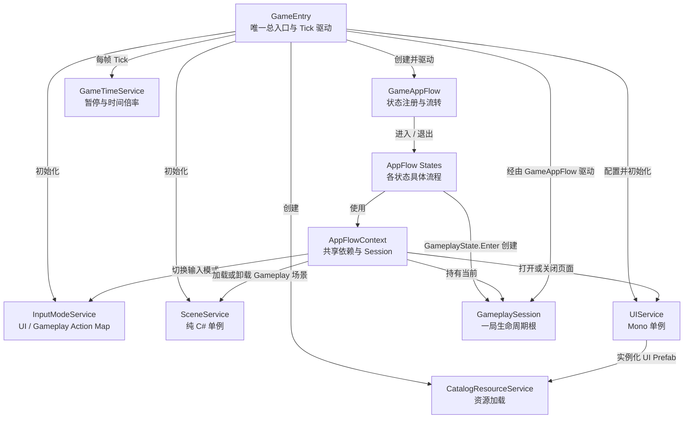
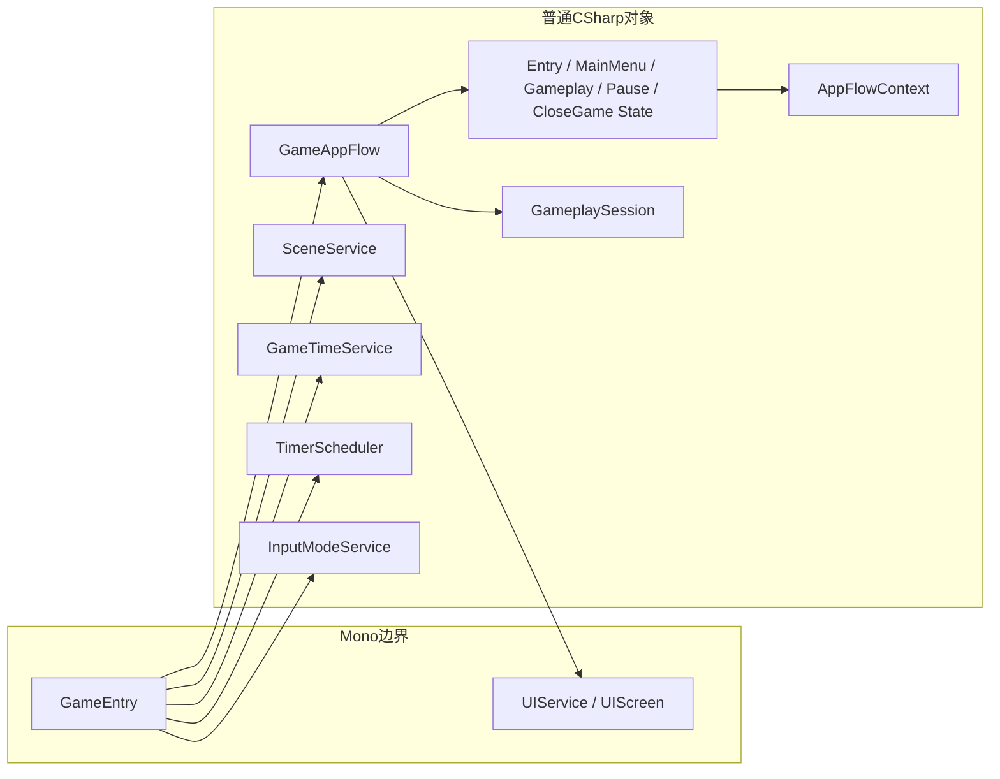
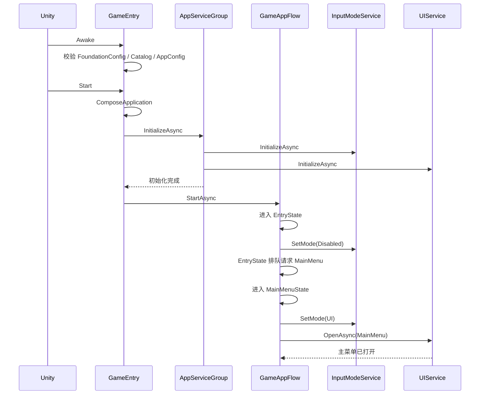
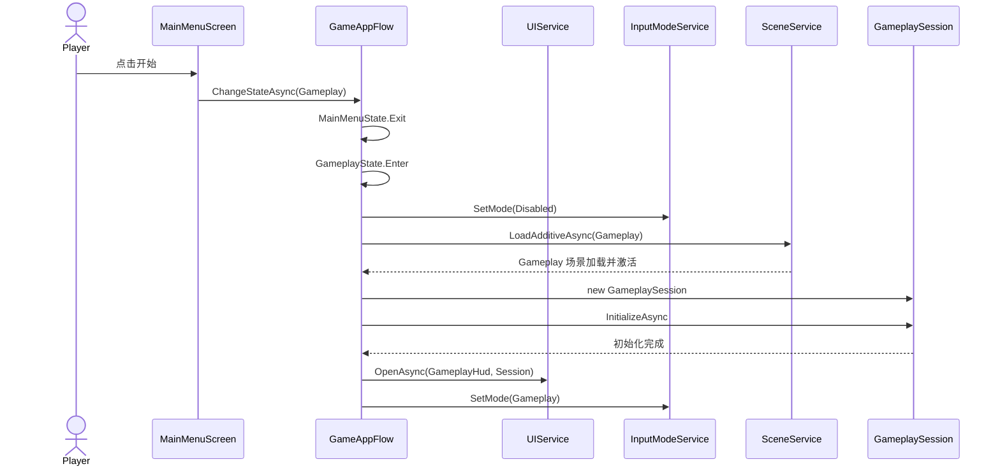
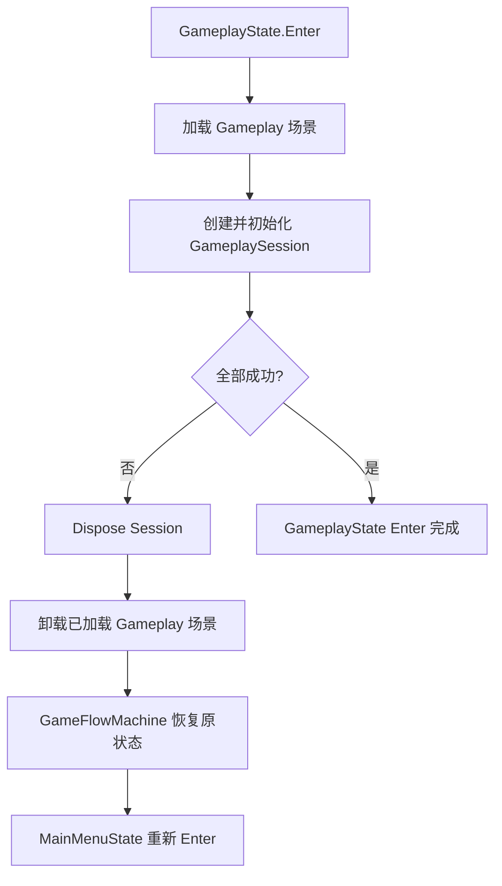
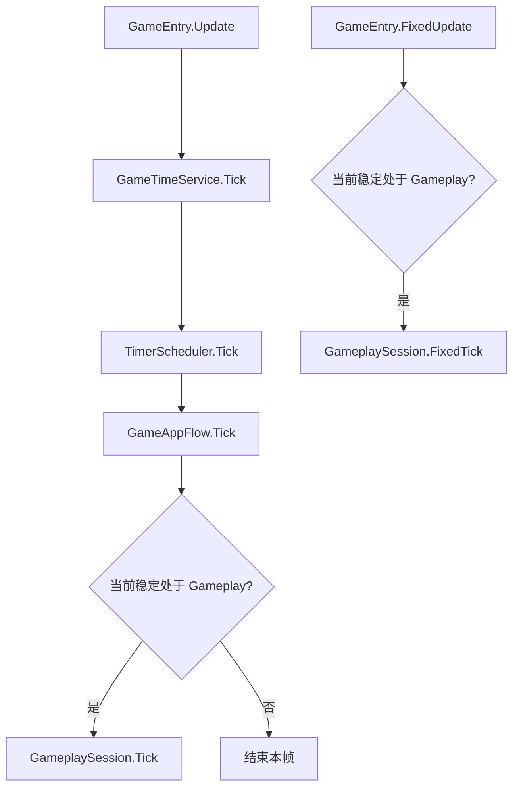
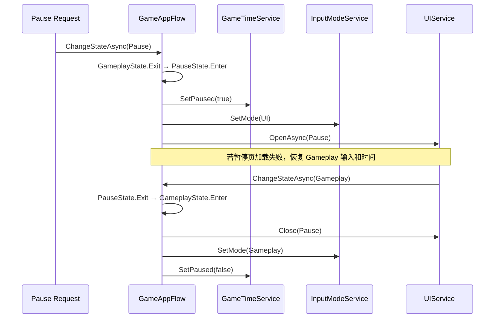
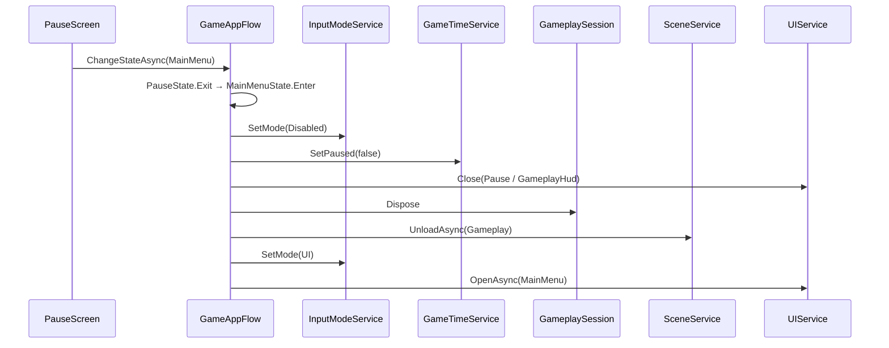
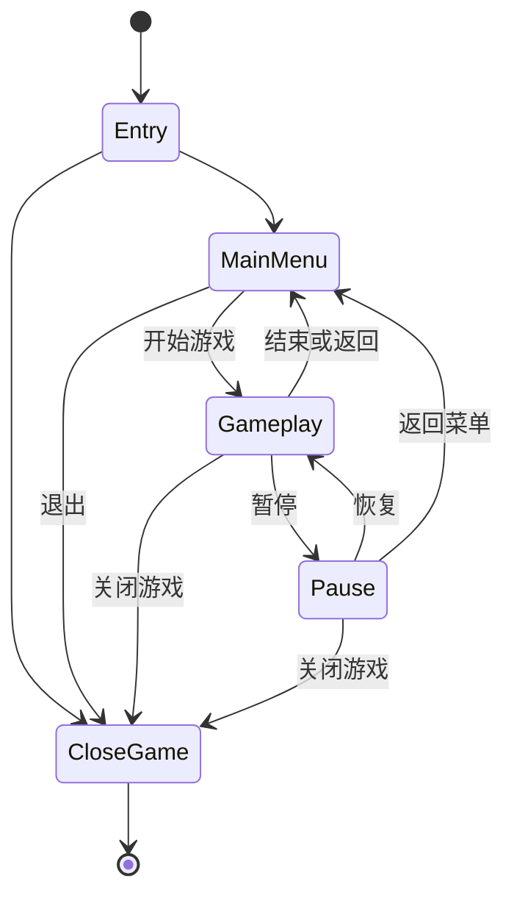

# 第一部分：启动、主菜单与 Gameplay 加载流程

> 状态：代码框架已完成。本文用于快速定位入口、状态归属和调用链。

## 1. 本层目标

第一部分只负责应用生命周期，不实现具体战斗规则：

- `GameEntry` 是唯一总入口和 Gameplay Tick 驱动源。
- `UIService` 管理主菜单、加载、局内 HUD、设置和暂停页面。
- `SceneService` 加载和卸载 Gameplay 场景。
- `GameAppFlow` 只管理状态注册、合法流转和排队跳转。
- `EntryState`、`MainMenuState`、`GameplayState`、`PauseState`、`CloseGameState` 分别实现具体流程。
- 小游戏流程不设置 Loading 状态或 Loading 页面；加载工作直接由 `GameplayState.EnterAsync` 完成。
- `GameplaySession` 是一局游戏的生命周期根，下一部分再向其中加入 `GameplayRun` 和 `GameplayWorld`。

## 2. 代码定位

| 职责 | 类型 | 文件 |
|---|---|---|
| 应用唯一入口、Update 驱动 | `GameEntry` | [`../Entry/GameEntry.cs`](../Entry/GameEntry.cs) |
| 应用状态 | `AppState` | [`../GameFlow/AppState.cs`](../GameFlow/AppState.cs) |
| 应用流程协调 | `GameAppFlow` | [`../GameFlow/GameAppFlow.cs`](../GameFlow/GameAppFlow.cs) |
| 状态共享上下文 | `AppFlowContext` | [`../GameFlow/AppFlowContext.cs`](../GameFlow/AppFlowContext.cs) |
| 状态公共基类 | `AppFlowState` | [`../GameFlow/States/AppFlowState.cs`](../GameFlow/States/AppFlowState.cs) |
| 启动状态 | `EntryState` | [`../GameFlow/States/EntryState.cs`](../GameFlow/States/EntryState.cs) |
| 主菜单状态 | `MainMenuState` | [`../GameFlow/States/MainMenuState.cs`](../GameFlow/States/MainMenuState.cs) |
| 局内状态 | `GameplayState` | [`../GameFlow/States/GameplayState.cs`](../GameFlow/States/GameplayState.cs) |
| 暂停状态 | `PauseState` | [`../GameFlow/States/PauseState.cs`](../GameFlow/States/PauseState.cs) |
| 关闭状态 | `CloseGameState` | [`../GameFlow/States/CloseGameState.cs`](../GameFlow/States/CloseGameState.cs) |
| 一局游戏生命周期根 | `GameplaySession` | [`../Gameplay/Run/GameplaySession.cs`](../Gameplay/Run/GameplaySession.cs) |
| 场景接口 | `ISceneService`、`SceneId` | [`../../GameFoundation/Core/ISceneService.cs`](../../GameFoundation/Core/ISceneService.cs)、[`../../GameFoundation/Core/SceneId.cs`](../../GameFoundation/Core/SceneId.cs) |
| 纯 C# 场景单例 | `SceneService` | [`../../GameFoundation/Service/Scene/SceneService.cs`](../../GameFoundation/Service/Scene/SceneService.cs) |
| UI 单例 | `UIService` | [`../../GameFoundation/Service/UI/UIService.cs`](../../GameFoundation/Service/UI/UIService.cs) |
| UI Mono 单例基类 | `PersistentMonoSingleton<T>` | [`../../GameFoundation/Service/Lifecycle/PersistentMonoSingleton.cs`](../../GameFoundation/Service/Lifecycle/PersistentMonoSingleton.cs) |
| 主菜单页面 | `MainMenuScreen` | [`../Presentation/UI/MainMenuScreen.cs`](../Presentation/UI/MainMenuScreen.cs) |
| 设置页面 | `SettingsScreen` | [`../Presentation/UI/SettingsScreen.cs`](../Presentation/UI/SettingsScreen.cs) |
| 暂停页面 | `PauseScreen` | [`../Presentation/UI/PauseScreen.cs`](../Presentation/UI/PauseScreen.cs) |

## 3. 架构关系



核心边界：

- `GameEntry` 负责组装，不实现业务规则。
- `GameAppFlow` 负责状态流转，不包含页面、场景和 Session 加载细节。
- 每个 State 负责自身的 `EnterAsync` 和 `ExitAsync`。
- `AppFlowContext` 提供状态共享依赖，并持有当前 Session。
- `SceneService` 只负责场景，不拥有 Session。
- `UIService` 只负责页面显示，不决定当前流程。
- `GameplaySession` 只在 Gameplay 场景加载成功后创建。

## 4. Mono 与普通类边界



约束：

- Gameplay Runtime 不自行创建 Mono 驱动器。
- 需要初始化、Update 或 FixedUpdate 的普通对象统一由 `GameEntry` 调度。
- UI 是 Unity 显示边界，可以继承 Mono。
- `SceneService` 不继承 Mono，异步操作通过 Unity `AsyncOperation` 和 `Task` 完成。

## 5. 启动流程



初始化顺序由 `AppServiceGroup` 明确控制。某项服务初始化失败时，已经初始化的服务会按反向顺序释放。

## 6. 点击开始游戏



`GameplayState.EnterAsync` 直接完成首次进入流程：

```text
加载 Gameplay 场景
  → 创建 GameplaySession
  → 初始化 GameplaySession
```

只有以上步骤全部成功，`GameplayState.EnterAsync` 才算完成。由 Pause 返回 Gameplay 时，已有 Session 会被直接恢复，不重复加载场景。

## 7. 加载失败回滚



回滚后不会留下半初始化 Session、已加载场景或错误的输入模式。

## 8. 每帧驱动



`GameplaySession` 只在当前稳定状态为 `Gameplay` 时推进；`Pause` 和状态切换过程中不会推进。

## 9. 暂停与恢复



暂停页面是 Gameplay 上方的 Popup，不创建新场景，也不销毁 Session。

## 10. 返回主菜单



销毁顺序固定为：先停止输入，再释放局内对象，最后卸载场景。

## 11. 状态流转图



`GameAppFlow` 会拒绝图中未声明的跳转。同一次状态进入过程中产生的下一状态请求会排队，在当前 `EnterAsync` 完成后统一执行，避免状态机重入。

## 12. 当前需要在 Unity 中配置的资产

代码框架已经存在，但要实际运行还需要配置：

1. 创建并加入 Build Settings 的 Gameplay 场景。
2. 在启动场景中添加 `GameEntry` 和 `UIService`。
3. 给 `GameEntry` 绑定：
   - `GameFoundationConfig`
   - `GameResourceCatalog`
   - `UIService`
4. 创建并注册以下 UI Prefab：
   - `MainMenu`
   - `GameplayHud`
   - `Pause`
   - `Settings`
5. 在 `GameResourceCatalog` 和 `UIService` 中建立 PageId 与 ResourceId 对应关系。页面与场景 ID 由使用它们的流程状态自行声明。

## 13. 后续扩展点

- `GameplaySession.InitializeAsync`：创建 `GameplayRun` 和 `GameplayWorld`。
- `GameplaySession.Tick`：按确定顺序推进 World。
- `GameplaySession.FixedTick`：推进固定步长移动和物理查询。
- `GameplayRun`：管理倒计时、波次、胜利、失败和结算。
- `GameplayWorld`：持有并推进本局 Entity。
