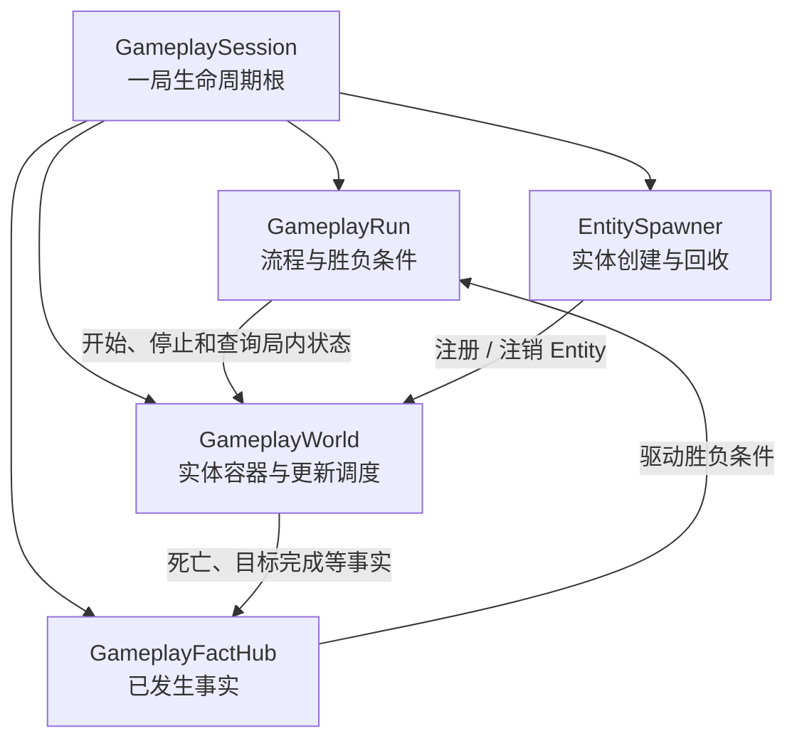
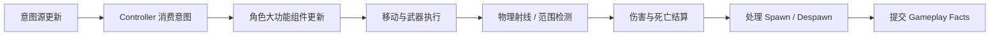
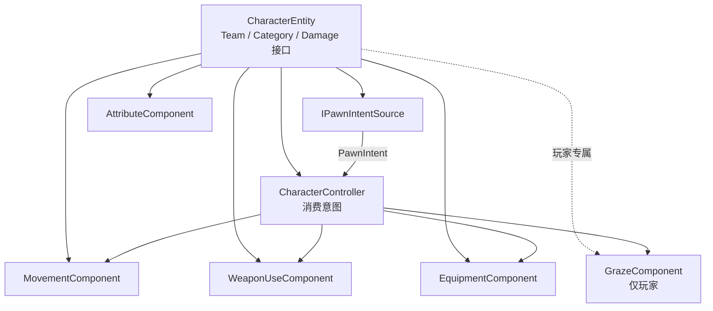

# 第二部分：GameplayRun、GameplayWorld 与 Entity 框架清单

> 状态：待实现。本文先锁定职责、对象关系和施工顺序，不展开武器与擦弹的具体数值。

## 1. 第二部分目标

将当前空壳 `GameplaySession` 补成一局可运行游戏的容器：



本部分暂不实现复杂武器、弹幕、擦弹收益和 AI 行为树，只建立它们可以自然接入的骨架。

## 2. 已锁定的设计约束

### 2.1 不是纯 ECS

Entity Component 只用于把较大的完整能力组合起来，不把每个字段和每个接口都拆成 Component。

例如玩家组件保持为：

- 移动
- 使用枪械
- 装备
- 属性
- 输入意图
- 擦弹

不新增以下碎片组件：

- `HealthComponent`
- `DamageReceiverComponent`
- `TeamComponent`
- `PlayerStatisticsComponent`

### 2.2 Entity 标识

- 每个生成实例拥有唯一 `EntityId`。
- 不再定义语义重复的 `RuntimeId`。
- `EntityId` 用于实例身份、命中去重、Owner 引用和调试。
- 不建立依赖 `EntityId` 的全局业务查找入口。
- 实际目标获取通过碰撞检测、射线和范围查询完成。

### 2.3 阵营

阵营直接放在 Entity 上：

```csharp
public enum EntityTeam
{
    Neutral,
    Player,
    Enemy
}
```

不创建 `TeamComponent`。

### 2.4 受伤与伤害

受伤和造成伤害通过接口表达：

```csharp
public interface IDamageable
{
    DamageResult TakeDamage(in DamageRequest request);
}

public interface IDamageSource
{
    Entity Owner { get; }
    EntityTeam Team { get; }
    DamagePayload CreateDamagePayload();
}
```

角色 Entity 实现 `IDamageable`，内部把伤害交给 `AttributeComponent` 处理。武器、子弹或攻击能力实现或持有 `IDamageSource`。

### 2.5 属性

`AttributeComponent` 是角色属性总入口，但不是无约束的字符串字典。

```text
AttributeComponent
├── AttributeType 枚举索引
├── 若干 Attribute 实例
├── 基础值
├── 当前值
├── 最小值 / 最大值
└── Modifier 列表（需要时再加入）
```

首版属性：

- `Health`
- `MaxHealth`
- `MoveSpeed`
- `MaxMoveSpeed`
- `DamageMultiplier`
- `DamageReduction`

HP 的修改、归零和恢复都通过 `AttributeComponent`，不单独创建生命组件。

## 3. GameplaySession

需要补充：

- 保存当前 `GameplayRun`
- 保存当前 `GameplayWorld`
- 保存 `EntitySpawner`
- 保存 `GameplayFactHub`
- 创建本局 `EntityIdGenerator`
- 持有 Gameplay 场景绑定引用
- 明确初始化顺序
- 明确 Tick 顺序
- 明确 Dispose 逆序
- 防止重复初始化和重复释放

建议初始化顺序：

```text
读取 GameplaySceneContext
  → 创建 FactHub
  → 创建 World
  → 创建 EntitySpawner
  → 创建 GameplayRun
  → 注册局内系统
  → 创建玩家 Entity
  → GameplayRun 进入 Initializing
```

## 4. GameplayRun

`GameplayRun` 负责“一局现在进行到哪里”，不负责单个 Entity 的行为。

建议状态：

```csharp
public enum GameplayRunState
{
    Initializing,
    Countdown,
    WaveActive,
    WaveInterval,
    Victory,
    Defeat,
    Finished
}
```

需要实现：

- 当前 Run 状态
- 状态转换合法性
- 初始倒计时
- 开始第一波的入口占位
- 胜利条件接口
- 失败条件接口
- 玩家死亡后请求失败
- 最终目标完成后请求胜利
- 胜负只允许结算一次
- 停止 World 继续产生新战斗行为
- 为后续结算 UI 提供结果快照

首版先定义接口和状态，不实现完整波次内容。

## 5. GameplayWorld

`GameplayWorld` 是本局 Entity 的唯一容器和更新调度器，但不是全局单例。

需要实现：

- 当前活跃 Entity 集合
- 待加入集合
- 待移除集合
- 遍历期间禁止直接修改活跃集合
- Entity 注册和注销
- Tick
- FixedTick
- 统一停止和 Dispose
- Collider 到 Entity 的映射
- 射线、范围检测结果转换为 Entity
- 世界停止后拒绝新实体生成

不提供：

```text
FindEntityById 用于普通业务逻辑
全局静态 World.Instance
Entity 自行查找任意其他 Entity
```

建议更新顺序：



## 6. Entity 基类

建议 Entity 本体持有：

```text
Entity
├── EntityId
├── EntityCategory
├── EntityTeam
├── IsAlive / IsDisposed
├── GameObject / Transform 等 Unity 对象引用
├── 大功能 Component 集合
└── Initialize / Tick / FixedTick / Dispose
```

Entity 分类：

```csharp
public enum EntityCategory
{
    Player,
    Enemy,
    Weapon,
    Projectile,
    Pickup,
    Wall
}
```

注意：`Wall` 替代原来的 `Obstacle`。

需要实现：

- 添加 Component
- 按类型获取 Component
- 防止重复添加同类型 Component
- Component 反向访问 Owner
- 生命周期顺序
- Entity 销毁幂等
- 池化重用时分配新的 `EntityId`

## 7. EntityComponent 基类

Component 粒度保持在“完整能力”，基础接口只保留必要生命周期：

```csharp
public interface IEntityComponent : IDisposable
{
    Entity Owner { get; }
    void Initialize();
}

public interface IEntityTickable
{
    void Tick(float deltaTime);
}

public interface IEntityFixedTickable
{
    void FixedTick(float fixedDeltaTime);
}
```

不是每个 Component 都要 Tick。World 只推进明确实现 Tick 接口的组件。

## 8. CharacterEntity

玩家和普通 AI 都使用 `CharacterEntity`，差别主要来自意图源和配置。



### 玩家组件

- `CharacterController`
- `PlayerInputComponent`：只生成意图
- `MovementComponent`
- `WeaponUseComponent`
- `EquipmentComponent`
- `AttributeComponent`
- `GrazeComponent`

### AI 敌人组件

- `CharacterController`
- `AIComponent`：感知、决策并生成意图
- `MovementComponent`
- `WeaponUseComponent` 或后续 `AbilityComponent`
- `EquipmentComponent`（确有装备需求时）
- `AttributeComponent`

AI 和输入组件都不能直接修改 Transform、弹药或属性。

## 9. 意图与 Controller

需要实现：

- `PawnIntent`
- `IPawnIntentSource`
- `PlayerInputComponent`
- `AIComponent` 的基础意图出口
- `CharacterController`
- 每帧意图清空规则
- Pressed、Held、Released 的区分
- Controller 禁止保存属性或武器状态

第一版 `PawnIntent` 包含：

```text
AimDirection
FirePressed / FireHeld / FireReleased
GrazePressed
ReloadPressed
SwitchWeaponSlot
SwitchWeaponStep
QuickSwapPressed
```

当前玩法不加入 WASD 移动意图。`MovementComponent` 主要执行开火后坐力和其他外力。

## 10. Unity 对象和碰撞映射

为遵守 Gameplay 不新增 Mono 驱动器的约束，实体 Prefab 首版只依赖 Unity 内置组件：

- `GameObject`
- `Transform`
- `SpriteRenderer`
- `Rigidbody2D`（需要时）
- `Collider2D`
- `Animator`（需要时）

普通 C# Entity 保存这些对象的引用，由 `GameEntry → GameplaySession → GameplayWorld` 驱动。

目标获取：

```text
Physics2D 射线 / Cast / Overlap
  → 返回 Collider2D
  → GameplayWorld 通过 Collider 映射取得 Entity
  → 查询 IDamageable 或其他能力接口
  → 执行规则
```

不通过 `EntityId` 在全局查找命中对象。

需要实现：

- `EntityUnityObject` 或同等包装结构
- Collider 注册和注销
- 多 Collider 归属同一 Entity
- Collider 被销毁后的安全清理
- LayerMask 与 Team 的双重过滤

## 11. EntitySpawner

统一处理：

- 根据 Prefab 或资源配置实例化 Unity 对象
- 创建 Entity
- 分配 `EntityId`
- 设置 Category 和 Team
- 创建并挂入大功能 Component
- 注册 Collider 映射
- 注册到 GameplayWorld
- 初始化失败时完整回滚
- Despawn 时反向释放

第一批工厂入口：

```text
SpawnPlayer
SpawnEnemy
SpawnWeapon
SpawnProjectile
SpawnPickup
SpawnWall
```

具体武器和敌人的配置解释放在后续模块，不塞进通用 Entity 基类。

## 12. GameplayFactHub

第二部分只建立局内事件边界：

- 强类型 Fact
- 本局作用域
- 无静态全局事件
- 订阅和解除订阅
- Dispatch 期间安全增删订阅
- Session Dispose 时清空

首批 Fact：

```text
EntitySpawnedFact
EntityDespawnedFact
CharacterDamagedFact
CharacterDiedFact
RunStateChangedFact
VictoryRequestedFact
DefeatRequestedFact
```

表现层后续订阅这些 Fact，Gameplay 不直接访问 UI、音频或 VFX。

## 13. 第二部分建议文件结构

```text
Gameplay/
├── Run/
│   ├── GameplaySession.cs
│   ├── GameplayRun.cs
│   ├── GameplayRunState.cs
│   └── GameplayResult.cs
├── World/
│   ├── GameplayWorld.cs
│   ├── EntitySpawner.cs
│   └── ColliderEntityMap.cs
├── Entity/
│   ├── Entity.cs
│   ├── EntityId.cs
│   ├── EntityIdGenerator.cs
│   ├── EntityCategory.cs
│   ├── EntityTeam.cs
│   ├── IEntityComponent.cs
│   └── EntityUnityObject.cs
├── Character/
│   ├── CharacterEntity.cs
│   ├── CharacterController.cs
│   ├── AttributeComponent.cs
│   ├── Attribute.cs
│   ├── AttributeType.cs
│   ├── MovementComponent.cs
│   ├── WeaponUseComponent.cs
│   └── EquipmentComponent.cs
├── Intent/
│   ├── PawnIntent.cs
│   ├── IPawnIntentSource.cs
│   ├── PlayerInputComponent.cs
│   └── AIComponent.cs
├── Combat/
│   ├── IDamageable.cs
│   ├── IDamageSource.cs
│   ├── DamageRequest.cs
│   ├── DamagePayload.cs
│   └── DamageResult.cs
└── Facts/
    ├── GameplayFactHub.cs
    └── Facts.cs
```

`GrazeComponent` 可以先定义空接口位置，但完整规则留到擦弹阶段实现。

## 14. 施工顺序

### 阶段 A：Entity 最小核心

- `EntityId`
- `EntityIdGenerator`
- `EntityCategory`
- `EntityTeam`
- `IEntityComponent`
- `Entity`

验收：可以创建、组合组件、初始化和幂等释放一个纯逻辑 Entity。

### 阶段 B：GameplayWorld

- Entity 注册和延迟注销
- Tick / FixedTick
- Collider 映射
- World 停止和释放

验收：遍历过程中请求销毁 Entity 不会破坏集合，也不会重复 Tick。

### 阶段 C：角色最小骨架

- `CharacterEntity`
- `AttributeComponent`
- Damage 接口
- `PawnIntent`
- `CharacterController`
- 输入和 AI 意图源占位

验收：输入源和 AI 源可以通过相同 Controller 调用角色能力；伤害通过角色接口扣除属性中的 HP。

### 阶段 D：GameplayRun

- Run 状态机
- 倒计时
- 胜利和失败请求
- 重复结算保护
- World 启停

验收：模拟玩家死亡或目标完成后，只产生一次明确结果。

### 阶段 E：Session 集成

- `GameplaySession` 创建上述对象
- 绑定 GameEntry Tick
- 明确初始化与 Dispose 顺序
- 加载失败和重开验证

验收：开始游戏、返回菜单、再次开始后，没有残留 Entity、订阅或旧 Run 状态。

## 15. 本部分暂不做

- 完整武器数值和 FireMode
- 弹丸运动与命中细节
- 后坐力曲线
- 擦弹窗口和充能
- 子弹时间
- 完整行为树
- 波次随机计划
- 掉落与奖励
- Boss
- 统计系统

这些模块会建立在第二部分的 Entity、World、Run 和 Damage 接口之上。

