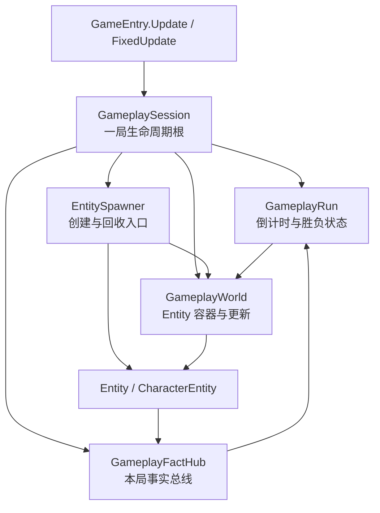
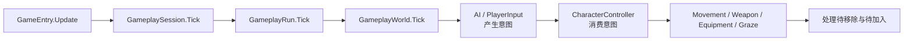
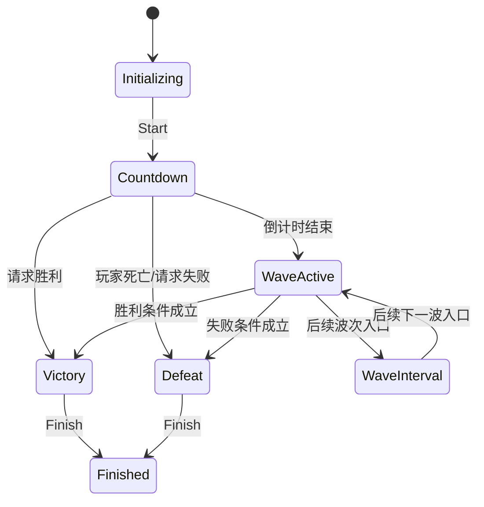
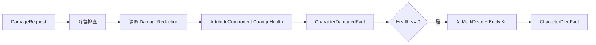
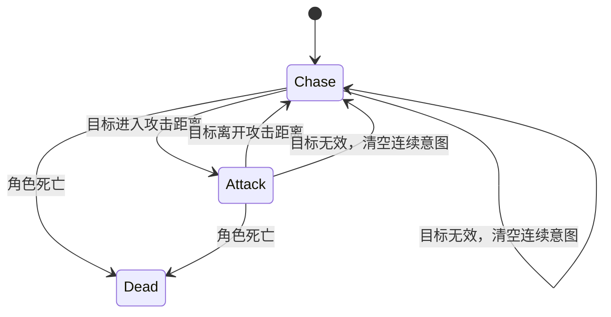
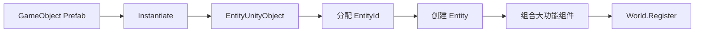

# 第二部分：GameplayWorld 与 Entity 基础框架

> 状态：基础代码已实现并通过编译检查。本文描述当前真实代码，不再作为待施工清单。
>
> 当前范围：一局生命周期、Entity 容器、角色能力骨架、伤害、意图、AI 三态状态机和局内事实。武器射击细节、弹幕、擦弹规则、波次内容和场景 Prefab 绑定在后续阶段实现。

## 1. 目标与设计原则

第二部分将 `GameplaySession` 从空壳补成局内逻辑根节点，并提供后续玩法模块可以直接接入的最小框架。



实现原则：

- 这是 Entity Component 组合模式，不是纯 ECS。
- Component 封装一项完整能力，不把每个字段拆成组件。
- Gameplay 对象均为普通 C# 对象，不新增 MonoBehaviour 驱动器。
- `GameplayWorld` 属于单局，不是全局单例。
- 跨模块长期引用优先保存 `EntityId`，需要对象时再从当前 World 查询。
- 以小游戏 Demo 的清晰度和迭代速度为优先，不引入 DI 容器、行为树等复杂框架。

## 2. 当前运行流程

### 2.1 创建一局

`GameplayState` 加载 Gameplay 场景后创建 `GameplaySession`。Session 按以下顺序初始化：

```text
GameplayFactHub
  → GameplayWorld
  → EntityIdGenerator + EntitySpawner
  → GameplayRun
  → GameplayRun.Start()
  → Countdown
```

当前 `GameplaySession` 不自动创建玩家。玩家 Prefab、出生点以及场景绑定引用尚未确定，后续由场景绑定阶段通过 `Session.Spawner.SpawnPlayer(...)` 接入。

### 2.2 每帧更新



实际顺序：

1. `GameplayRun.Tick` 推进倒计时并检查胜负条件。
2. `GameplayWorld.Tick` 依次更新 Entity。
3. Entity 按组件添加顺序更新实现了 `IEntityTickable` 的组件。
4. World 在遍历结束后统一处理待移除和待加入 Entity。

固定帧由 `GameEntry.FixedUpdate → GameplaySession.FixedTick → GameplayWorld.FixedTick` 推进，目前主要用于 `MovementComponent`。暂停时 Session 不推进 Run 和 World。

### 2.3 释放一局

`GameplaySession.Dispose()` 可以重复调用，实际按以下逆序释放：

```text
GameplayRun
  → EntitySpawner
  → GameplayWorld（释放全部 Entity 和 Unity GameObject）
  → GameplayFactHub（清空全部订阅）
```

重新开始游戏会创建全新的 Session、World、FactHub 和 `EntityIdGenerator`，不保留上一局实体和订阅。

## 3. GameplaySession

`GameplaySession` 是一局游戏的生命周期根，由 `GameAppFlow` 持有。

```csharp
bool IsInitialized
GameplayFactHub Facts
GameplayWorld World
EntitySpawner Spawner
GameplayRun Run

Task InitializeAsync()
void Tick()
void FixedTick(float fixedDeltaTime)
void Dispose()
```

职责：

- 创建和持有所有本局对象。
- 控制初始化、Update、FixedUpdate 和释放顺序。
- 使用 `IGameTimeService` 获取 DeltaTime、暂停状态和局内时间。
- 防止重复初始化以及释放后继续调用。
- 初始化中途失败时回收已经创建的对象。

不负责 UI 页面切换、场景加载、单个 Entity 行为以及具体波次配置。

## 4. GameplayRun

`GameplayRun` 只负责“一局进行到哪个阶段”和胜负结算，不处理角色行为。

### 4.1 状态

```csharp
public enum GameplayRunState
{
    Initializing,
    Countdown,
    WaveActive,
    WaveInterval,
    Victory,
    Defeat,
    Finished
}
```



代码会检查状态转换合法性，非法转换直接抛出异常。

### 4.2 倒计时与模拟开关

- 默认倒计时为 `1.5` 秒，可由构造参数修改。
- World 创建后允许注册 Entity，但默认不推进实体模拟。
- 倒计时结束进入 `WaveActive`，调用 `World.SetSimulationEnabled(true)`。
- 胜利或失败后调用 `World.Stop()`，停止战斗并拒绝注册新 Entity。

### 4.3 胜负判定

Run 支持主动调用 `RequestVictory()`、`RequestDefeat()`，也支持通过 `AddVictoryCondition()`、`AddDefeatCondition()` 添加 `IGameplayCondition`。

Run 同时订阅：

- `CharacterDiedFact`：死亡对象为 Player 时请求失败。
- `VictoryRequestedFact`：请求胜利。
- `DefeatRequestedFact`：请求失败。

内部结算标记保证胜负只发生一次。结算后生成 `GameplayResult`，保存结果类型和结算时的局内时间。

当前尚未实现具体“最终目标完成”条件和完整波次切换，只保留接入口。

## 5. GameplayWorld

`GameplayWorld` 是本局 Entity 的唯一容器和统一更新入口。

### 5.1 内部集合

```text
_entities          当前活跃 Entity
_entitiesById      EntityId → Entity
_pendingAdd        遍历期间等待加入的 Entity
_pendingRemove     遍历期间等待移除的 EntityId
ColliderMap        Collider2D → EntityId
```

### 5.2 注册与移除

`Register(Entity)`：

1. 检查 World 尚未停止。
2. 检查 `EntityId` 未重复。
3. 尚未初始化的 Entity 立即执行 `Initialize()`。
4. 如果 World 正在遍历，则放入 `_pendingAdd`。
5. 正式加入时注册 Collider 并发布 `EntitySpawnedFact`。

`Despawn(EntityId)`：

- 遍历期间只记录 ID，遍历结束后统一移除。
- 正式移除时先注销 Collider，再发布 `EntityDespawnedFact`，最后释放 Entity。
- 重复移除或无效 ID 不会造成重复释放。

### 5.3 EntityId 查询

```csharp
bool TryGetEntity(EntityId entityId, out Entity entity)
bool TryGetEntity(Collider2D collider, out Entity entity)
```

查询只限当前 GameplayWorld，不提供静态 `World.Instance`、跨局 Entity 表或 Entity 自行访问全局容器。AI 目标、伤害来源、Owner 和后续跨帧对象关系优先记录 `EntityId`。

### 5.4 物理查询

```csharp
bool TryRaycastTarget(
    Vector2 origin,
    Vector2 direction,
    float distance,
    LayerMask layerMask,
    EntityTeam sourceTeam,
    out EntityId targetId)

void GetEntitiesInRange(
    Vector2 center,
    float radius,
    LayerMask layerMask,
    EntityTeam sourceTeam,
    List<EntityId> results)
```

处理流程：

```text
Physics2D 查询
  → Collider2D
  → ColliderEntityMap 得到 EntityId
  → GameplayWorld 得到 Entity
  → 过滤死亡对象和同阵营对象
  → 返回 EntityId
```

范围查询按 `EntityId` 去重，支持一个 Entity 带多个 Collider。

## 6. Entity 核心

### 6.1 EntityId

`EntityId` 是以 `ulong` 为值的只读结构体：

- `0` 表示无效 ID。
- 支持相等比较、哈希和调试字符串。
- `EntityIdGenerator` 从 `1` 开始递增分配。
- Generator 属于单个 Session，唯一性范围为当前一局。
- 后续加入对象池时，每次重新生成逻辑 Entity 仍应获取新 ID。

Unity 6 同时存在 `UnityEngine.EntityId`。引用 Gameplay ID 的 Unity API 文件应使用完整命名或别名，避免类型冲突。

### 6.2 分类与阵营

```csharp
public enum EntityCategory
{
    Player,
    Enemy,
    Weapon,
    Projectile,
    Pickup,
    Wall
}

public enum EntityTeam
{
    Neutral,
    Player,
    Enemy
}
```

`Wall` 表示游戏中的墙体，不使用含义宽泛的 `Obstacle`。阵营直接存放在 Entity 上，不创建 `TeamComponent`。

### 6.3 Entity 持有内容

```text
Entity
├── Id
├── Category
├── Team
├── EntityUnityObject
├── IsAlive
├── IsInitialized
├── IsDisposed
└── 大功能 Component 列表
```

组件规则：

- `AddComponent` 只能在 Entity 初始化前调用。
- 同一具体类型不能重复添加。
- 添加时自动绑定 `Owner`。
- `TryGetComponent<T>` 和 `GetComponent<T>` 支持按具体类型或接口查询。
- `Initialize` 按添加顺序初始化组件。
- `Tick` 和 `FixedTick` 只推进实现对应接口的组件。
- `Dispose` 逆序释放组件，然后销毁 Unity GameObject。
- `Kill()` 将 `IsAlive` 设为 false，World 在 Tick 收尾时执行 Despawn。

## 7. EntityComponent

基础接口保持最小化：

```csharp
public interface IEntityComponent : IDisposable
{
    Entity Owner { get; }
    void Initialize();
}

public interface IEntityTickable
{
    void Tick(float deltaTime);
}

public interface IEntityFixedTickable
{
    void FixedTick(float fixedDeltaTime);
}
```

`EntityComponent` 实现 Owner 绑定以及默认空生命周期。不是每个组件都需要 Tick。

本阶段明确不创建：

- `HealthComponent`
- `DamageReceiverComponent`
- `TeamComponent`
- `PlayerStatisticsComponent`

## 8. Unity 对象包装

`EntityUnityObject` 保存 Entity 对应的 Unity 引用：

```text
GameObject
Transform
Rigidbody2D（可为空）
Collider2D[]（包含子节点）
```

实体 Prefab 不需要额外挂 Gameplay MonoBehaviour。创建包装对象时一次性收集 Rigidbody 和 Collider，由普通 C# Entity 负责逻辑。释放 Entity 时会销毁对应 GameObject。

## 9. CharacterEntity 与伤害

玩家和普通敌人都使用 `CharacterEntity`。角色差异来自 Entity 分类、阵营、意图源和组件组合。

```csharp
public interface IDamageable
{
    DamageResult TakeDamage(in DamageRequest request);
}
```

### 9.1 伤害数据

```text
DamagePayload
└── Amount

DamageRequest
├── SourceId
├── SourceTeam
└── Payload

DamageResult
├── AppliedDamage
├── HealthAfterDamage
└── Killed
```

伤害来源接口保存 Owner ID，而非直接保存 Entity：

```csharp
public interface IDamageSource
{
    EntityId OwnerId { get; }
    EntityTeam Team { get; }
    DamagePayload CreateDamagePayload();
}
```

### 9.2 TakeDamage 流程



当前规则：

- 已死亡角色忽略伤害。
- 非 Neutral 的同阵营伤害被忽略。
- 实际伤害为 `Amount × (1 - DamageReduction)`。
- 生命归零只结算一次死亡。
- AI 角色死亡时先切换到 `Dead`，再标记 Entity 死亡。

## 10. AttributeComponent

`AttributeComponent` 是角色属性总入口，不使用字符串字典。

```csharp
public enum AttributeType
{
    Health,
    MaxHealth,
    MoveSpeed,
    MaxMoveSpeed,
    DamageMultiplier,
    DamageReduction
}
```

每项属性由 `AttributeValue` 保存基础值、当前值、最小值和最大值。

| 属性 | 默认值 | 范围 |
| --- | ---: | --- |
| Health | 100 | 0～MaxHealth |
| MaxHealth | 100 | 1～float.MaxValue |
| MoveSpeed | 4 | 0～MaxMoveSpeed |
| MaxMoveSpeed | 4 | 0～float.MaxValue |
| DamageMultiplier | 1 | 0～100 |
| DamageReduction | 0 | 0～0.95 |

主要入口：

```csharp
float GetCurrent(AttributeType type)
float GetBase(AttributeType type)
void SetCurrent(AttributeType type, float value)
void SetMaxHealth(float value, bool fillHealth)
float ChangeHealth(float delta)
```

Modifier、Buff、Debuff 和数值重算链暂未加入，确认实际玩法需要时再扩展。

## 11. 意图与 CharacterController

输入组件和 AI 都只生成 `PawnIntent`，不能直接修改 Transform、武器弹药或角色属性。

### 11.1 PawnIntent

```text
MoveDirection       AI 追击使用；玩家暂不写入 WASD 移动
AimDirection
FirePressed
FireHeld
FireReleased
GrazePressed
ReloadPressed
SwitchWeaponSlot
SwitchWeaponStep
QuickSwapPressed
```

`Pressed` 和 `Released` 是单帧信号，Controller 消费后通过 `ClearFrameIntent()` 清空；`FireHeld` 保持到输入源收到松开状态。

### 11.2 共用 Controller

`CharacterController.Initialize()` 从 Owner 取得一个 `IPawnIntentSource`，以及可选的 Movement、WeaponUse、Equipment、Graze 组件。

```text
读取 PawnIntent
  → Movement.SetMoveDirection
  → WeaponUse.ApplyIntent
  → Equipment.ApplyIntent
  → Graze.ApplyIntent
  → 清除单帧意图
```

Controller 不保存血量、弹药、装备数据或 AI 状态。

Unity 内置类型中也存在 `UnityEngine.CharacterController`。同时引用 UnityEngine 的代码应使用 `GameplayCharacterController` 别名或完整命名。

## 12. 玩家组件组合

`EntitySpawner.SpawnPlayer` 当前按以下顺序装配：

```text
AttributeComponent
PlayerInputComponent
CharacterController
MovementComponent
WeaponUseComponent
EquipmentComponent
GrazeComponent
```

- `PlayerInputComponent`：接收输入适配层调用并产生意图。
- `CharacterController`：消费意图并分发给能力组件。
- `MovementComponent`：执行移动和外力。
- `WeaponUseComponent`：保存扳机状态并发出开火、换弹请求。
- `EquipmentComponent`：保存当前与上一个武器槽位。
- `AttributeComponent`：角色属性总入口。
- `GrazeComponent`：目前只保留擦弹请求入口。

当前玩家输入入口：

```csharp
SetAimDirection(Vector2 direction)
SetFire(bool isHeld)
PressGraze()
PressReload()
SelectWeaponSlot(int slot)
StepWeapon(int step)
PressQuickSwap()
```

Input System 与这些方法之间的具体绑定尚未实现。

## 13. AI 敌人组件

`EntitySpawner.SpawnEnemy` 当前装配：

```text
AttributeComponent
AIComponent
CharacterController
MovementComponent
WeaponUseComponent
```

AI 目标保存为 `EntityId TargetId`，每帧通过 `GameplayWorld.TryGetEntity(TargetId)` 获取对象。

### 13.1 三态状态机

```csharp
public enum AIState
{
    Chase,
    Attack,
    Dead
}
```



行为规则：

- `Chase`：瞄准目标，并输出朝向目标的 `MoveDirection`。
- `Attack`：停止追击，保持瞄准并输出开火意图。
- `Dead`：清空移动、瞄准和开火意图，不再决策。
- 默认攻击距离为 `5`，生成敌人时可以覆盖。

AI 不直接移动 Transform，也不直接调用武器；真实效果由 Controller 和能力组件执行。

## 14. 当前能力组件

### MovementComponent

- 接收归一化后的移动方向。
- `AddImpulse` 可供后坐力和击退使用。
- 在 FixedTick 中读取 `MoveSpeed`。
- 有 Rigidbody2D 时使用 `MovePosition`，否则修改 Transform。
- 当前外力在一个固定帧执行后清零。

### WeaponUseComponent

- 保存 `IsTriggerHeld`。
- `FirePressed` 时触发 `FireRequested`。
- `ReloadPressed` 时触发 `ReloadRequested`。
- Dispose 时清空事件引用。

射速、弹药、FireMode、命中和子弹生成留给武器阶段。

### EquipmentComponent

- 槽位从 `1` 开始。
- 保存 `CurrentWeaponSlot` 和 `PreviousWeaponSlot`。
- 支持指定槽位、前后步进和快速切回上一武器。

### GrazeComponent

当前只记录本帧是否请求擦弹，用于固定后续接口位置；不包含擦弹窗口、充能或子弹时间。

## 15. EntitySpawner

Spawner 是运行时 Entity 的统一创建入口：

```text
SpawnPlayer
SpawnEnemy
SpawnWeapon
SpawnProjectile
SpawnPickup
SpawnWall
Despawn
```



如果组件装配或注册失败，Spawner 会 Dispose 已创建 Entity，确保实例化出的 GameObject 被回收。普通武器、子弹、掉落物和墙体目前只创建基础 Entity，其专属组件在对应玩法阶段加入。

## 16. GameplayFactHub

`GameplayFactHub` 是 Session 作用域的强类型同步事实总线。

```csharp
IDisposable Subscribe<T>(Action<T> handler)
void Publish<T>(T fact)
```

特性：

- 无静态全局事件。
- 订阅返回 `IDisposable`，由持有方主动解除。
- 发布时复制订阅快照，回调中订阅或退订不会破坏当前遍历。
- Session 释放时统一清空。

| Fact | 产生位置 | 用途 |
| --- | --- | --- |
| `EntitySpawnedFact` | GameplayWorld | Entity 正式加入 World |
| `EntityDespawnedFact` | GameplayWorld | Entity 正式离开 World |
| `CharacterDamagedFact` | CharacterEntity | 表现、音效和受击反馈入口 |
| `CharacterDiedFact` | CharacterEntity | 死亡反馈与玩家失败判定 |
| `RunStateChangedFact` | GameplayRun | 局内阶段表现入口 |
| `VictoryRequestedFact` | 后续目标系统 | 请求胜利 |
| `DefeatRequestedFact` | 后续规则系统 | 请求失败 |

表现层后续可订阅这些事实，但 Gameplay 不直接操作 UI、音频和 VFX。

## 17. 当前文件结构

```text
Gameplay/
├── Run/
│   ├── GameplaySession.cs
│   ├── GameplayRun.cs
│   ├── GameplayRunState.cs
│   ├── GameplayResult.cs
│   └── IGameplayCondition.cs
├── World/
│   ├── GameplayWorld.cs
│   ├── EntitySpawner.cs
│   └── ColliderEntityMap.cs
├── Entity/
│   ├── Entity.cs
│   ├── EntityId.cs
│   ├── EntityIdGenerator.cs
│   ├── EntityCategory.cs
│   ├── EntityTeam.cs
│   ├── IEntityComponent.cs
│   └── EntityUnityObject.cs
├── Character/
│   ├── CharacterEntity.cs
│   ├── CharacterController.cs
│   ├── AttributeComponent.cs
│   ├── AttributeValue.cs
│   ├── AttributeType.cs
│   ├── MovementComponent.cs
│   ├── WeaponUseComponent.cs
│   ├── EquipmentComponent.cs
│   └── GrazeComponent.cs
├── Intent/
│   ├── PawnIntent.cs
│   ├── IPawnIntentSource.cs
│   ├── PlayerInputComponent.cs
│   ├── AIComponent.cs
│   └── AIState.cs
├── Combat/
│   ├── IDamageable.cs
│   ├── IDamageSource.cs
│   ├── DamageRequest.cs
│   ├── DamagePayload.cs
│   └── DamageResult.cs
└── Facts/
    ├── GameplayFactHub.cs
    └── Facts.cs
```

## 18. 已完成验收项

- [x] 一局拥有独立 Session、World、Spawner、Run 和 FactHub。
- [x] EntityId 在本局内唯一，并可用于查询 Entity。
- [x] Entity 支持大功能组件组合与 Owner 反向访问。
- [x] 同类型组件不能重复添加。
- [x] Entity 初始化和释放具有明确顺序。
- [x] Entity 和 Session 的 Dispose 幂等。
- [x] World 遍历期间的 Spawn、Despawn 不直接修改活跃集合。
- [x] Collider 支持映射到 EntityId，多 Collider 范围查询会去重。
- [x] 射线和范围查询支持 LayerMask 与 Team 过滤。
- [x] 玩家输入与 AI 通过相同 Controller 驱动能力。
- [x] AI 实现 Chase、Attack、Dead 三态状态机。
- [x] 角色通过统一接口受伤，HP 由 AttributeComponent 管理。
- [x] 玩家死亡只请求一次失败结算。
- [x] 胜负后停止 World 继续产生战斗行为。
- [x] 释放 Session 时清理 Entity 和 Fact 订阅。
- [x] 当前代码通过独立 C# 编译检查，0 Error。

## 19. 下一阶段接入顺序

1. Gameplay 场景绑定：玩家/敌人 Prefab、出生点和初始生成。
2. Input System 适配：把 Gameplay Action Map 写入 `PlayerInputComponent`。
3. 武器配置 Asset、武器实例、开火与弹药。
4. 子弹或射线命中，通过 `EntityId` 找到 `IDamageable`。
5. 后坐力接入 `MovementComponent.AddImpulse`。
6. 擦弹检测、充能和子弹时间。
7. 波次生成、最终目标和胜利条件。
8. Gameplay HUD、胜利与失败结算表现。

## 20. 当前未实现边界

- Gameplay 场景引用包装和自动创建玩家。
- Input System 到 `PlayerInputComponent` 的绑定。
- 完整武器参数、FireMode、射速、弹药和换弹。
- Projectile 运动、碰撞、穿透和命中去重。
- 后坐力曲线和镜头反馈。
- 擦弹窗口、能量、慢动作和奖励。
- 完整波次计划与刷怪规则。
- 掉落、奖励、Boss 和统计系统。
- 对象池复用。
- 复杂 AI 行为树、寻路和躲避。

这些内容应继续建立在当前 Session、World、EntityId、Character、Damage 和 Fact 边界之上，不回填到通用 Entity 基类中。
