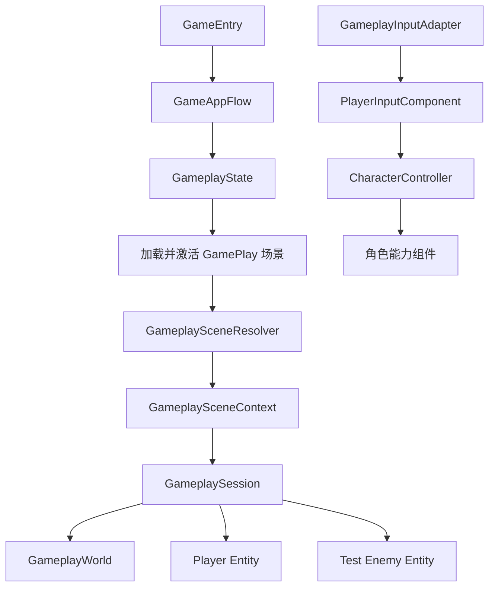
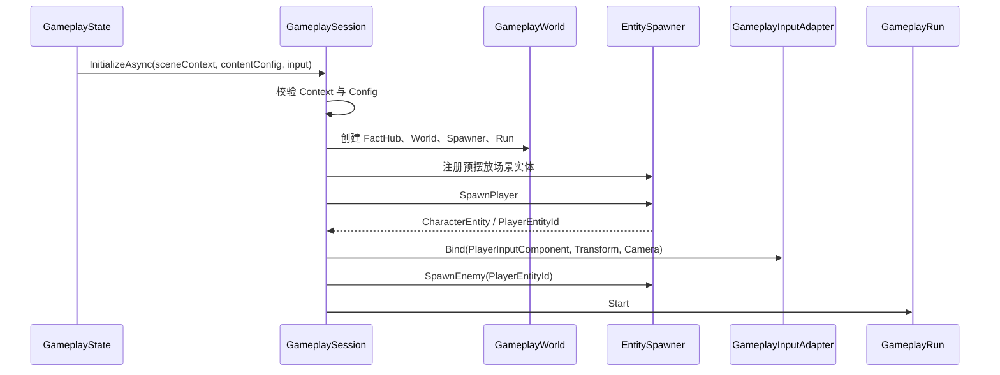
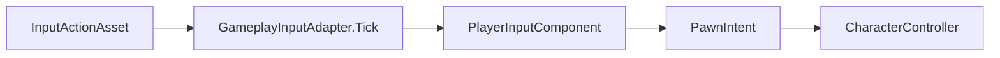
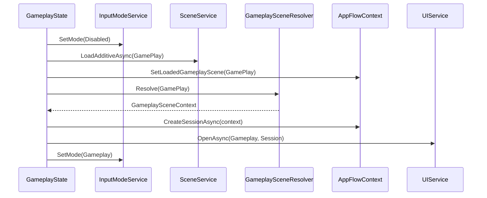

# 第三部分：Gameplay 场景接入与输入驱动

> 状态：已实现。
>
> 第三阶段已经把第二阶段的纯 C# Gameplay 框架接入真实 Unity 场景，并完成玩家、测试敌人、场景实体、输入、暂停和 Session 生命周期的基础闭环。Unity 运行时与 Editor 程序集编译通过；文末保留需要在 Play Mode 中人工体验的验收项。

## 1. 阶段目标与完成结果

本阶段解决的是“应用流程如何找到 Unity 场景内容，并把输入交给纯 C# Gameplay”的问题，不包含真正的武器射击、弹丸伤害和擦弹结算。

当前已经打通以下链路：



完成结果：

- 主菜单点击开始后，由 `GameplayState` 加载 `GamePlay` 场景。
- 场景加载完成后解析唯一的 `GameplaySceneBindings`。
- 每局创建一个 `GameplaySession`、一个玩家和配置数量的测试敌人。
- 测试敌人通过玩家 `EntityId` 获取目标，而不是持有玩家对象引用。
- Input System 输入经 `GameplayInputAdapter` 写入 `PlayerInputComponent`。
- `CharacterController` 消费玩家或 AI 产生的统一 `PawnIntent`。
- `GameEntry` 统一驱动应用流程、Session Tick 和 FixedTick。
- 暂停与恢复复用同一个 Session，不重新加载场景或生成实体。
- 退出 Gameplay 时先解除输入绑定，再释放 World 和卸载场景。

## 2. 本阶段边界

### 2.1 已实现

- Gameplay 灰盒场景与固定层级。
- 场景引用的集中配置、校验和一次性解析。
- Gameplay 内容配置 Asset。
- 预摆放墙体注册和运行时实体生成。
- 玩家与测试敌人生成。
- `Gameplay` / `UI` Input Action Map。
- 瞄准、开火、擦弹、换弹、切枪和暂停的输入意图接入。
- Gameplay/Pause 状态切换。
- Session 初始化失败回滚、退出和重复进入所需的清理逻辑。
- Unity Editor 一键生成第三阶段资源的工具。

### 2.2 尚未实现

- 武器运行时、弹药、射速和换弹过程。
- 弹丸或射线生成与命中。
- 伤害和死亡的完整实战闭环。
- 开火后坐力与玩家实际位移。
- 擦弹判定、充能、慢动作和增益消费。
- 正式波次、掉落物、奖励和结算 UI。

当前 Fire、Reload、SwitchWeapon、Graze 均已到达对应角色组件，但部分组件仍是下一阶段的功能入口。

## 3. 关键设计约束

- `GameEntry` 是应用总入口，也是唯一统一驱动 `Update` / `FixedUpdate` 的 Gameplay Mono。
- Unity 场景可以使用少量被动 MonoBehaviour 保存序列化引用；它们不包含 Update 和业务状态机。
- `GameplaySceneContext`、Resolver、Session、World、Entity、输入适配器和角色能力均为普通 C# 对象。
- Entity Prefab 只挂 Unity 表现与物理组件，不挂一套平行的 Mono Gameplay 逻辑。
- 场景对象不写入 ScriptableObject；配置 Asset 只保存 Prefab、LayerMask 和数值。
- 场景结构只在进入 Gameplay 时解析一次，不在每帧使用 `GameObject.Find`。
- 场景、配置、Action 或关键引用缺失时立即抛出带名称的异常，不静默降级。
- Gameplay 层使用 `EntityId` 传递目标身份；实际碰撞对象通过 `ColliderEntityMap` 映射回 Entity。
- 以小游戏 Demo 为目标，保持直接调用和清晰依赖，不引入 DI 容器、复杂事件总线或纯 ECS 调度。

## 4. Mono 与纯 C# 的边界

第三阶段新增的场景 Mono 只有两类：

| 类型 | 是否 Mono | 职责 |
| --- | --- | --- |
| `GameplaySceneBindings` | 是 | 集中保存场景关键引用并创建 Context |
| `SceneEntityAuthoring` | 是 | 为预摆放物体声明 Category 和 Team |
| `GameplaySceneContext` | 否 | 保存已经校验过的场景引用 |
| `GameplaySceneResolver` | 否 | 从已加载场景解析唯一 Bindings |
| `GameplayInputAdapter` | 否 | 将 Input System 状态写成角色意图 |
| `GameplaySession` | 否 | 管理一局游戏的创建、更新和释放 |

`GameplaySceneBindings` 与 `SceneEntityAuthoring` 都是 Unity 序列化桥梁，不拥有 Gameplay 规则。

## 5. GamePlay 场景结构

当前 `Assets/Scenes/GamePlay.unity` 使用以下灰盒层级：

```text
GameplayRoot                       GameplaySceneBindings
├── WorldRoot
│   ├── Wall_Top                  SceneEntityAuthoring: Wall / Neutral
│   ├── Wall_Bottom               SceneEntityAuthoring: Wall / Neutral
│   ├── Wall_Left                 SceneEntityAuthoring: Wall / Neutral
│   └── Wall_Right                SceneEntityAuthoring: Wall / Neutral
├── PresentationRoot
├── SpawnPoints
│   ├── PlayerSpawn
│   └── EnemySpawns
│       └── EnemySpawn_01
├── DropRoot
├── ArenaBounds                   BoxCollider2D
└── GameplayCamera                Camera
```

节点职责：

| 节点 | 用途 |
| --- | --- |
| `GameplayRoot` | 场景内容总根节点和唯一 Bindings 所在对象 |
| `WorldRoot` | 玩家、敌人、弹丸和墙体的父节点 |
| `PresentationRoot` | 后续特效、飘字等表现对象的父节点 |
| `PlayerSpawn` | 玩家出生位置和朝向 |
| `EnemySpawns` | 测试敌人以及后续波次的出生点集合 |
| `DropRoot` | 后续掉落物父节点 |
| `ArenaBounds` | 战场范围引用 |
| `GameplayCamera` | 屏幕坐标转世界瞄准方向使用的相机 |

Gameplay 相机没有额外 `AudioListener`，避免与常驻 Entry 场景的监听器重复。

## 6. 场景引用入口

### 6.1 GameplaySceneBindings

`GameplaySceneBindings` 集中序列化：

- `WorldRoot`
- `PresentationRoot`
- `DropRoot`
- `PlayerSpawn`
- `EnemySpawns`
- `GameplayCamera`
- `ArenaBounds`
- `SceneEntities`

创建 Context 前会检查：

- 所有必需引用不为空。
- 至少存在一个敌人出生点。
- 关键引用属于当前 GamePlay 场景。

层级名称用于编辑器可读性；运行时代码依赖序列化引用，不依赖名称查找。

### 6.2 GameplaySceneContext

`GameplaySceneContext` 是只读的纯 C# 场景数据包，包含：

```text
Scene
WorldRoot
PresentationRoot
PlayerSpawn
EnemySpawns
DropRoot
ArenaBounds
GameplayCamera
SceneEntities
```

它只保存引用，不生成 Entity、不更新场景节点，也不负责卸载场景。

### 6.3 GameplaySceneResolver

解析流程：

```text
SceneId("GamePlay")
  → SceneManager.GetSceneByName
  → 验证场景有效且已加载
  → 扫描场景 Root 下的 GameplaySceneBindings
  → 验证数量恰好为 1
  → Bindings.Validate
  → 创建 GameplaySceneContext
```

Foundation 的 `ISceneService` 只负责通用场景加载，不感知具体 Gameplay 节点。

## 7. Gameplay 内容配置

`GameplayContentConfig` 位于：

```text
Assets/Res/Config/GameplayContentConfig.asset
```

当前字段：

| 分组 | 字段 | 当前用途 |
| --- | --- | --- |
| 实体预制体 | `PlayerPrefab` | 生成玩家 Unity 对象 |
| 实体预制体 | `TestEnemyPrefab` | 生成测试敌人 Unity 对象 |
| 测试敌人 | `SpawnTestEnemy` | 是否生成测试敌人 |
| 测试敌人 | `TestEnemyCount` | 生成数量，最多不超过出生点数量 |
| 测试敌人 | `TestEnemyAttackRange` | 初始化 `AIComponent` 攻击距离 |
| 物理查询 | `PlayerTargetMask` | 玩家攻击目标层 |
| 物理查询 | `EnemyTargetMask` | 敌人攻击目标层 |
| 物理查询 | `GrazeProjectileMask` | 擦弹可检测弹丸层 |
| 物理查询 | `WallMask` | 墙体物理查询层 |

`GameEntry` 作为 Composition Root 持有该 Asset，并传入 `GameAppFlow`。

Gameplay 场景名不再属于配置：

- `GameplayState` 自己声明 `SceneId("GamePlay")` 并负责加载。
- `AppFlowContext` 只记录本次实际加载的场景 ID，供失败回滚和退出时卸载。
- `GameAppConfig` 不承担 UI 页面和 Gameplay 场景配置。

## 8. Prefab 与 Layer

当前灰盒 Prefab：

```text
Assets/Res/Gameplay/Player/Player.prefab
Assets/Res/Gameplay/Enemy/TestEnemy.prefab
```

两者只包含必要 Unity 组件：

```text
Transform
SpriteRenderer
Rigidbody2D
CircleCollider2D
```

角色的 Attribute、Input/AI、Controller、Movement、WeaponUse、Equipment 和 Graze 能力由 `EntitySpawner` 在纯 C# `CharacterEntity` 上装配。

第三阶段建立的 Layer：

```text
Player
Enemy
PlayerProjectile
EnemyProjectile
Wall
Pickup
```

这些 Layer 是后续目标筛选、弹丸命中、擦弹和墙体查询的统一基础。

## 9. 场景实体注册与所有权

墙体等预摆放对象通过 `SceneEntityAuthoring` 声明：

```text
EntityCategory.Wall
EntityTeam.Neutral
```

Session 初始化时依次调用 `EntitySpawner.RegisterSceneEntity`，为其分配唯一 `EntityId` 并注册到 World 和 Collider 映射。

`EntityUnityObject` 区分 Unity 对象所有权：

- 运行时通过 Prefab 生成的对象：Entity 释放时销毁 GameObject。
- 场景预摆放对象：Entity 释放时不销毁 GameObject，由场景卸载统一回收。

因此 Session 清理不会误删仍由 Unity 场景管理的对象，也不会遗留动态生成物。

## 10. Session 初始化与释放

### 10.1 初始化顺序



`Run.Start()` 放在场景实体、玩家、输入和测试敌人全部成功创建之后。初始化任一步异常都会进入统一回收逻辑。

Session 对外保存：

- `Facts`
- `World`
- `Spawner`
- `Run`
- `SceneContext`
- `PlayerEntityId`

需要玩家时通过 `World.TryGetEntity(PlayerEntityId, ...)` 查找，不额外长期持有玩家实体字段。

### 10.2 释放顺序

```text
GameplayInputAdapter.Unbind
  → GameplayRun.Dispose
  → EntitySpawner.Dispose
  → GameplayWorld.Dispose
  → GameplayFactHub.Dispose
  → 清空 SceneContext 和 PlayerEntityId
```

应用级 `GameplayInputAdapter` 可以跨 Session 复用，但每局玩家绑定必须随 Session 解除。

## 11. Input Action 方案

正式 Action Map：

```text
Gameplay
UI
```

Gameplay Map：

| Action | 类型 | 默认输入 | 生成的意图 |
| --- | --- | --- | --- |
| `Aim` | Value / Vector2 | Pointer Position | `SetAimDirection` |
| `Fire` | Button | 鼠标左键 | `SetFire`，形成 Pressed/Held/Released |
| `Graze` | Button | 鼠标右键 | `PressGraze` |
| `Reload` | Button | R | `PressReload` |
| `SwitchWeaponStep` | Value / Axis | 鼠标滚轮 | `StepWeapon` |
| `WeaponSlot1` | Button | 1 | `SelectWeaponSlot(1)` |
| `WeaponSlot2` | Button | 2 | `SelectWeaponSlot(2)` |
| `WeaponSlot3` | Button | 3 | `SelectWeaponSlot(3)` |
| `QuickSwap` | Button | Q | `PressQuickSwap` |
| `Pause` | Button | Escape | 请求进入 Pause |

UI Map 的 `Cancel` 同样可用于从 Pause 恢复。

玩家没有 WASD Move Action。玩家的位移来源将在第四阶段接入射击后坐力；AI 的 `MoveDirection` 仍由 `AIComponent` 产生。

## 12. GameplayInputAdapter 的实际行为

`GameplayInputAdapter` 是 Input System 到 `PlayerInputComponent` 的唯一适配入口。



实现方式是由 `GameEntry.Update` 间接调用 Adapter 的 `Tick`，在每帧轮询 Action 状态；没有为每局重复注册 InputAction 回调。

每帧行为：

1. 检查 Gameplay Pause 或 UI Cancel 是否在本帧按下。
2. 当 Gameplay Map 启用且玩家已经绑定时，更新瞄准方向。
3. 使用 `Fire.IsPressed()` 写入持续开火状态。
4. 使用 `WasPressedThisFrame()` 写入擦弹、换弹、槽位和快速切枪的单帧请求。
5. 读取滚轮 Axis，转换为 `+1/-1` 切枪步进。

瞄准转换：

```text
Pointer 屏幕坐标
  → GameplayCamera.ScreenToWorldPoint
  → 世界点 - 玩家世界坐标
  → 归一化方向
  → PlayerInputComponent.SetAimDirection
```

鼠标位于玩家中心导致方向接近零时，保留上一帧有效方向。

`Unbind()` 会先写入 `SetFire(false)`，避免离开本局后保留按住开火状态，再清空玩家、Transform、Camera 和 Pause 标记。

## 13. GameEntry 与更新驱动

`GameEntry.Start` 的装配顺序：

```text
ComposeServices
  → AppServiceGroup.InitializeAsync
  → 使用 InputModeService.Actions 创建 GameplayInputAdapter
  → 创建 GameAppFlow
  → GameAppFlow.StartAsync
```

运行时驱动：

```text
GameEntry.Update
  → GameTimeService.Tick
  → TimerScheduler.Tick
  → GameAppFlow.Tick
      → GameplayInputAdapter.Tick
      → 消费 Pause 请求
      → Flow 状态 Tick
      → GameplaySession.Tick

GameEntry.FixedUpdate
  → GameAppFlow.FixedTick
      → GameplaySession.FixedTick
          → GameplayWorld.FixedTick
```

`ShotGame.Gameplay.asmdef` 已引用 `Unity.InputSystem`；Foundation Core 不依赖 Input System 类型。

## 14. GameplayState 与 Pause 流程

### 14.1 首次进入 Gameplay



### 14.2 暂停与恢复

Pause 属于应用流程意图，不写入 `PawnIntent`。

```text
Escape / UI Cancel
  → GameplayInputAdapter.PauseRequested
  → GameAppFlow 消费请求
  → Gameplay ↔ Pause
```

进入 Pause 后：

- Session 和 GamePlay 场景保留。
- Gameplay Tick/FixedTick 停止。
- 时间服务进入暂停。
- Action Map 切换到 UI。

恢复 Gameplay 时只恢复 InputMode 与时间，不重新解析场景、不重新绑定玩家、不创建新 Session。

### 14.3 失败回滚与退出

首次进入任何一步失败：

```text
InputMode.Disabled
  → Session.Dispose（若已创建）
  → 清空本局引用
  → 卸载本次已经加载的 GamePlay 场景
  → 异常继续上抛并记录
```

正常返回主菜单也由 `AppFlowContext.StopGameplayAsync` 执行同一套局内清理原则。

## 15. 自动搭建工具

菜单入口：

```text
Unity → Shot Game → Setup Third Phase
```

`ThirdPhaseSetup` 会创建或更新：

- Player 和 TestEnemy 灰盒 Prefab。
- `GameplayContentConfig.asset` 及 LayerMask。
- Gameplay HUD 与 Pause UI Prefab。
- `GamePlay.unity` 的层级、出生点、相机、边界、墙体和 Bindings。
- Entry 场景中的 GameEntry 引用和 UI 页面注册。
- Gameplay/UI Action Map。
- 所需 Layer、资源目录和 Build Settings。

自动完成标记只用于避免每次脚本重载都覆盖场景；手动菜单命令仍可重复执行。工具添加 Build Settings 时会保留已有场景列表。

## 16. 主要文件定位

```text
Assets/Scripts/ShotGame/
├── Entry/
│   └── GameEntry.cs
├── GameFlow/
│   ├── AppFlowContext.cs
│   ├── GameAppFlow.cs
│   └── States/GameplayState.cs
├── Gameplay/
│   ├── Config/GameplayContentConfig.cs
│   ├── Intent/GameplayInputAdapter.cs
│   ├── Run/GameplaySession.cs
│   ├── Scene/
│   │   ├── GameplaySceneBindings.cs
│   │   ├── GameplaySceneContext.cs
│   │   ├── GameplaySceneResolver.cs
│   │   └── SceneEntityAuthoring.cs
│   └── World/EntitySpawner.cs
└── Editor/
    ├── ThirdPhaseSetup.cs
    └── ThirdPhaseSetupMarker.cs

Assets/Res/
├── Config/GameplayContentConfig.asset
└── Gameplay/
    ├── Player/Player.prefab
    └── Enemy/TestEnemy.prefab

Assets/Scenes/GamePlay.unity
```

## 17. 验收结果

### 17.1 已由资源或代码确认

- [x] `GamePlay` 场景存在唯一合法 `GameplaySceneBindings`。
- [x] PlayerSpawn、EnemySpawns、Camera、ArenaBounds 和场景实体已配置并校验。
- [x] GameplayContentConfig 正确引用玩家和测试敌人 Prefab。
- [x] Session 只允许初始化一次，并保存唯一 `PlayerEntityId`。
- [x] 测试敌人创建时接收当前局玩家 ID。
- [x] Action Map 名称统一为 Gameplay/UI。
- [x] 玩家输入中不包含 WASD Move。
- [x] Aim、Fire、Graze、Reload、切枪、QuickSwap 和 Pause 已接入。
- [x] 返回菜单或失败回滚时先解除本局 Input 绑定。
- [x] 场景预摆放实体与动态实体使用不同的 GameObject 所有权策略。
- [x] Runtime 与 Editor 程序集编译 0 Error、0 Warning。

### 17.2 仍需 Play Mode 人工体验

- [ ] 点击开始后场景中只存在一个 GameplaySession、一个玩家。
- [ ] 测试敌人能根据距离在 Chase 与 Attack 间切换。
- [ ] 鼠标瞄准方向稳定，所有按键只产生一次正确意图。
- [ ] Pause 可以暂停并恢复同一个 Session。
- [ ] 返回菜单后再次开始，不残留旧 Entity、输入状态或 GameObject。
- [ ] 实际运行时 Console 无异常。

## 18. 第三阶段最终状态

第三阶段完成后，项目已经具备“场景与输入可运行、战斗尚未结算”的灰盒基础：

```text
主菜单
  → GameplayState 加载 GamePlay
  → 解析场景引用
  → 创建 Session / World
  → 注册墙体
  → 生成玩家与测试敌人
  → 玩家输入和 AI 都生成 PawnIntent
  → CharacterController 把意图交给能力组件
  → 可暂停、恢复、退出和重开
```

第四阶段在此基础上实现武器运行时、射击、弹丸命中、伤害、换弹、切枪和后坐力，形成第一条真正可玩的战斗闭环。
