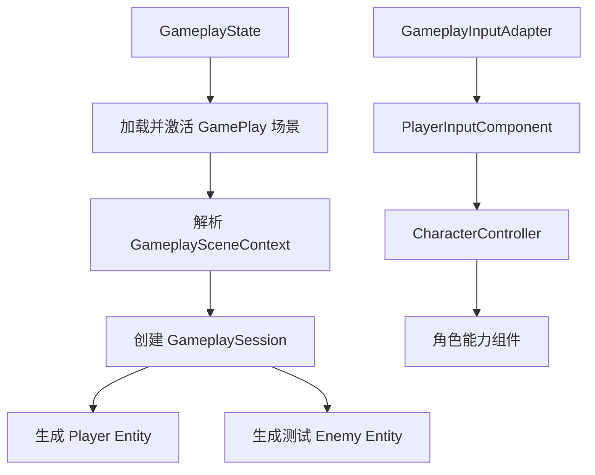
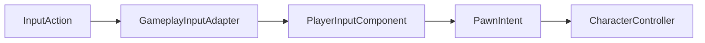
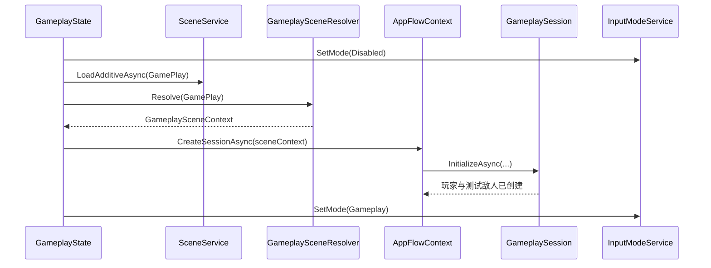

# 第三部分：Gameplay 场景接入与输入驱动计划

> 状态：运行时代码、配置、Prefab 与灰盒场景已生成；Unity 批处理编译通过，等待 Play Mode 手动体验验收。
>
> 本阶段目标不是完成武器和擦弹规则，而是把第二部分的纯逻辑框架接入真实 Gameplay 场景，使玩家、测试敌人和输入意图能够随一局游戏正确创建、更新和释放。

## 1. 阶段目标

第三部分需要打通以下运行链路：



完成后应达到：

- 点击开始游戏后进入灰盒战场。
- Session 初始化时生成玩家和至少一个测试敌人。
- 测试敌人通过玩家 `EntityId` 追击并进入攻击状态。
- 鼠标和键盘输入能够写入 `PlayerInputComponent`。
- `CharacterController` 能消费瞄准、开火、换弹、切枪和擦弹意图。
- 暂停、返回菜单、重新开始不会残留输入回调和旧 Entity。

## 2. 本阶段边界

### 2.1 本阶段实现

- Gameplay 场景层级约定。
- 纯 C# 场景引用解析。
- Gameplay 内容配置 Asset。
- Session 初始化参数调整。
- 玩家和测试敌人的首次生成。
- Input Action Map 整理。
- Input System 到 `PlayerInputComponent` 的适配。
- Pause 输入到 AppFlow 的连接。
- 初始化失败回滚和重复进入验证。

### 2.2 本阶段不实现

- 真正的武器开火、射速、弹药和换弹过程。
- 子弹生成、弹道和伤害命中。
- 开火后坐力。
- 擦弹判定、充能和慢动作。
- 正式波次生成。
- 掉落物、奖励和结算 UI。

本阶段按下 Fire 后，只要求 `WeaponUseComponent` 正确收到意图并触发现有的 `FireRequested` 接入口。

## 3. 设计约束

- 继续由 `GameEntry` 作为唯一 Gameplay Mono 更新入口。
- 场景允许使用不含 `Update` 的被动 MonoBehaviour 保存序列化引用；当前只有 `GameplaySceneBindings` 和 `SceneEntityAuthoring`。
- Player、Enemy、Input、SceneContext 的运行逻辑仍为普通 C# 对象。
- `GameplaySceneContext`、输入适配器和 Session 都是普通 C# 对象。
- Entity Prefab 只需要 Unity 内置组件，例如 Transform、SpriteRenderer、Rigidbody2D、Collider2D。
- 场景对象不写入 ScriptableObject；配置 Asset 只保存 Prefab 和数值。
- 不使用 `GameObject.Find` 在每帧查找对象，只在 Session 初始化时解析一次场景。
- 场景、配置或 Action 缺失时立即抛出带具体名称的异常，不静默降级。

## 4. 当前问题

### 4.1 Input Action Map 名称不一致

当前配置实际为：

```text
GameFoundationConfig._gameplayActionMap = Player
Res/Config/Input.inputactions 中的 Map = Battle
```

`GameFoundationConfig.asset` 引用的是 `Res/Config/Input.inputactions`，因此进入 Gameplay 并切换输入模式时会找不到 `Player` Map。

第三部分统一为：

```text
Gameplay Action Map = Gameplay
UI Action Map       = UI
```

### 4.2 当前 Action 与玩法文档不一致

现有 `Battle` Map 包含 `Shot`、`Dodge` 和 `Move`。正式玩法约定为：

- `Shot` 改为 `Fire`。
- `Dodge` 改为 `Graze`。
- 删除玩家 WASD `Move`，玩家只通过射击后坐力位移。
- 补充切枪、快速换枪和暂停 Action。

### 4.3 Session 尚未绑定场景内容

当前 `GameplaySession.InitializeAsync()` 只创建 World、Spawner、Run 和 FactHub，没有：

- Gameplay 场景引用。
- 玩家 Prefab。
- 玩家出生点。
- 测试敌人 Prefab 与出生点。
- 输入适配器。

第三部分负责补齐这些依赖，但不把场景解析职责塞进 Entity 或 GameplayWorld。

## 5. 场景层级约定

`GamePlay.unity` 使用简单、固定、可读的层级：

```text
GameplayRoot
├── WorldRoot
├── PresentationRoot
├── SpawnPoints
│   ├── PlayerSpawn
│   └── EnemySpawns
│       ├── EnemySpawn_01
│       └── EnemySpawn_02（可选）
├── DropRoot
├── ArenaBounds
└── GameplayCamera
```

节点职责：

| 节点 | 类型/要求 | 用途 |
| --- | --- | --- |
| `GameplayRoot` | 唯一根节点 | 场景解析入口 |
| `WorldRoot` | Transform | 玩家、敌人、子弹和墙体的父节点 |
| `PresentationRoot` | Transform | 后续特效和场景表现父节点 |
| `PlayerSpawn` | Transform，唯一 | 玩家出生位置与朝向 |
| `EnemySpawns` | Transform | 测试敌人和后续波次出生点容器 |
| `DropRoot` | Transform | 后续掉落物父节点 |
| `ArenaBounds` | BoxCollider2D | 战场合法范围 |
| `GameplayCamera` | Camera | 鼠标屏幕坐标转世界瞄准方向 |

`GameplayRoot` 挂载唯一的 `GameplaySceneBindings`，集中序列化以上引用。Resolver 只在 Session 初始化时扫描一次该组件，不依赖节点名称查找；层级名称仅用于编辑器可读性。

## 6. GameplaySceneContext

新增纯 C# `GameplaySceneContext`，只保存已经解析好的引用：

```csharp
public sealed class GameplaySceneContext
{
    public Scene Scene { get; }
    public Transform WorldRoot { get; }
    public Transform PresentationRoot { get; }
    public Transform PlayerSpawn { get; }
    public IReadOnlyList<Transform> EnemySpawns { get; }
    public Transform DropRoot { get; }
    public BoxCollider2D ArenaBounds { get; }
    public Camera GameplayCamera { get; }
}
```

职责边界：

- 只保存引用，不负责生成 Entity。
- 不负责每帧查找或刷新节点。
- 不持有 GameplayRun 状态。
- 不主动销毁场景对象，场景生命周期仍由 `SceneService` 管理。

## 7. GameplaySceneResolver

新增纯 C# `GameplaySceneResolver`：

```csharp
GameplaySceneContext Resolve(SceneId sceneId)
```

解析流程：

1. 通过 `SceneManager.GetSceneByName(sceneId.Value)` 获取已加载场景。
2. 验证场景有效且已经加载。
3. 从场景 Root GameObjects 中扫描 `GameplaySceneBindings`。
4. 校验该场景中恰好存在一个 Bindings。
5. 由 Bindings 校验 PlayerSpawn、至少一个 EnemySpawn、Camera、ArenaBounds 和所有引用均属于当前场景。
6. 创建不可变的 `GameplaySceneContext`。

不扩展 `ISceneService` 去承载 Gameplay 场景结构，避免 Foundation 层知道具体游戏节点。

## 8. GameplayContentConfig

新增 `ScriptableObject`：

```csharp
[CreateAssetMenu(
    fileName = "GameplayContentConfig",
    menuName = "Shot Game/Gameplay Content Config")]
public sealed class GameplayContentConfig : ScriptableObject
{
    GameObject PlayerPrefab;
    GameObject TestEnemyPrefab;
    bool SpawnTestEnemy;
    int TestEnemyCount;
    float TestEnemyAttackRange;
}
```

建议首版字段：

| 字段 | 建议默认值 | 说明 |
| --- | ---: | --- |
| PlayerPrefab | 必填 | 玩家 Entity 的 Unity 表现对象 |
| TestEnemyPrefab | 必填 | 第三部分测试敌人 |
| SpawnTestEnemy | true | 是否在初始化时生成测试敌人 |
| TestEnemyCount | 1 | 不能超过有效出生点数量 |
| TestEnemyAttackRange | 5 | 传给 `AIComponent` |

Asset 建议创建在：

```text
Assets/Res/Config/GameplayContentConfig.asset
```

`GameEntry` 作为 Composition Root 持有该配置引用，再传给 GameAppFlow 和 Session。Gameplay 场景 ID 由 `GameplayState` 自己声明，不再通过 `GameAppConfig` 配置。

## 9. Session 初始化调整

### 9.1 新增依赖

Session 需要得到：

```text
IGameTimeService
GameplayContentConfig
GameplaySceneContext
GameplayInputAdapter
```

建议初始化入口调整为：

```csharp
Task InitializeAsync(
    GameplaySceneContext sceneContext,
    GameplayContentConfig contentConfig,
    GameplayInputAdapter input)
```

也可以由构造函数接收稳定依赖、`InitializeAsync` 接收场景 Context。最终保持一种方式即可，不同时保留多个模糊入口。

### 9.2 新初始化顺序

```text
创建 FactHub
  → 创建 World
  → 创建 Spawner
  → 创建 Run
  → SpawnPlayer
  → 保存 PlayerEntityId
  → 绑定 GameplayInputAdapter
  → SpawnTestEnemy(PlayerEntityId)
  → Run.Start
```

`Run.Start()` 放在实体和输入成功创建之后，避免初始化失败时已经开始倒计时。

### 9.3 Session 新增状态

```csharp
EntityId PlayerEntityId { get; }
GameplaySceneContext SceneContext { get; }
```

Session 不长期保存 `CharacterEntity Player`。需要玩家对象时，通过：

```csharp
World.TryGetEntity(PlayerEntityId, out var player)
```

### 9.4 释放顺序

```text
解除输入绑定
  → Dispose GameplayRun
  → Dispose EntitySpawner
  → Dispose GameplayWorld
  → Dispose GameplayFactHub
  → 清空 SceneContext 和 PlayerEntityId
```

输入必须最先解除，避免 Entity 已释放后仍收到 Input Action 回调。

## 10. Input Action 方案

正式 Map 名称：`Gameplay`。

| Action | 类型 | 默认输入 | 写入目标 |
| --- | --- | --- | --- |
| `Aim` | Value/Vector2 | Pointer Position | `SetAimDirection` |
| `Fire` | Button | 鼠标左键 | `SetFire` |
| `Graze` | Button | 鼠标右键 | `PressGraze` |
| `Reload` | Button | R | `PressReload` |
| `SwitchWeaponStep` | Value/Axis | 鼠标滚轮 | `StepWeapon` |
| `WeaponSlot1` | Button | 1 | `SelectWeaponSlot(1)` |
| `WeaponSlot2` | Button | 2 | `SelectWeaponSlot(2)` |
| `WeaponSlot3` | Button | 3 | `SelectWeaponSlot(3)` |
| `QuickSwap` | Button | Q | `PressQuickSwap` |
| `Pause` | Button | Escape | AppFlow Pause/Resume |

当前版本不保留玩家 `Move` Action。AI 的 `MoveDirection` 仍由 `AIComponent` 产生。

## 11. GameplayInputAdapter

`GameplayInputAdapter` 是普通 C# 类，负责 Input System 与 Gameplay 意图之间的唯一适配。

建议职责：

- 初始化时缓存 `Gameplay` Map 及所有必需 Action。
- Bind 时接收当前玩家的 `PlayerInputComponent`、Transform 和 Gameplay Camera。
- 注册按钮 Action 的 performed/canceled 回调。
- 每帧读取 Pointer Position，转换为世界坐标和瞄准方向。
- 提供一次性的 Pause 请求。
- Unbind/Dispose 时完整解除回调。



输入适配器不负责：

- 直接移动 Transform。
- 直接调用 WeaponUse 或 Graze。
- 切换 AppFlow 状态以外的业务行为。
- 保存玩家生命、弹药或装备状态。

### 11.1 瞄准转换

键鼠首版流程：

```text
Aim Action 读取屏幕坐标
  → GameplayCamera.ScreenToWorldPoint
  → 世界点 - 玩家世界坐标
  → Vector2.normalized
  → PlayerInputComponent.SetAimDirection
```

如果鼠标正好位于玩家中心，保留上一帧有效瞄准方向，避免产生零向量导致武器方向跳变。

手柄右摇杆与辅助瞄准不在本阶段实现，但 Action 层保留后续扩展空间。

### 11.2 Fire 状态

- `performed` 调用 `SetFire(true)`。
- `canceled` 调用 `SetFire(false)`。
- `PlayerInputComponent` 自己生成 Pressed、Held、Released 三种状态。

Graze、Reload、槽位和 QuickSwap 只在 performed 时产生单帧意图。

## 12. InputModeService 与装配调整

`InputModeService` 已持有运行时克隆的 `InputActionAsset`，但 `IInputModeService` 不暴露 Input System 类型。Foundation Core 不应为 Gameplay 输入细节增加依赖。

建议装配方式：

1. `GameEntry` 创建 `InputModeService`。
2. `_appServices.InitializeAsync()` 完成后，`InputModeService.Actions` 已可用。
3. `GameEntry` 使用运行时 Actions 创建 `GameplayInputAdapter`。
4. 再创建 `GameAppFlow` 并传入 Gameplay 输入适配器。
5. `GameplayState` 加载场景后解析 SceneContext，并创建 Session。

因此 `GameEntry.Start` 的高层顺序调整为：

```text
ComposeServices
  → InitializeServicesAsync
  → ComposeGameFlow
  → GameAppFlow.StartAsync
```

不修改 `IInputModeService`，也不让 GameFlow 直接依赖具体的 `InputModeService`。

## 13. Pause 输入边界

Pause 是应用流程意图，不属于角色 `PawnIntent`，因此不把 `PausePressed` 加进 `PawnIntent`。

建议：

- `GameplayInputAdapter` 保存一次性 `PauseRequested` 标记。
- `GameAppFlow.Tick` 在 Session Tick 前后消费该标记。
- Gameplay 状态收到请求后切换到 `AppState.Pause`。
- Pause 状态收到同一 Action 时恢复到 `AppState.Gameplay`。
- 状态切换期间忽略重复 Pause 请求。

如果 Pause 页面暂未配置，可以先验证时间和 Action Map 切换，再接页面表现。

## 14. GameplayState 流程调整

首次进入 Gameplay：



失败回滚维持现有原则：

```text
停止输入
  → 解除 Input 回调
  → Dispose Session
  → 卸载 Gameplay 场景
  → 保持非 Gameplay 输入状态
```

Pause 恢复时不重新解析场景、不重新绑定玩家、不创建新 Session，只恢复 Gameplay Action Map 和时间。

## 15. Prefab 最低要求

### 15.1 Player Prefab

```text
Player
├── SpriteRenderer
├── Rigidbody2D
└── Collider2D
```

建议 Rigidbody2D：

- Body Type：Dynamic。
- Gravity Scale：0。
- Freeze Rotation Z：开启。
- Collision Detection：Continuous 或按测试结果决定。

### 15.2 TestEnemy Prefab

```text
TestEnemy
├── SpriteRenderer
├── Rigidbody2D
└── Collider2D
```

敌人暂时只需要显示追击和攻击状态切换，不要求本阶段产生弹幕。

Prefab 不挂 PlayerEntity、AIComponent 或 CharacterController Mono 脚本，这些能力由 `EntitySpawner` 在普通 C# Entity 上装配。

## 16. 计划文件结构

```text
Gameplay/
├── Config/
│   └── GameplayContentConfig.cs
├── Scene/
│   ├── GameplaySceneBindings.cs
│   ├── GameplaySceneContext.cs
│   ├── GameplaySceneResolver.cs
│   └── SceneEntityAuthoring.cs
└── Intent/
    └── GameplayInputAdapter.cs

GameFlow/
├── AppFlowContext.cs                 调整 Session 创建参数
├── GameAppFlow.cs                    接收/消费 Pause 请求
└── States/GameplayState.cs           场景解析后创建 Session

Entry/
└── GameEntry.cs                      调整服务与 Flow 装配顺序

Res/Config/
├── Input.inputactions                统一 Gameplay Actions
└── GameplayContentConfig.asset

Scenes/
└── GamePlay.unity                    建立约定层级和出生点

Editor/
└── ThirdPhaseSetup.cs                一键生成配置、Prefab、UI、Layer 和场景引用
```

根据最终装配位置，可能需要给 `ShotGame.Gameplay.asmdef` 增加 `Unity.InputSystem` 引用。不要让 `GameFoundation.Core` 引用 Input System。

## 17. 施工顺序

### 阶段 A：修正输入配置

- 将 `Battle` Map 重命名为 `Gameplay`。
- 将 `GameFoundationConfig.asset` 的 Gameplay Map 改为 `Gameplay`。
- 按正式名称整理全部 Action 和默认绑定。
- 删除玩家 Move Action。
- 验证 UI 与 Gameplay Map 可以正常切换。

验收：开始游戏不再因找不到 Action Map 抛异常。

### 阶段 B：场景引用解析

- 建立 GamePlay 灰盒场景层级。
- 实现 `GameplaySceneContext`。
- 实现 `GameplaySceneResolver`。
- 为缺失、重复或类型错误节点提供明确异常。

验收：场景加载后能一次性得到完整、有效的 Context。

### 阶段 C：内容配置与实体生成

- 创建 `GameplayContentConfig`。
- 创建 Player/TestEnemy 灰盒 Prefab。
- GameEntry 持有并验证配置。
- Session 初始化时生成玩家。
- 保存 `PlayerEntityId`。
- 测试敌人使用玩家 ID 作为 AI 目标。

验收：进入场景后玩家和敌人正确生成，敌人可以追击玩家。

### 阶段 D：输入适配

- 实现 `GameplayInputAdapter`。
- 绑定玩家 InputComponent、Transform 和 GameplayCamera。
- 接入 Aim、Fire、Graze、Reload、Switch 和 QuickSwap。
- 明确 Bind、Unbind 和 Dispose。

验收：所有输入都能生成正确的 `PawnIntent`，没有 Gameplay 类直接读取固定按键。

### 阶段 E：暂停与生命周期

- 接入 Pause Action。
- 验证 Gameplay/Pause Action Map 切换。
- 验证返回菜单时先解除输入再销毁 Entity。
- 验证连续开始两局没有重复回调、旧目标 ID 或残留 GameObject。

验收：暂停、恢复、退出和重开均稳定。

## 18. 验收清单

- [x] `GamePlay` 场景存在唯一合法 `GameplayRoot`。
- [x] PlayerSpawn、EnemySpawns、Camera、ArenaBounds 已配置，并有初始化校验。
- [x] Gameplay 配置 Asset 正确引用玩家和测试敌人 Prefab。
- [ ] 点击开始后只创建一个 GameplaySession。
- [x] Session 代码保证每局只创建一个玩家并保存 `PlayerEntityId`。
- [x] 测试敌人创建时接收当前局玩家 ID。
- [ ] 敌人可以在 Chase 与 Attack 间切换。
- [x] Action Map 名称统一为 Gameplay/UI。
- [x] Gameplay 不包含玩家 WASD Move Action。
- [x] 输入适配器将鼠标屏幕位置转换为稳定瞄准方向。
- [x] Fire 通过 `PlayerInputComponent` 区分 Pressed、Held、Released。
- [x] Graze、Reload、切枪和 QuickSwap 按单帧意图接入。
- [ ] Pause 可以进入暂停并恢复同一 Session。
- [x] 返回菜单销毁 Session 时先解除本局 Input 绑定。
- [x] Session 释放时清空旧玩家引用和 EntityId。
- [x] 初始化任一步失败都会回收 Session 并卸载场景。
- [x] 运行时与 Editor 程序集编译 0 Error。
- [ ] Unity Play Mode 实际运行时 Console 无异常。

## 20. Unity 自动搭建入口

首次编译后，如果不存在完成标记，编辑器会自动执行第三阶段搭建。也可以随时手动执行：

```text
Unity 菜单 → Shot Game → Setup Third Phase
```

该命令会创建或更新：

- Player 与 TestEnemy 灰盒 Prefab。
- `GameplayContentConfig.asset` 及 LayerMask。
- Gameplay HUD 与 Pause UI Prefab。
- `GamePlay.unity` 的战场层级、出生点、相机、边界、墙体和 Bindings。
- Entry 场景中的 GameEntry 配置与 UI 页面注册。
- Gameplay/UI Action Map 名称、资源目录和 Build Settings。

完成标记仅用于防止每次脚本重载都覆盖场景；手动菜单命令不受标记限制。

## 19. 第三部分完成后的状态

第三部分结束时，游戏已经具备一个“可操控但尚未真正射击”的灰盒运行环境：

```text
主菜单
  → 进入 Gameplay
  → 创建玩家和测试敌人
  → 玩家能够瞄准并发出各种角色意图
  → AI 能追击并进入攻击状态
  → 可以暂停、恢复、退出和重开
```

第四部分将在这条链路上实现真正的武器运行时、开火、ShotPackage、弹丸/射线命中以及后坐力，形成第一个可操作的射击闭环。
