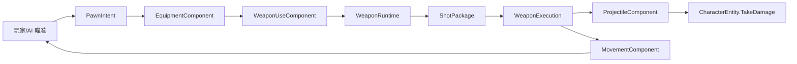

# 第四部分：武器、射击与后坐力战斗闭环

> 状态：已实现。
>
> 第四阶段已经完成“瞄准 → 武器判定 → ShotPackage → 弹丸 → 命中伤害 → 后坐移动 → 换弹/切枪”的第一条战斗闭环。运行时、Presentation、GameFlow、Entry 和 Editor 程序集编译通过，0 Error、0 Warning；Play Mode 手感仍需人工验收。

## 1. 阶段完成结果

当前 GamePlay 灰盒场景已经具备：

- 玩家散弹枪和冲锋枪。
- 测试敌人的低频敌弹武器。
- 半自动和全自动开火。
- 每把武器独立的弹匣、备弹、冷却和换弹状态。
- 数字键、滚轮和 Q 快速换枪。
- 一次扳机对应一个 `ShotPackage`。
- 多弹丸散布、弹丸寿命、命中和墙体阻挡。
- 玩家与 AI 共用武器、弹丸和伤害执行层。
- 射击产生反方向持续后坐速度。
- HUD 显示武器、弹药、换弹状态和玩家生命。



## 2. 实现边界

### 2.1 已实现

- `WeaponConfig` 武器 Asset。
- `WeaponRuntime` 弹药与状态机。
- `EquipmentComponent` 武器槽管理。
- `WeaponUseComponent` 意图到武器运行时的入口。
- `ShotPackage` 单次扳机结算数据。
- `WeaponExecution` 弹丸与后坐执行。
- `ProjectileComponent` 弹丸运行逻辑。
- `ProjectileSpawnData` 弹丸生成参数。
- 持续后坐速度、最大速度和恢复速度。
- 阵营过滤、伤害、死亡和延迟 Despawn。
- `ShotFiredFact`、`WeaponStateChangedFact`。
- 最小 Gameplay HUD。
- 三套武器 Asset、三套弹丸 Prefab。
- `FourthPhaseSetup` 自动配置工具。

### 2.2 留给后续阶段

- 擦弹候选、Perfect Window 和伤害拦截。
- 擦弹充能和强化 ShotPackage。
- 奖励子弹时间。
- 轨道枪蓄力与命中扫描。
- 穿透、爆炸、反弹和弹幕 Pattern。
- 正式波次、Boss、掉落和奖励构筑。
- 对象池和复杂表现。

第四阶段只实现普通 Projectile 路线，没有为未使用的射线、榴弹和复杂 FireMode 提前建立继承体系。

## 3. 设计约束

- Input 和 AI 只产生 `PawnIntent`，不直接修改弹药或生成弹丸。
- `CharacterController` 只协调角色能力，不保存武器状态。
- 武器、弹丸和后坐逻辑都是普通 C# 对象，由 World Tick 驱动。
- 弹丸 Prefab 不挂 Gameplay MonoBehaviour。
- 目标身份和伤害来源使用 `EntityId`。
- 碰撞对象通过 `ColliderEntityMap` 映射回 Entity。
- 弹药只属于 `WeaponRuntime`。
- 生命只属于 `AttributeComponent`，受伤入口仍是 `CharacterEntity.TakeDamage`。
- 主动移动和后坐速度只属于 `MovementComponent`。
- 配置 Asset 只作为只读模板，不保存局内状态。
- Demo 采用直接调用与少量强类型 Fact，不引入 DI 容器和复杂消息层。

## 4. CharacterController 执行顺序

第四阶段将切枪放在开火之前：

```text
读取 PawnIntent
  → Movement.SetMoveDirection
  → Equipment.ApplyIntent
  → WeaponUse.ApplyIntent
  → Graze.ApplyIntent
  → IntentSource.ClearFrameIntent
```

因此同一帧发生切枪与开火时，新武器处理本帧开火，行为固定且可预测。

玩家没有 Move Action，`MoveDirection` 恒为零；AI 仍使用它追击玩家。

## 5. WeaponConfig

`WeaponConfig` 是一把武器的静态只读模板。

| 分组 | 字段 | 作用 |
| --- | --- | --- |
| 标识 | `DisplayName` | HUD 名称 |
| 输入 | `FireMode` | 半自动或全自动 |
| 弹药 | `MagazineSize` | 弹匣容量 |
| 弹药 | `InitialReserveAmmo` | 初始备弹 |
| 节奏 | `FireInterval` | 有效 ShotPackage 间隔 |
| 节奏 | `ReloadDuration` | 完整换弹时间 |
| 弹丸 | `ProjectilePrefab` | 弹丸 Unity 表现 |
| 弹丸 | `ProjectileCount` | 一包生成数量 |
| 弹丸 | `SpreadAngle` | 总散布角度 |
| 弹丸 | `Damage` | 每颗弹丸基础伤害 |
| 弹丸 | `ProjectileSpeed` | 移动速度 |
| 弹丸 | `ProjectileLifetime` | 最大寿命 |
| 弹丸 | `ProjectileRadius` | CircleCast 半径 |
| 后坐 | `RecoilImpulse` | 一包产生的反向冲量 |
| 出膛 | `MuzzleOffset` | 枪口相对角色中心距离 |

`Validate()` 会在 Session 创建实体前检查名称、弹药、时间、弹丸 Prefab、Collider2D 以及所有数值范围。

## 6. WeaponRuntime

每个武器槽持有独立 `WeaponRuntime`：

```text
Config
State: Ready / Cooldown / Reloading
MagazineAmmo
ReserveAmmo
CooldownRemaining
ReloadRemaining
```

### 6.1 开火规则

- 半自动只响应 `FirePressed`。
- 全自动在 `FireHeld` 时持续尝试开火。
- Cooldown 或 Reloading 时不生成 ShotPackage。
- 弹匣为空时请求开火会尝试自动换弹。
- 无效 AimDirection 不扣弹。
- 成功开火后扣除一发并进入 Cooldown。
- 每帧最多生成一个 ShotPackage，不在低帧率时补发多包。

### 6.2 换弹规则

- 弹匣未满且备弹大于零时允许主动换弹。
- 换弹期间不能开火。
- 完成后只从备弹补足缺口，不丢弃弹匣余弹。
- 备弹不足时补入全部剩余备弹。
- 切换武器会取消旧武器的换弹过程。
- 每把枪独立保存弹匣、备弹和冷却。
- 所有时间使用 Gameplay `deltaTime`，暂停时不推进。

## 7. EquipmentComponent

`EquipmentComponent` 管理 1 至 3 个 `WeaponRuntime`，当前配置使用两个玩家槽位和一个敌人槽位。

```text
Weapons
CurrentWeaponSlot
PreviousWeaponSlot
CurrentWeapon
```

切换规则：

- 外部槽位使用 1-based 编号。
- 数字键选择不存在的槽位时忽略。
- 滚轮只在已有武器间循环。
- Q 在当前武器和上一把有效武器间切换。
- 选择当前槽位不重复切换。
- 成功切换时取消旧枪 Reloading，并更新 Previous。

未加入背包、通用物品栏或武器数据库。

## 8. WeaponUseComponent

`WeaponUseComponent` 替换了第三阶段的 Fire/Reload 占位事件，直接完成角色武器驱动。

职责：

- 保存最近一次有效 AimDirection。
- Tick 该角色所有 WeaponRuntime。
- 读取当前武器。
- 处理 FirePressed、FireHeld 和 ReloadPressed。
- 调用 WeaponRuntime 创建 ShotPackage。
- 成功后调用 `WeaponExecution.Execute`。
- 在武器切换、扣弹、换弹开始和完成时发布 `WeaponStateChangedFact`。

角色创建时由 `EntitySpawner` 注入 Equipment、Attribute、WeaponExecution、FactHub、TargetMask 和 WallMask。

## 9. ShotPackage

`ShotPackage` 是一次有效扳机行为的不可变快照：

```text
SourceId / SourceTeam
Origin / Direction
ProjectilePrefab
ProjectileCount / SpreadAngle
Damage
ProjectileSpeed / ProjectileLifetime / ProjectileRadius
RecoilImpulse
TargetMask / WallMask
```

关键规则：

- 一次散弹齐射也只对应一个 ShotPackage。
- 一包只扣一发弹药、产生一次后坐。
- 多颗弹丸共享该包的伤害和射击参数。
- ShotPackage 不持有 WeaponRuntime。
- 没有无实际查找需求的 ShotId。
- 多弹丸在总散布角内等角度分布，当前没有随机散布。

这个边界为第五阶段提供了明确强化入口：擦弹充能修改一次 ShotPackage，而不是逐颗弹丸消费 Buff。

## 10. WeaponExecution

一次执行步骤：

```text
ShotPackage
  → 计算每颗弹丸角度
  → EntitySpawner.SpawnProjectile
  → MovementComponent.AddImpulse(-Direction * RecoilImpulse)
  → Publish ShotFiredFact
```

散弹的五颗弹丸只执行一次 AddImpulse 和一次 ShotFiredFact。

## 11. ProjectileComponent

弹丸是普通 Entity 加一个 `ProjectileComponent`，组件同时负责：

- SourceId、SourceTeam 和 DamagePayload。
- 固定方向与速度移动。
- 生命周期倒计时。
- 目标与墙体查询。
- 阵营过滤。
- DamageRequest。
- 命中或到期后的 Despawn。

### 11.1 移动和命中

每次 FixedTick：

```text
start = 当前坐标
distance = Speed * fixedDeltaTime
  → CircleCastAll(start, Radius, Direction, distance, TargetMask | WallMask)
  → 从合法命中中选择最近对象
  → 墙体：销毁弹丸
  → IDamageable：发送 DamageRequest 后销毁弹丸
  → 无命中：移动到终点
```

主动 CircleCast 避免完全依赖 `OnTriggerEnter2D` 造成高速穿透，也不需要给每颗弹丸挂业务 Mono。

### 11.2 过滤规则

- 忽略自身 Entity。
- 忽略发射者 Entity。
- 忽略已死亡对象。
- 忽略与 SourceTeam 相同的对象。
- 只接受 Wall 或 `IDamageable`。
- 当前弹丸不穿透、不反弹。

World 遍历期间的 Despawn 使用既有 PendingRemove，保证安全延迟移除。

## 12. 伤害与死亡

弹丸构造：

```csharp
new DamageRequest(SourceId, SourceTeam, DamagePayload)
```

`CharacterEntity.TakeDamage` 继续负责：

- 无效伤害过滤。
- 同阵营过滤。
- DamageReduction。
- 修改 AttributeComponent.Health。
- 发布 CharacterDamagedFact。
- 生命归零时标记 AI Dead、Kill Entity 并发布 CharacterDiedFact。

没有新增 DamageReceiverComponent 或 HealthComponent。

## 13. 后坐移动

`MovementComponent` 现在同时拥有：

```text
MoveDirection
RecoilVelocity
MaxRecoilSpeed
RecoilRecovery
```

开火：

```text
RecoilVelocity += -AimDirection * RecoilImpulse
RecoilVelocity = ClampMagnitude(RecoilVelocity, MaxRecoilSpeed)
```

FixedTick：

```text
MoveVelocity = MoveDirection * MoveSpeed
FinalVelocity = MoveVelocity + RecoilVelocity
MovePosition(Current + FinalVelocity * fixedDeltaTime)
RecoilVelocity = MoveTowards(RecoilVelocity, 0, RecoilRecovery * fixedDeltaTime)
```

当前玩家参数：

| 参数 | 值 |
| --- | ---: |
| MaxRecoilSpeed | 12 |
| RecoilRecovery | 8 |

`IsRecoilMoving` 以 RecoilVelocity 是否超过小阈值判断，将作为第五阶段“动势擦弹”的唯一资格来源。

玩家主动 MoveDirection 恒为零，因此射击仍是唯一推进来源。测试敌人武器 RecoilImpulse 为零，不干扰追击 AI。

## 14. 玩家与 AI 共用链路

玩家：

```text
GameplayInputAdapter
  → PlayerInputComponent
  → CharacterController
  → Equipment / WeaponUse
```

AI：

```text
AIComponent(TargetEntityId)
  → PawnIntent(AimDirection, FireHeld)
  → CharacterController
  → Equipment / WeaponUse
```

两者从 Controller 开始共用相同 WeaponRuntime、WeaponExecution、ProjectileComponent 和 DamageRequest，仅武器配置与目标 LayerMask 不同。

## 15. GameplayContentConfig

第四阶段新增：

```text
PlayerInitialWeapons
TestEnemyWeapon
PlayerMaxRecoilSpeed
PlayerRecoilRecovery
```

当前引用：

```text
玩家槽 1 → PlayerShotgun.asset
玩家槽 2 → PlayerSMG.asset
测试敌人 → TestEnemyGun.asset
PlayerTargetMask → Enemy
EnemyTargetMask → Player
WallMask → Wall
```

Config 会检查玩家武器数量、空引用、重复武器、测试敌人武器和后坐参数。

## 16. 当前武器参数

| 参数 | 散弹枪 | 冲锋枪 | 测试敌弹 |
| --- | ---: | ---: | ---: |
| FireMode | SemiAutomatic | Automatic | Automatic |
| MagazineSize | 6 | 24 | 8 |
| ReserveAmmo | 48 | 144 | 999 |
| FireInterval | 0.45 | 0.1 | 0.8 |
| ReloadDuration | 1.2 | 1.0 | 1.5 |
| ProjectileCount | 5 | 1 | 1 |
| SpreadAngle | 24° | 4° | 0° |
| Damage | 8 | 5 | 10 |
| ProjectileSpeed | 16 | 20 | 6 |
| ProjectileLifetime | 1.2 | 1.1 | 4.0 |
| ProjectileRadius | 0.13 | 0.09 | 0.13 |
| RecoilImpulse | 7 | 1.2 | 0 |
| MuzzleOffset | 0.55 | 0.5 | 0.5 |

散弹枪验证单次大幅位移，冲锋枪验证连续小冲量修正，敌弹以低速、低频和高可读性为主。

## 17. HUD 与 Fact

新增 Fact：

| Fact | 内容 | 用途 |
| --- | --- | --- |
| `ShotFiredFact` | SourceId、Origin、Direction、RecoilImpulse | 后续枪口、音效、镜头反馈入口 |
| `WeaponStateChangedFact` | OwnerId、槽位、名称、状态、弹匣、备弹 | HUD 刷新 |

`GameplayScreen` 打开时接收 `GameplaySession`，读取玩家初始状态并订阅：

- WeaponStateChangedFact。
- CharacterDamagedFact。

关闭页面时解除订阅。当前 HUD 显示武器名、弹匣/备弹、换弹状态和生命。

## 18. Prefab 与资源

```text
Assets/Res/Gameplay/
├── Weapon/
│   ├── PlayerShotgun.asset
│   ├── PlayerSMG.asset
│   └── TestEnemyGun.asset
└── Projectile/
    ├── PlayerShotgunProjectile.prefab
    ├── PlayerSMGProjectile.prefab
    └── EnemyProjectile.prefab
```

弹丸 Prefab 只包含：

```text
Transform
SpriteRenderer
CircleCollider2D（Trigger）
```

Layer 分别为 PlayerProjectile 和 EnemyProjectile，移动由纯 C# ProjectileComponent 驱动。

### 18.1 Prefab FileID 修复记录

首次手工生成弹丸 YAML 时，曾错误使用 Unity 保留的 `fileID 100100000` 作为根 GameObject，Unity 因此将三个 Prefab 判定为损坏。

现已完成：

- 三个 Prefab 的 GameObject、Transform、SpriteRenderer、Collider2D 使用各自独立的普通本地 FileID。
- 三个 WeaponConfig 内引用的 Prefab 根 FileID 同步更新。
- 工程内不再包含 `fileID 100100000`。
- 本地引用完整性和 Meta GUID 唯一性检查通过。

`FourthPhaseSetup` 使用 `PrefabUtility.SaveAsPrefabAsset` 生成资源，不会再手工指定保留 FileID。

## 19. EntitySpawner 装配

玩家：

```text
AttributeComponent
PlayerInputComponent
MovementComponent（玩家后坐参数）
EquipmentComponent（散弹枪、冲锋枪）
WeaponUseComponent（Enemy TargetMask）
GrazeComponent（第五阶段入口）
CharacterController
```

敌人：

```text
AttributeComponent
AIComponent(PlayerEntityId)
MovementComponent
EquipmentComponent（测试敌弹）
WeaponUseComponent（Player TargetMask）
CharacterController
```

弹丸：

```text
EntityCategory.Projectile
Team = SourceTeam
ProjectileComponent
```

动态对象由 Entity 拥有 GameObject；Session/World 释放时统一销毁。

## 20. 自动配置入口

```text
Unity → Shot Game → Setup Fourth Phase
```

该工具创建或更新：

- 三个弹丸 Prefab。
- 三个 WeaponConfig Asset。
- GameplayContentConfig 武器、LayerMask 和后坐参数。
- Gameplay HUD 文本与序列化引用。
- 第四阶段完成标记。

## 21. 主要文件定位

```text
Assets/Scripts/ShotGame/Gameplay/
├── Character/
│   ├── CharacterController.cs
│   ├── EquipmentComponent.cs
│   ├── MovementComponent.cs
│   └── WeaponUseComponent.cs
├── Config/GameplayContentConfig.cs
├── Projectile/
│   ├── ProjectileComponent.cs
│   └── ProjectileSpawnData.cs
├── Weapon/
│   ├── WeaponConfig.cs
│   ├── WeaponFireMode.cs
│   ├── WeaponState.cs
│   ├── WeaponRuntime.cs
│   ├── ShotPackage.cs
│   └── WeaponExecution.cs
├── Facts/Facts.cs
└── World/EntitySpawner.cs

Assets/Scripts/ShotGame/Presentation/UI/GameplayScreen.cs
Assets/Scripts/ShotGame/Editor/FourthPhaseSetup.cs
```

## 22. 验收状态

### 22.1 已通过静态与编译验证

- [x] WeaponConfig 和所有运行时类型已实现。
- [x] 玩家配置散弹枪与冲锋枪，敌人配置测试敌弹。
- [x] 玩家和 AI 共用武器、弹丸和伤害链路。
- [x] 半自动、全自动、冷却、主动/自动换弹已接入。
- [x] 切枪、滚轮和 QuickSwap 已接入。
- [x] ShotPackage 统一扣弹、多弹丸和后坐结算。
- [x] 弹丸 CircleCast、阵营过滤、墙体和伤害已接入。
- [x] 玩家只接受后坐推进，不存在输入移动入口。
- [x] `IsRecoilMoving` 已可供擦弹阶段查询。
- [x] HUD 数据和 Fact 订阅已接入。
- [x] 弹丸 Prefab FileID 与 WeaponConfig 引用已修复。
- [x] Runtime 与 Editor 程序集编译 0 Error、0 Warning。
- [x] Git 差异格式、Meta GUID 和资源引用检查通过。

### 22.2 仍需 Play Mode 人工验收

- [ ] 散弹枪点按只发射一包五颗弹丸。
- [ ] 冲锋枪按住连续开火。
- [ ] 两把武器的后坐节奏具有明显差异。
- [ ] 玩家弹只伤敌人，敌弹只伤玩家。
- [ ] 弹丸不明显穿过角色和墙体。
- [ ] 换弹、切枪打断和独立弹药状态符合预期。
- [ ] Pause/Resume 保留同一局状态。
- [ ] 返回菜单并重开无旧弹丸和状态残留。
- [ ] Unity Console 无异常。

## 23. 第四阶段最终流程

```text
进入 GamePlay
  → 创建玩家、敌人和各自 WeaponRuntime
  → 玩家/AI 产生 Aim 与 Fire 意图
  → Equipment 先处理切枪
  → WeaponRuntime 校验状态、弹药和冷却
  → 创建一个 ShotPackage 并扣除一发
  → WeaponExecution 生成一组弹丸
  → 玩家获得一次反向后坐冲量
  → Projectile CircleCast 命中墙体或角色
  → CharacterEntity 结算伤害与死亡
  → HUD 通过 Fact 刷新
```

第五阶段将在这条稳定链路上增加主动擦弹、动势资格、完美窗口、充能强化和奖励子弹时间。
