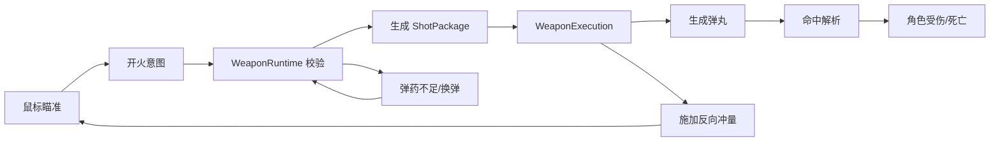
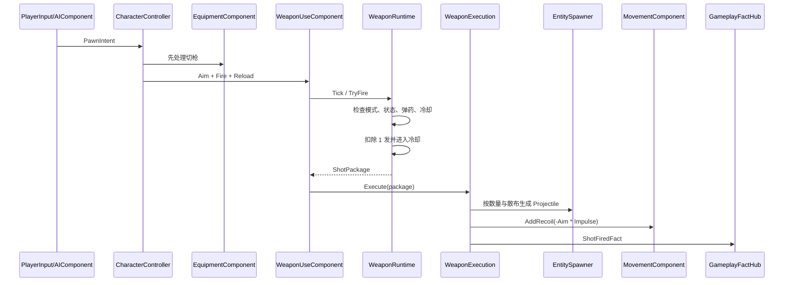
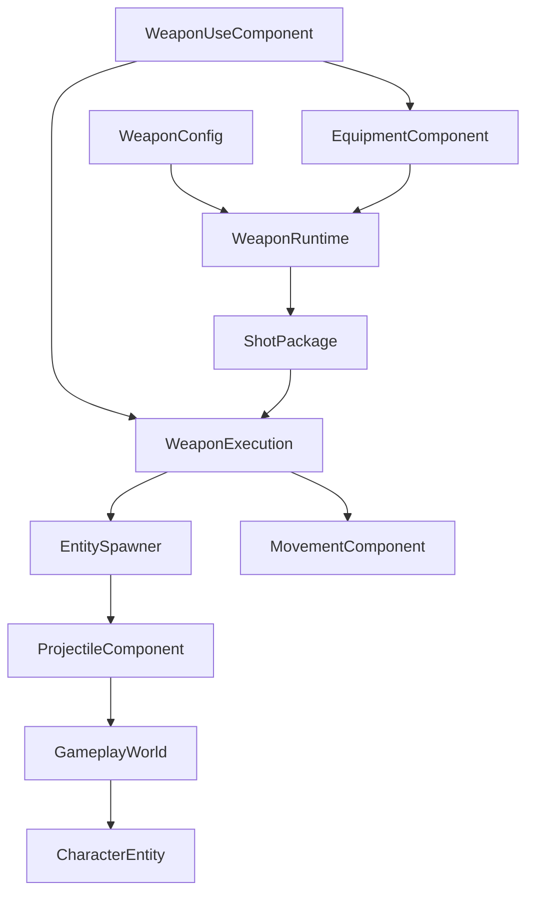

# 第四部分：武器、射击与后坐力战斗闭环计划

> 状态：已实现。运行时代码、武器 Asset、弹丸 Prefab、HUD 与自动配置工具均已落地，相关程序集编译 0 Error、0 Warning；Play Mode 手感与实际运行验收仍需人工完成。
>
> 本阶段依据《擦弹射击 Demo 核心玩法与完整流程》和前三阶段现有代码制定。目标是在当前场景、Entity、输入和 AI 基础上，完成“瞄准 → 开火 → 弹丸命中 → 伤害/死亡 → 反向后坐位移 → 换弹/切枪”的第一条可玩战斗闭环。

## 1. 阶段目标

第四阶段结束时，玩家应能在 `GamePlay` 灰盒场景中：

- 使用鼠标瞄准。
- 使用散弹枪或冲锋枪开火。
- 每次有效开火向瞄准反方向产生后坐位移。
- 用不同武器体验“大幅单次位移”和“连续小幅修正”两种移动语法。
- 消耗弹匣、主动换弹、空仓自动换弹。
- 使用数字键、滚轮和 Q 在两把武器间切换。
- 通过弹丸伤害并击杀测试敌人。
- 被测试敌人的弹丸命中并扣除生命。
- 在 HUD 看到当前武器、弹匣、备弹和换弹状态。

核心闭环：



## 2. 本阶段范围

### 2.1 本阶段实现

- 武器配置 Asset。
- 武器独立运行时状态。
- 半自动与全自动两种开火模式。
- `ShotPackage` 一次扳机结算单位。
- 散布和多弹丸生成。
- 纯 C# 弹丸移动、寿命、碰撞查询和伤害。
- 玩家弹丸与敌人弹丸的阵营过滤。
- 持续衰减的后坐速度、最大速度和墙体碰撞。
- 默认两个武器槽、直接切换、滚轮切换和快速换枪。
- 主动换弹、空仓自动换弹、切枪打断换弹。
- 玩家与测试敌人共用武器执行层。
- 最小 HUD 状态反馈。
- 第四阶段 Prefab、Asset 和场景配置生成工具。

### 2.2 本阶段暂不实现

- 右键擦弹判定、Perfect Window 和弹丸偏转。
- 擦弹充能、强化 ShotPackage 和子弹时间。
- 轨道枪的按住蓄力、松开开火和命中扫描。
- 榴弹、爆炸范围、穿透、反弹和持续危险区。
- 三连发、复杂射击序列和弹幕 Pattern。
- 正式波次、Boss、掉落物和奖励构筑。
- 完整枪械动画、音效、相机 Kick 和高级 VFX。
- 对象池；Demo 数量出现真实性能问题后再增加。

第四阶段只完成普通 Projectile 路线。射线武器等到轨道枪阶段再实现，避免为尚未使用的模式提前抽象。

## 3. 实现原则

- 保持 Entity Component 当前风格：组件封装一项完整能力，不拆成大量微型组件。
- 玩家与 AI 继续只产生 `PawnIntent`，不能直接生成弹丸或修改弹药。
- `CharacterController` 只协调 Equipment、WeaponUse、Movement 等能力，不保存武器状态。
- 武器、弹丸和后坐运行时均为普通 C# 类，由现有 World Tick 驱动。
- 不给每颗弹丸增加负责业务逻辑的 MonoBehaviour。
- 弹丸通过 Physics2D Cast 主动查询命中，再用 `ColliderEntityMap` 找到 Entity。
- 跨模块传递 Owner、Target、Source 时使用 `EntityId`。
- 每把武器的平衡参数使用 Asset，创建在 `Assets/Res` 下。
- 第一版使用直接方法调用和少量 Fact，不增加复杂命令层、工厂层或事件总线。
- 同一规则只保留一个真相来源：弹药属于 `WeaponRuntime`，生命属于 `AttributeComponent`，速度属于 `MovementComponent`。

## 4. 权威开火流程

一次有效开火严格按以下顺序执行：



关键规则：

- 无效开火不生成 ShotPackage，也不产生后坐力。
- 一次扣弹对应一个 `ShotPackage`，而不是对应一颗 Projectile。
- 散弹枪一次产生多颗弹丸，但只扣一发弹药、只产生一次后坐冲量。
- 同一帧既切枪又开火时，先完成切枪，再由新武器处理开火。
- 暂停时 Session 不 Tick，冷却、换弹、弹丸和后坐全部冻结。
- 后续擦弹强化只修改 ShotPackage，不直接改 WeaponConfig Asset。

## 5. 模块关系与职责边界



| 模块 | 职责 | 不负责 |
| --- | --- | --- |
| `WeaponConfig` | 一把武器的静态参数 | 当前弹药、冷却和换弹状态 |
| `WeaponRuntime` | 单把武器的弹药、冷却、换弹和触发判定 | 生成 GameObject、移动角色 |
| `EquipmentComponent` | 武器槽、当前武器、上一把武器和切换 | 处理扳机、命中和伤害 |
| `WeaponUseComponent` | 接收 Aim/Fire/Reload，驱动当前武器 | 保存生命和移动速度 |
| `ShotPackage` | 一次有效扳机行为的不可变结算数据 | 跨帧运行状态 |
| `WeaponExecution` | 根据 ShotPackage 生成弹丸并请求后坐 | 判断弹药是否足够 |
| `ProjectileComponent` | 弹丸移动、寿命、命中和失效 | 武器换弹与角色输入 |
| `MovementComponent` | AI 位移、后坐速度、衰减和位置更新 | 决定何时开火 |
| `CharacterEntity` | 阵营过滤、受伤、死亡 | 追踪弹丸轨迹 |

## 6. WeaponConfig

新增 `WeaponConfig : ScriptableObject`，一把武器对应一个 Asset。

建议字段：

| 分组 | 字段 | 说明 |
| --- | --- | --- |
| 标识 | `DisplayName` | HUD 显示名称 |
| 输入 | `FireMode` | `SemiAutomatic` 或 `Automatic` |
| 弹药 | `MagazineSize` | 弹匣容量 |
| 弹药 | `InitialReserveAmmo` | 初始备弹，`-1` 表示无限备弹会增加分支，首版不采用 |
| 弹药 | `ReloadDuration` | 完整换弹时间 |
| 射击 | `FireInterval` | 两次 ShotPackage 之间的最小间隔 |
| 射击 | `ProjectilePrefab` | 当前武器生成的弹丸 Prefab |
| 射击 | `ProjectileCount` | 每个 ShotPackage 的弹丸数量 |
| 射击 | `SpreadAngle` | 总散布角度 |
| 弹丸 | `Damage` | 单颗弹丸基础伤害 |
| 弹丸 | `ProjectileSpeed` | 弹丸速度 |
| 弹丸 | `ProjectileLifetime` | 最大存活时间 |
| 弹丸 | `ProjectileRadius` | Cast 检测半径 |
| 后坐 | `RecoilImpulse` | 一次 ShotPackage 的反向冲量 |
| 出膛 | `MuzzleOffset` | 从角色中心沿瞄准方向前移的距离 |

校验规则：

- MagazineSize、ProjectileCount 必须大于 0。
- FireInterval、ReloadDuration、ProjectileSpeed、ProjectileLifetime 必须大于 0。
- Damage、ProjectileRadius、RecoilImpulse、MuzzleOffset 不能小于 0。
- ProjectilePrefab 必填，并且必须包含用于 Collider 映射的 Collider2D。
- Asset 在 Session 创建武器运行时前统一校验，错误在玩家可操作前暴露。

不在首版 WeaponConfig 中加入未使用的穿透、爆炸、暴击、曲线和强化字段。

## 7. 首批武器配置

第四阶段实现两把玩家武器和一把测试敌人武器。

### 7.1 玩家散弹枪

定位：近距离扇形爆发，单次强后坐，形成明显“大跳”。

建议起始值：

| 参数 | 起始值 |
| --- | ---: |
| FireMode | SemiAutomatic |
| MagazineSize | 6 |
| InitialReserveAmmo | 48 |
| ReloadDuration | 1.2 秒 |
| FireInterval | 0.45 秒 |
| ProjectileCount | 5 |
| SpreadAngle | 24° |
| Damage | 8 / 弹丸 |
| ProjectileSpeed | 16 |
| ProjectileLifetime | 1.2 秒 |
| RecoilImpulse | 7 |
| MuzzleOffset | 0.55 |

### 7.2 玩家冲锋枪

定位：按住连发，单发低伤、低后坐，通过连续小冲量修正移动轨迹。

建议起始值：

| 参数 | 起始值 |
| --- | ---: |
| FireMode | Automatic |
| MagazineSize | 24 |
| InitialReserveAmmo | 144 |
| ReloadDuration | 1.0 秒 |
| FireInterval | 0.1 秒 |
| ProjectileCount | 1 |
| SpreadAngle | 4° |
| Damage | 5 |
| ProjectileSpeed | 20 |
| ProjectileLifetime | 1.1 秒 |
| RecoilImpulse | 1.2 |
| MuzzleOffset | 0.5 |

### 7.3 测试敌人武器

定位：低频、慢速、清晰可见，只用于验证敌弹、玩家受伤和下一阶段擦弹素材。

建议起始值：

| 参数 | 起始值 |
| --- | ---: |
| FireMode | Automatic |
| MagazineSize | 8 |
| InitialReserveAmmo | 999 |
| ReloadDuration | 1.5 秒 |
| FireInterval | 0.8 秒 |
| ProjectileCount | 1 |
| SpreadAngle | 0° |
| Damage | 10 |
| ProjectileSpeed | 6 |
| ProjectileLifetime | 4 秒 |
| RecoilImpulse | 0 |
| MuzzleOffset | 0.5 |

这些数值只作为灰盒起点，最终以 Play Mode 中“位移是否可控、散弹是否容易撞墙、敌弹是否可读”为准调整。

## 8. WeaponRuntime

`WeaponRuntime` 是普通 C# 对象，每个武器槽各持有一个实例。

建议状态：

```csharp
public enum WeaponState
{
    Ready,
    Cooldown,
    Reloading
}
```

核心数据：

```text
Config
State
MagazineAmmo
ReserveAmmo
CooldownRemaining
ReloadRemaining
```

核心行为：

```text
Tick(deltaTime)
TryCreateShotPackage(...)
TryStartReload()
CancelReload()
```

### 8.1 半自动规则

- 只响应 `FirePressed`。
- 按住不重复开火。
- 松开不产生行为。

### 8.2 全自动规则

- `FireHeld` 为 true 时尝试开火。
- 只有冷却结束才能创建下一包。
- 帧率较低时首版每帧最多生成一个 ShotPackage，不做单帧补发循环，避免瞬间堆叠冲量。

### 8.3 冷却规则

- 成功开火后进入 Cooldown。
- 冷却结束且未换弹时回到 Ready。
- 冷却使用 Gameplay 的 scaled `deltaTime`，暂停时完全停止。

### 8.4 换弹规则

- R 可在弹匣未满且备弹大于 0 时主动换弹。
- 弹匣为 0 时再次请求开火，自动开始换弹。
- 换弹期间不能开火。
- 换弹完成时，从备弹补足弹匣；不丢弃原弹匣余弹。
- 切换到其他槽会取消当前武器换弹，已等待时间不保留，弹药不变化。
- 切回该枪后仍保留原弹匣、备弹和冷却状态。
- 未装备的武器仍更新冷却，但不自动推进已取消的换弹。

首版不做阶段式换弹和换弹中途补入部分弹药。

## 9. EquipmentComponent

当前只保存槽位数字的 `EquipmentComponent` 将升级为真正的武器槽管理器。

建议数据：

```text
List<WeaponRuntime> Weapons
CurrentWeaponIndex
PreviousWeaponIndex
```

规则：

- 默认最多两个有效槽；代码允许配置 1 至 3 把，便于后续扩展。
- 对外槽位仍使用玩家习惯的 1-based 数字，对内 List 使用 0-based 索引。
- 数字键选择不存在的槽位时忽略，不抛运行时异常。
- 滚轮在已有武器间循环，不会切到空槽。
- Q 在当前武器和上一把有效武器间切换。
- 切到当前槽不产生状态变化。
- 成功切换时取消旧武器的 Reloading，并更新 Previous。
- 每把 `WeaponRuntime` 独立保留弹匣、备弹和冷却。

`EquipmentComponent` 提供直接查询：

```text
CurrentWeapon
PreviousWeapon
WeaponCount
TrySelectSlot
SelectNext
QuickSwap
```

不增加通用背包、物品栏或装备数据库。

## 10. WeaponUseComponent

现有 `FireRequested` / `ReloadRequested` 占位事件将被实际逻辑替换。

职责：

- 保存最近一次有效 AimDirection。
- 接收 `PawnIntent` 中的 FirePressed、FireHeld 和 ReloadPressed。
- 从 `EquipmentComponent` 获取当前 `WeaponRuntime`。
- Tick 当前及非当前武器的冷却状态。
- 请求当前武器创建 ShotPackage。
- 成功后直接调用 `WeaponExecution.Execute`。
- 发布必要的武器状态变化 Fact。

不保留无订阅者的占位事件，也不通过全局消息再绕回同一个 Entity。

角色装配时为 WeaponUse 提供：

```text
GameplayWorld
EntitySpawner
GameplayFactHub
EquipmentComponent
MovementComponent
Owner target LayerMask
ProjectileRoot（WorldRoot）
```

这些依赖由 `EntitySpawner` 在创建角色时明确注入。

## 11. CharacterController 调整

当前 Controller 先调用 WeaponUse、后调用 Equipment。第四阶段调整为：

```text
读取 PawnIntent
  → Movement.SetMoveDirection（AI 使用，玩家恒为零）
  → Equipment.ApplyIntent（先处理切枪）
  → WeaponUse.ApplyIntent（再处理新武器的开火/换弹）
  → Graze.ApplyIntent（仍为占位）
  → ClearFrameIntent
```

这样同一帧切枪并开火时行为明确，也避免 WeaponUse 读到旧槽位。

Controller 不直接访问 WeaponConfig、Ammo 或 Projectile。

## 12. ShotPackage

`ShotPackage` 是一次有效扳机行为的只读数据快照。

建议字段：

```text
SourceId
SourceTeam
Origin
Direction
ProjectilePrefab
ProjectileCount
SpreadAngle
Damage
ProjectileSpeed
ProjectileLifetime
ProjectileRadius
RecoilImpulse
TargetMask
```

设计规则：

- 创建后不可修改。
- Direction 必须是有效归一化向量。
- 散弹的一组弹丸属于同一个 ShotPackage。
- ShotPackage 不保存 WeaponRuntime 引用，避免弹丸生命周期反向持有武器。
- 后续 Charge/Graze 阶段可以在执行前生成强化后的副本。
- 不增加全局 ShotId；当前没有跨系统查找一次射击包的需求。

散布计算：

- ProjectileCount 为 1 时角度偏移为 0。
- 多弹丸在 `[-SpreadAngle/2, +SpreadAngle/2]` 内等角度分布。
- 首版不加入随机散布，保证同一瞄准方向可重复验证。
- 冲锋枪若需要手感随机性，等核心闭环稳定后再加入 Seed 驱动的轻微偏移。

## 13. WeaponExecution

`WeaponExecution` 是一个小型纯 C# 执行类，不做继承层级。

执行步骤：

1. 根据 ShotPackage 的数量和散布计算每颗弹丸方向。
2. 调用 `EntitySpawner.SpawnProjectile` 生成弹丸 Entity。
3. 对 Owner 的 `MovementComponent` 施加一次反向冲量。
4. 发布一次 `ShotFiredFact`。

后坐方向：

```text
RecoilDirection = -ShotPackage.Direction
```

注意：多弹丸不会重复施加后坐；后坐只跟一次 ShotPackage 对应。

## 14. ProjectileComponent

弹丸使用普通 Entity 加一个大功能组件 `ProjectileComponent`，不为伤害、寿命、阵营再拆多个小组件。

初始化数据：

```text
SourceId
SourceTeam
Direction
Speed
Lifetime
Radius
DamagePayload
TargetMask
WallMask
```

### 14.1 FixedTick 移动

每次 FixedTick：

```text
start = 当前坐标
distance = Speed * fixedDeltaTime
  → CircleCastAll(start, Radius, Direction, distance, TargetMask | WallMask)
  → 选取最近的合法命中
  → 有命中：结算并 Despawn
  → 无命中：移动到 start + Direction * distance
```

主动 Cast 而不是只依赖 `OnTriggerEnter2D`，可以避免高速弹丸穿透，同时维持纯 C# Tick 入口。

### 14.2 命中过滤

按顺序处理：

1. 忽略弹丸自己的 Collider。
2. 通过 `GameplayWorld.TryGetEntity(collider, out entity)` 获取对象。
3. 忽略无效、已死亡或与 SourceTeam 相同的 Entity。
4. 命中 `Wall` 时直接销毁弹丸。
5. 命中实现 `IDamageable` 的敌对 Entity 时发送 `DamageRequest`。
6. 首版无穿透，无论伤害是否最终为 0，弹丸命中合法目标后都销毁。

### 14.3 寿命

- 每帧以 Gameplay `deltaTime` 递减剩余寿命。
- 寿命归零后通过 `EntitySpawner.Despawn(EntityId)` 回收。
- World 正在遍历时，现有 pending remove 机制保证安全延迟删除。

### 14.4 伤害归属

弹丸保存发射者 `SourceId` 和 `SourceTeam`，构造：

```csharp
new DamageRequest(SourceId, SourceTeam, new DamagePayload(Damage))
```

受伤和死亡继续由现有 `CharacterEntity.TakeDamage` 作为唯一入口，不新增 `DamageReceiverComponent` 或独立 `HealthComponent`。

## 15. 后坐移动

当前 `MovementComponent` 的 `_impulse` 只生效一个 FixedTick，不能形成可感知的滑行动势。第四阶段改为持续速度模型。

建议状态：

```text
MoveDirection       AI 主动移动方向
RecoilVelocity      玩家/角色当前后坐速度
MaxRecoilSpeed      后坐叠加上限
RecoilRecovery      每秒衰减速度
```

开火：

```text
RecoilVelocity += -AimDirection * RecoilImpulse
RecoilVelocity = ClampMagnitude(RecoilVelocity, MaxRecoilSpeed)
```

FixedTick：

```text
MoveVelocity = MoveDirection * MoveSpeed
FinalVelocity = MoveVelocity + RecoilVelocity
Rigidbody2D.MovePosition(Current + FinalVelocity * fixedDeltaTime)
RecoilVelocity = MoveTowards(RecoilVelocity, Vector2.zero, RecoilRecovery * fixedDeltaTime)
```

约束：

- 玩家 MoveDirection 恒为零，因此射击仍是玩家唯一推进来源。
- AI 可保留主动移动；测试敌人武器 RecoilImpulse 为 0，避免干扰当前 AI 状态验证。
- 连射小冲量可以叠加，但受 MaxRecoilSpeed 限制。
- 瞄准变化不会直接旋转已有 RecoilVelocity，玩家只能用后续开火改变轨迹。
- `IsRecoilMoving` 以 RecoilVelocity 是否高于小阈值判断，为第五阶段擦弹资格提供唯一依据。

首版玩家运动参数建议放入 `GameplayContentConfig`：

| 参数 | 起始值 |
| --- | ---: |
| PlayerMaxRecoilSpeed | 12 |
| PlayerRecoilRecovery | 8 |

`RecoilControl` 和曲线化衰减等到基础手感确认后再加入，不创建未被当前规则消费的参数。

## 16. 墙体碰撞

第四阶段沿用角色 Prefab 的 Dynamic Rigidbody2D、Collider2D 与场景 Wall Collider2D：

- Gravity Scale 为 0。
- 冻结 Z 轴旋转。
- Collision Detection 使用 Continuous。
- 角色通过 `Rigidbody2D.MovePosition` 更新位置。
- 首版墙体行为为物理滑动/阻挡，不实现武器专属反弹。
- 如果 Play Mode 出现 MovePosition 穿墙，再补充 `Rigidbody2D.Cast` 修正剩余位移；不预先实现复杂自定义碰撞器。

弹丸命中墙体则立即销毁，不反弹。

## 17. 玩家与 AI 共用执行层

玩家链路：

```text
GameplayInputAdapter
  → PlayerInputComponent
  → CharacterController
  → EquipmentComponent / WeaponUseComponent
```

敌人链路：

```text
AIComponent
  → PawnIntent(AimDirection, FireHeld)
  → CharacterController
  → EquipmentComponent / WeaponUseComponent
```

两者从 Controller 往后完全共用同一套武器、弹丸和伤害代码，仅配置不同：

- 玩家目标层为 Enemy。
- 敌人目标层为 Player。
- 玩家武器有后坐力。
- 测试敌人武器首版无后坐力。

AI 不直接获取玩家对象；仍通过 `TargetEntityId` 从 World 查询玩家位置并产生瞄准意图。

## 18. GameplayContentConfig 调整

新增配置引用：

```text
PlayerInitialWeapons       WeaponConfig[]，首版为散弹枪、冲锋枪
TestEnemyWeapon            WeaponConfig
PlayerMaxRecoilSpeed
PlayerRecoilRecovery
```

保留第三阶段已有 Prefab 与 LayerMask。

校验：

- 玩家至少配置一把、最多三把武器。
- 武器引用不能重复或为空。
- 测试敌人启用时必须配置敌人武器。
- 玩家后坐最大速度、恢复速度必须大于 0。
- 所有 WeaponConfig 在 Session 启动前递归校验。

## 19. EntitySpawner 调整

### 19.1 SpawnPlayer

装配顺序建议：

```text
AttributeComponent
PlayerInputComponent
MovementComponent（后坐参数）
EquipmentComponent（玩家初始武器）
WeaponUseComponent（玩家目标层）
GrazeComponent
CharacterController
```

组件初始化顺序必须确保 Controller 初始化时能取得所有必需能力。

### 19.2 SpawnEnemy

装配：

```text
AttributeComponent
AIComponent(TargetEntityId)
MovementComponent
EquipmentComponent（测试敌人武器）
WeaponUseComponent（敌人目标层）
CharacterController
```

### 19.3 SpawnProjectile

新增明确参数或一个简单的 `ProjectileSpawnData`：

```text
Prefab
Position
Direction
SourceId
SourceTeam
Damage
Speed
Lifetime
Radius
TargetMask
WallMask
Parent
```

Spawner 创建 `EntityCategory.Projectile`，Team 与发射者一致，并添加 `ProjectileComponent` 后注册到 World。

## 20. Fact 与最小 HUD

新增两个必要 Fact 即可：

### 20.1 ShotFiredFact

```text
SourceId
Origin
Direction
RecoilImpulse
```

用途：后续枪口闪光、音效和相机 Kick；本阶段可先用于调试。

### 20.2 WeaponStateChangedFact

```text
OwnerId
WeaponSlot
DisplayName
State
MagazineAmmo
ReserveAmmo
```

在以下时机发布：

- Session 初始装备完成。
- 成功开火扣弹。
- 开始换弹。
- 换弹完成。
- 切换武器。

`GameplayScreen` 在打开时用 Session 找到玩家当前武器并初始化 HUD，再订阅 Fact；关闭页面时解除订阅。

HUD 只显示：

```text
当前武器名
弹匣 / 备弹
Reloading（换弹时）
玩家生命
```

不在本阶段制作准星系统、伤害数字或复杂武器面板。

## 21. 预制体与 Asset

计划新增：

```text
Assets/Res/Gameplay/
├── Weapon/
│   ├── PlayerShotgun.asset
│   ├── PlayerSMG.asset
│   └── TestEnemyGun.asset
└── Projectile/
    ├── PlayerShotgunProjectile.prefab
    ├── PlayerSMGProjectile.prefab
    └── EnemyProjectile.prefab
```

弹丸 Prefab 最低组件：

```text
Transform
SpriteRenderer
CircleCollider2D（Trigger）
```

弹丸不依赖 Rigidbody2D 物理推进，由 `ProjectileComponent` 的 Cast + Transform 位移统一控制。Prefab Layer 分别为 `PlayerProjectile` 或 `EnemyProjectile`。

Player/TestEnemy Prefab 继续不挂武器 Gameplay Mono。

## 22. 计划文件结构

```text
Assets/Scripts/ShotGame/Gameplay/
├── Character/
│   ├── CharacterController.cs          调整执行顺序
│   ├── EquipmentComponent.cs           升级为武器槽管理
│   ├── MovementComponent.cs            持续后坐速度
│   └── WeaponUseComponent.cs           实际武器驱动
├── Config/
│   └── GameplayContentConfig.cs        初始武器与后坐配置
├── Projectile/
│   ├── ProjectileComponent.cs
│   └── ProjectileSpawnData.cs          仅在参数过长时增加
├── Weapon/
│   ├── WeaponConfig.cs
│   ├── WeaponFireMode.cs
│   ├── WeaponState.cs
│   ├── WeaponRuntime.cs
│   ├── ShotPackage.cs
│   └── WeaponExecution.cs
├── Facts/
│   └── Facts.cs                        新增射击与武器状态 Fact
└── World/
    └── EntitySpawner.cs                装配武器并生成弹丸

Assets/Scripts/ShotGame/Presentation/UI/
└── GameplayScreen.cs                   最小武器/生命 HUD

Assets/Scripts/ShotGame/Editor/
├── FourthPhaseSetup.cs
└── FourthPhaseSetupMarker.cs
```

如果 `ProjectileSpawnData` 不能明显改善方法签名，则直接使用 `ShotPackage` 创建弹丸，不为了“数据层完整”额外增加类型。

## 23. 实施顺序

### 阶段 A：配置与运行时

- 实现 WeaponConfig、WeaponFireMode、WeaponState。
- 实现 WeaponRuntime 的弹药、冷却、换弹状态机。
- 创建三把灰盒武器 Asset。
- 扩展 GameplayContentConfig 并补充校验。

验收：不进入 Unity 场景即可验证半自动、全自动、扣弹、冷却、换弹和取消换弹规则。

### 阶段 B：装备与角色驱动

- 升级 EquipmentComponent。
- 实现有效槽位切换、循环切换和 QuickSwap。
- 调整 CharacterController 的调用顺序。
- 实现 WeaponUseComponent 和 ShotPackage 创建。

验收：玩家和 AI 的 Fire Intent 都能驱动各自当前武器，切枪后状态独立保留。

### 阶段 C：弹丸与伤害

- 创建弹丸 Prefab。
- 实现 ProjectileComponent。
- 扩展 EntitySpawner.SpawnProjectile。
- 接入 TargetMask、WallMask、ColliderEntityMap 和 DamageRequest。

验收：玩家弹丸只伤敌人，敌弹只伤玩家，墙体阻挡弹丸，死亡 Entity 正确移除。

### 阶段 D：后坐移动

- 将 MovementComponent 改为持续 RecoilVelocity。
- 接入最大速度、恢复速度和 `IsRecoilMoving`。
- WeaponExecution 每个 ShotPackage 只施加一次反向冲量。
- 调整 Rigidbody2D 参数并检查墙体阻挡。

验收：无 WASD 时玩家能靠散弹大跳和冲锋枪连续微调移动，松开后稳定停下。

### 阶段 E：换弹、HUD 与体验验证

- 接入主动换弹、空仓自动换弹和切枪打断。
- 新增 ShotFiredFact、WeaponStateChangedFact。
- GameplayScreen 显示武器、弹药、换弹和生命。
- 编写 FourthPhaseSetup 并生成/更新资源。

验收：从主菜单进入后无需手工配置即可完成一轮射击、受伤、击杀、换弹、切枪和暂停恢复。

## 24. 重点测试用例

### 24.1 开火

- 半自动按住鼠标只发射一次，松开再按才能再次开火。
- 全自动按住鼠标按 FireInterval 连续开火。
- 冷却未结束时不扣弹、不生成弹丸、不产生后坐。
- 散弹一次扣 1 发，生成 5 颗弹丸，只产生一次后坐。
- AimDirection 无效时不允许创建 ShotPackage。

### 24.2 弹药与换弹

- 弹匣减到 0 后按开火自动进入 Reloading。
- 弹匣未满时按 R 可主动换弹。
- 满弹匣或备弹为 0 时按 R 无效。
- 备弹不足时只补入剩余数量。
- 换弹中切枪会取消，切回后弹药未被凭空补充。

### 24.3 切枪

- 1/2 切换正确，3 在没有第三把枪时无效。
- 滚轮只在已有槽位间循环。
- Q 能在当前和上一把枪间往返。
- 两把枪分别保留弹匣、备弹和冷却。

### 24.4 命中与阵营

- 玩家弹丸命中敌人产生一次伤害。
- 玩家弹丸不会伤害玩家。
- 敌弹命中玩家产生一次伤害。
- 敌弹不会伤害敌人。
- 弹丸碰墙、命中或寿命结束后只 Despawn 一次。
- 敌人死亡后 Collider 映射与 GameObject 均被移除。

### 24.5 后坐与生命周期

- 后坐方向始终与 ShotPackage 瞄准方向相反。
- 散弹和冲锋枪形成明显不同的位移节奏。
- 连射速度不会超过 MaxRecoilSpeed。
- 停火后 RecoilVelocity 按恢复速度归零。
- Pause 期间弹丸、冷却、换弹和后坐完全冻结。
- 返回菜单再开始不会保留旧弹药、弹丸或后坐速度。

## 25. 验收清单

- [x] WeaponConfig Asset 可直接调整所有本阶段武器参数。
- [x] 玩家初始装备散弹枪和冲锋枪。
- [x] 测试敌人装备低频敌弹武器。
- [x] 玩家与 AI 共用 WeaponRuntime、WeaponExecution 和 ProjectileComponent。
- [x] FirePressed/Held 分别接入半自动和全自动武器规则。
- [x] ShotPackage 是一次扣弹、一次后坐和一组弹丸的共同结算单位。
- [x] 玩家代码中不存在 WASD 位移入口，玩家移动只接受射击后坐。
- [ ] 散弹大跳和冲锋枪微调在 Play Mode 中具有明显手感差异。
- [x] 弹丸使用 CircleCast 主动查询，具备防高速穿透的实现基础。
- [x] 阵营过滤、伤害、死亡和 World 延迟移除已接入。
- [x] 主动换弹、自动换弹、切枪打断和独立武器状态已实现。
- [x] HUD 已接入武器、弹药、换弹和生命数据。
- [x] Pause 时 Session 不更新，可保留同一局武器与弹丸状态。
- [x] 退出时复用 Session/World 既有释放链路，不保存跨局武器状态。
- [x] Runtime 与 Editor 编译 0 Error、0 Warning。
- [ ] Play Mode Console 无异常。

## 26. 第四阶段完成后的状态

```text
进入 GamePlay
  → 玩家获得散弹枪与冲锋枪
  → 鼠标瞄准并开火
  → WeaponRuntime 校验并生成 ShotPackage
  → 弹丸向前攻击
  → 后坐力推动玩家向后移动
  → 弹丸命中敌人/玩家并结算伤害
  → 弹药耗尽后换弹，或切换另一把武器继续战斗
```

这时项目第一次具备可验证的核心乐趣：“枪既是武器，也是唯一推进器”。

第五阶段再建立在这条可靠射击链路上，实现右键主动擦弹、动势资格、完美窗口、充能与奖励慢动作。这样擦弹系统消费的是已经稳定存在的 Projectile、ShotPackage 和 `IsRecoilMoving`，不会与基础射击同时调试。
