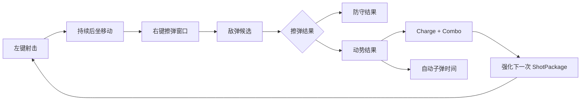
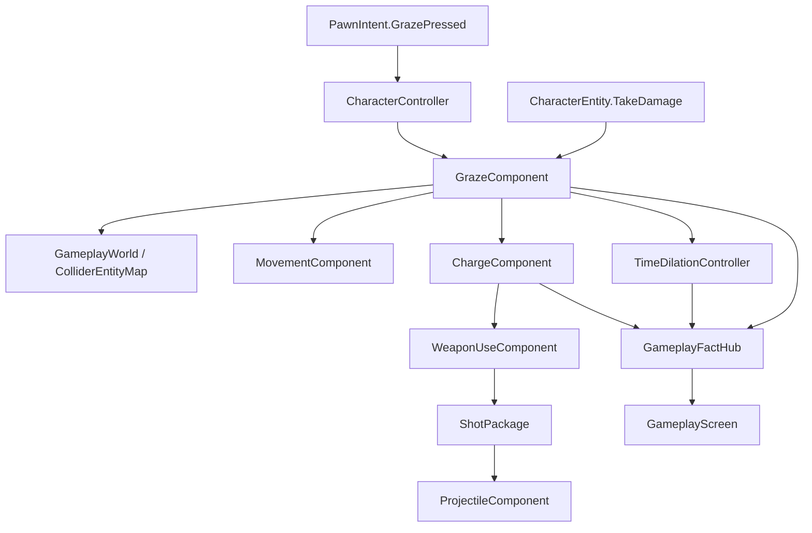

# 第五部分：主动擦弹、充能与子弹时间

> 状态：已实现。
>
> 第五阶段已经完成本项目最核心的特色循环：“射击制造后坐路线 → 右键主动确认风险 → 擦弹获得充能和慢动作 → 下一次有效射击消费强化”。Gameplay、Presentation 与 Editor 程序集静态编译通过，0 Error、0 Warning；具体窗口手感与高速碰撞边界仍需在 Unity Play Mode 中验收。

## 1. 阶段完成结果

当前 Gameplay 已具备：

- 右键主动开启一次擦弹动作。
- `Startup → Perfect → Active → Cooldown → Idle` 完整状态流转。
- 使用逻辑外圈查询敌弹，不增加业务 MonoBehaviour。
- 以弹丸 `EntityId` 追踪候选、登记命中并防止重复结算。
- 外圈安全离开后才结算普通擦弹。
- Perfect 阶段接触 Hurtbox 时拦截敌弹伤害。
- 依据结算瞬间 `MovementComponent.IsRecoilMoving` 区分防守和动势结果。
- 动势擦弹增加玩家级 Charge 和 Combo，并自动触发子弹时间。
- 下一次真正生成的 `ShotPackage` 获得强化并在执行成功后消费 Charge。
- 二、三级强化弹可以穿透敌人，但墙体始终终止弹丸。
- 慢动作中敌人和敌弹完整减速，玩家运动至少保持 0.75 倍真实速度。
- HUD 显示擦弹阶段、Charge、Combo 和当前时间倍率。
- 玩家颜色显示 Startup、Perfect 和 Active。



## 2. 实现边界

### 2.1 已实现

- `GrazeConfig` 集中配置擦弹、充能和子弹时间。
- `GrazePhase` 擦弹状态枚举。
- `GrazeResultType` 四种结算类型。
- `GrazeComponent` 窗口、候选、命中、离开和结算。
- `ChargeComponent` 玩家级充能与连段。
- `TimeDilationController` Session 级慢动作仲裁。
- `IEntityUnscaledTickable` 局内真实时间更新入口。
- 弹丸 `EntityId` 随 `DamageRequest` 进入受伤流程。
- Perfect 拦截与保护反冲减伤。
- `ShotPackage` 强化快照和强化弹穿透。
- 擦弹、充能、时间倍率的强类型 Fact。
- HUD、玩家颜色和第五阶段自动配置工具。

### 2.2 留给后续阶段

- 正式波次、胜负条件和局内结算流程。
- 多种敌人组合、关键目标和生成时序。
- 敌人掉落、波次奖励与拾取。
- 激光、近战和持续范围攻击的独立擦弹规则。
- 同一齐射多颗弹的收益衰减。
- 三级强化弹穿透轻型掩体。
- 轨道枪、Boss、复杂弹幕 Pattern 和完整表现。

本阶段只为当前普通 Projectile 建立规则，不增加通用 Buff 管线、攻击策略继承树或全局时间单例。

## 3. 核心规则

1. 右键只提交擦弹动作，不能直接开启慢动作。
2. 只有 Idle 接受新的右键输入。
3. 空按、失败和成功都会进入同一套总冷却。
4. 外圈接触只登记候选，必须安全离开才奖励。
5. Perfect 阶段接触 Hurtbox 可以拦截伤害并销毁敌弹。
6. Active 阶段直接命中仍然正常受伤。
7. 擦弹结算时才读取 `IsRecoilMoving`，不缓存按键时状态。
8. 防守结果不给 Charge、Combo 或慢动作。
9. Charge 属于玩家，切枪不会丢失。
10. 空仓、冷却、换弹和无效方向不会消费 Charge。
11. 一包散弹只消费一次 Charge，所有弹片共享同一强化等级。
12. 只有 `TimeDilationController` 修改 Gameplay 时间倍率。

## 4. 模块关系与职责



| 模块 | 职责边界 |
| --- | --- |
| `GrazeComponent` | 主动窗口、敌弹候选、伤害拦截和擦弹类型结算 |
| `ChargeComponent` | Charge 等级、Combo、持续时间、强化快照和消费 |
| `TimeDilationController` | 慢动作请求、叠加、真实时间倒计时与恢复 |
| `MovementComponent` | 主动速度、后坐速度、反冲资格和玩家慢动作补偿 |
| `CharacterEntity` | 受伤合法性、擦弹询问、减伤、生命和死亡唯一入口 |
| `ProjectileComponent` | 移动、命中、伤害来源、穿透和已命中目标集合 |
| `WeaponUseComponent` | 有效开火后申请 Charge 强化，执行成功后消费 |
| `GameplayScreen` | 订阅 Fact，只负责文字和颜色表现 |

## 5. GrazeConfig

配置文件：

```text
Assets/Res/Gameplay/Graze/GrazeConfig.asset
```

为了保持 Demo 简单，擦弹窗口、Charge 和子弹时间共用一个只读 Asset，没有拆成多个小 Profile。

### 5.1 当前擦弹参数

| 参数 | 当前值 | 时间域 |
| --- | ---: | --- |
| `StartupDuration` | 0.02 秒 | Unscaled |
| `PerfectDuration` | 0.07 秒 | Unscaled |
| `ActiveDuration` | 0.10 秒 | Unscaled |
| `TotalCooldown` | 0.35 秒 | Unscaled |
| `GrazeSensorRadius` | 0.95 | 空间 |
| `RecoilDamageReduction` | 35% | 伤害比例 |

### 5.2 当前 Charge 参数

| 参数 | 当前值 |
| --- | ---: |
| 最大等级 | 3 |
| Charge 持续时间 | 6.0 真实秒 |
| Combo 宽限期 | 1.2 真实秒 |
| 一级伤害/尺寸 | ×1.25 / ×1.15 |
| 二级伤害/尺寸/穿透 | ×1.50 / ×1.30 / 1 |
| 三级伤害/尺寸/穿透 | ×2.00 / ×1.60 / 2 |

### 5.3 当前子弹时间参数

| 参数 | 当前值 |
| --- | ---: |
| 普通动势倍率/时长 | 0.25 / 0.18 真实秒 |
| 完美动势倍率/时长 | 0.15 / 0.28 真实秒 |
| 累计时长上限 | 0.60 真实秒 |
| 玩家最低运动倍率 | 0.75 |

`GameplayContentConfig` 持有 `GrazeConfig` 引用，并在 Session 创建任何角色前调用 `Validate()`。运行时不会修改 Asset。

## 6. 擦弹状态机

```csharp
public enum GrazePhase
{
    Idle,
    Startup,
    Perfect,
    Active,
    Cooldown
}
```

从右键按下时刻开始：

```text
0ms    Startup
20ms   Perfect
90ms   Active
190ms  Cooldown
350ms  Idle
```

- `ApplyIntent(true)` 只在 Idle 时启动动作。
- Startup 已提交操作，但没有有效擦弹能力。
- Perfect 同时允许外圈登记和 Hurtbox 拦截。
- Active 允许外圈登记，但不拦截直接命中。
- Cooldown 不产生擦弹效果。
- `IEntityUnscaledTickable.UnscaledTick` 推进阶段，慢动作不会延长窗口。
- Pause 时 Session 不更新，窗口会冻结。

`CharacterController` 在本帧消费右键意图后立即调用 `ApplyIntent`，因此同一帧进入 Startup，不需要等待下一次 FixedUpdate。

## 7. 外圈查询与候选弹丸

玩家没有额外 Graze Sensor GameObject。`GrazeComponent.FixedTick` 直接执行：

```text
Physics2D.OverlapCircleAll(
    玩家位置,
    GrazeSensorRadius,
    GrazeProjectileMask)
```

Collider 通过 `GameplayWorld.TryGetEntity(collider)` 映射回 Entity，并检查：

- Entity 当前存活。
- `EntityCategory == Projectile`。
- 存在 `ProjectileComponent`。
- Projectile 的 `SourceId` 有效。
- Projectile 与玩家阵营敌对。

候选以弹丸自身 `EntityId` 为键，而不是使用 Shooter `SourceId`。同一个敌人连续发射的每颗弹都有独立身份。

每个候选只保存当前规则真正需要的状态：

```text
OverlappedActiveWindow
HitHurtbox
```

规则如下：

- 弹丸首次位于外圈时建立候选。
- 只要它与 Perfect 或 Active 实际重叠，就登记有效窗口重叠。
- 上一物理帧在外圈、本帧离开且弹丸仍存活时，尝试安全离开结算。
- 从未重叠有效窗口、曾命中 Hurtbox、在外圈内销毁或撞墙的弹丸不奖励。
- `_resolvedProjectileIds` 保证同一弹丸最多结算一次。
- 集合生命周期与玩家/Session 一致，无需跨局过期系统。

## 8. Hurtbox 命中与伤害流程

`DamageRequest` 当前包含：

```text
SourceId               发射者 EntityId
SourceTeam             发射者阵营
DamageSourceEntityId   直接造成伤害的弹丸 EntityId
Payload                伤害数据
```

保留 `DamageSourceEntityId` 的默认值，因此非弹丸伤害仍能使用同一入口，但不会错误获得弹丸擦弹或保护反冲减伤。

`CharacterEntity.TakeDamage` 的实际顺序：

```text
存活、伤害值与阵营检查
  → Graze.TryInterceptProjectile(ProjectileId)
      → Perfect：返回 0 伤害
      → 其他阶段：登记 Hurtbox 命中并继续
  → 只对有效敌弹计算保护反冲减伤
  → 计算 Attribute DamageReduction
  → 修改 Health
  → Charge.NotifyDamaged
  → 发布 CharacterDamagedFact
  → 死亡清理 Charge、擦弹候选和慢动作
```

Perfect 拦截后，普通敌弹仍由 `ProjectileComponent` 的命中流程 Despawn。`CharacterEntity` 不反向依赖 `EntitySpawner`。

## 9. 四种擦弹结果

```csharp
public enum GrazeResultType
{
    Defensive,
    PerfectDefensive,
    Momentum,
    PerfectMomentum
}
```

| 结果 | 产生条件 | Charge / Combo | 慢动作 |
| --- | --- | --- | --- |
| Defensive | 外圈安全离开，结算时没有后坐 | 无 | 无 |
| PerfectDefensive | Perfect 拦截命中，没有后坐 | 无 | 无 |
| Momentum | 外圈安全离开，结算时仍在后坐 | 增加 | 0.25 倍 |
| PerfectMomentum | Perfect 拦截命中，结算时仍在后坐 | 高档增加 | 0.15 倍 |

是否属于动势结果只读取 `MovementComponent.IsRecoilMoving`。当前阈值由 Movement 内部统一维护，Graze 不复制另一套速度判断。

## 10. 保护反冲减伤

真实敌弹命中时，同时满足以下条件才应用 35% 减伤：

- 玩家仍在后坐移动。
- 当前不是 Perfect 或 Active 有效窗口。
- `DamageSourceEntityId` 确实对应存活的敌对 Projectile。

因此：

- 没有按右键的反冲中弹会获得保护减伤。
- Startup 和 Cooldown 中弹仍可获得保护减伤。
- Active 中弹视为擦弹失败，承受正常伤害。
- 非弹丸环境伤害不会错误套用保护反冲。

最终伤害：

```text
FinalDamage = BaseDamage
            × GrazeIncomingDamageMultiplier
            × (1 - AttributeDamageReduction)
```

## 11. ChargeComponent

Charge 是玩家能力，不属于某把武器，也没有放入 `AttributeComponent` 万能字典。

运行时状态：

```text
ChargeLevel: 0..3
ChargeRemaining
ComboCount
ComboGraceRemaining
```

### 11.1 获得规则

普通 Momentum：

```text
Combo +1
第一段至少一级
第二段及以后至少二级
刷新 Combo 和 Charge 时长
```

PerfectMomentum：

```text
Combo +1
第一次至少二级
第三段及以后可达到三级
刷新 Combo 和 Charge 时长
```

达到三级后继续成功只刷新时长，不继续抬高倍率。

### 11.2 超时与受伤

- Combo 和 Charge 都使用 Unscaled 时间。
- Combo 宽限期结束只清空 Combo，不立刻移除已有 Charge。
- Charge 持续时间归零时等级清零。
- 真实受伤总会清空 Combo。
- 受伤时零级或一级 Charge 保留。
- 二、三级 Charge 降为一级，并刷新一级持续时间。
- 防守结果不刷新 Charge 或 Combo。

### 11.3 消费规则

```text
WeaponRuntime 成功创建基础 ShotPackage
  → ChargeComponent 创建强化副本并返回使用等级
  → WeaponExecution 执行强化包
  → 执行成功后 ChargeComponent.Consume
```

空仓、冷却、换弹或无效瞄准不会产生基础包，因此不会消费。散弹的一组弹片来自同一个包，只消费一次。

## 12. 强化 ShotPackage

`ShotPackage` 新增：

```text
EmpowerLevel
RemainingPenetrations
```

`WithEmpowerment` 返回不可变强化副本，只修改本次射击数据，不写回 `WeaponConfig`。

| Charge | 伤害 | 弹丸查询半径 | 可穿透敌人数 |
| --- | ---: | ---: | ---: |
| 0 | ×1.00 | ×1.00 | 0 |
| 1 | ×1.25 | ×1.15 | 0 |
| 2 | ×1.50 | ×1.30 | 1 |
| 3 | ×2.00 | ×1.60 | 2 |

当前不会改变后坐冲量，确保玩家预判的后坐落点不因 Charge 等级突然变化。

## 13. 弹丸穿透

每颗弹丸分别持有：

```text
EmpowerLevel
RemainingPenetrations
HitEntityIds
```

一次 FixedTick 最多处理 8 次命中：

- 在剩余移动距离中 CircleCast 最近目标。
- 墙体无条件终止弹丸。
- 每个目标 EntityId 每颗弹最多受伤一次。
- 没有剩余穿透次数时，命中后 Despawn。
- 仍可穿透时，从命中处沿方向前进一个安全偏移，再处理剩余距离。
- 每颗散弹弹片独立保存剩余穿透次数和已命中集合。

当前穿透只支持敌人，不支持 LightCover。

## 14. TimeDilationController

`TimeDilationController` 是 `GameplaySession` 持有的普通 C# 对象，不是全局单例。

职责：

- 接收 Momentum 和 PerfectMomentum 的慢动作请求。
- 通过 `IGameTimeService.SetTimeScale` 修改倍率。
- 使用 Unscaled 时间记录真实剩余时间。
- 连续请求选择更慢倍率并延长剩余时间。
- 累计时长限制在 0.6 秒内。
- 到期、玩家死亡或 Session Dispose 时恢复 1 倍。

叠加规则：

```text
CurrentScale = min(CurrentScale, RequestedScale)
Remaining = min(MaxAccumulatedDuration, Remaining + RequestedDuration)
```

Pause 由 `IGameTimeService.SetPaused` 独立控制。暂停不会覆盖内部 Gameplay 倍率，恢复后继续剩余慢动作。

## 15. 时间域与更新入口

第五阶段新增 `IEntityUnscaledTickable`，避免把真实时间逻辑塞进 MonoBehaviour Update。

Session Update 顺序：

```text
TimeDilation.Tick(UnscaledDeltaTime)
  → GameplayWorld.UnscaledTick(UnscaledDeltaTime)
      → GrazePhase / Combo / Charge
  → GameplayRun.Tick(DeltaTime)
  → GameplayWorld.Tick(DeltaTime)
```

| 系统 | 时间域 |
| --- | --- |
| GrazePhase | Unscaled |
| Charge 与 Combo | Unscaled |
| 子弹时间剩余时长 | Unscaled |
| AI、武器、换弹、弹丸寿命 | Gameplay scaled |
| 输入读取 | 每帧，不依赖 Gameplay 倍率 |
| 玩家物理移动 | Unity FixedUpdate，并应用玩家倍率补偿 |

玩家补偿：

```text
DesiredPlayerScale = max(WorldScale, PlayerMotionScaleDuringSlowTime)
FixedDeltaMultiplier = DesiredPlayerScale / WorldScale
```

例如世界为 0.25 倍、玩家目标为 0.75 倍时，玩家每次物理更新使用 `fixedDeltaTime × 3`。AI 不注入时间控制器，因此不会获得补偿。

## 16. Fact 与表现

新增或扩展的 Fact：

| Fact | 主要数据 |
| --- | --- |
| `GrazePhaseChangedFact` | PlayerId、前后阶段 |
| `GrazeSucceededFact` | PlayerId、ProjectileId、结果、Combo、Charge |
| `ChargeChangedFact` | 前后等级、Combo、剩余时间 |
| `TimeDilationChangedFact` | 当前倍率、剩余时间、是否生效 |
| `ShotFiredFact` | 新增 EmpowerLevel |

`GameplayScreen` 订阅这些事实，显示：

```text
当前擦弹阶段或最后一次结果
Charge 等级
Combo 数量
子弹时间倍率
```

玩家颜色：

- Startup：暗绿色。
- Perfect：亮绿色。
- Active：中绿色。
- Idle/Cooldown：恢复 Prefab 默认蓝色。

表现层只读取事实和 Entity，不参与擦弹、充能或伤害判定。

## 17. Session 与玩家组装

Session 初始化关键顺序：

```text
创建 FactHub / World / Spawner / Run
  → 创建 TimeDilationController
  → 注册场景 Entity
  → SpawnPlayer
  → Spawn 测试敌人
  → Run.Start
```

玩家组件：

```text
AttributeComponent
PlayerInputComponent
MovementComponent（注入 TimeDilationController）
EquipmentComponent
ChargeComponent
WeaponUseComponent（可读取 Charge）
GrazeComponent
CharacterController
```

AI 沿用第四阶段组件，不持有 Charge、Graze 或玩家时间补偿。

## 18. 配置与资源

```text
Assets/Res/Gameplay/Graze/
└── GrazeConfig.asset

Assets/Res/Config/
└── GameplayContentConfig.asset       持有 GrazeConfig 引用

Assets/Scripts/ShotGame/Editor/
├── FifthPhaseSetup.cs
└── FifthPhaseSetupMarker.cs
```

`FifthPhaseSetup` 会通过 Unity Editor API：

- 确保 Graze 资源目录和 `GrazeConfig.asset` 存在。
- 写入 `GameplayContentConfig` 引用。
- 向 Gameplay HUD Prefab 增加擦弹、Charge 和时间文本并绑定字段。
- 创建一次性完成标记。

项目打开导致外部批处理不能独占 Unity 时，可使用菜单：

```text
Shot Game/Setup Fifth Phase
```

`GameplayScreen` 同时保留运行时 HUD 文本补全，确保 Prefab 尚未被工具持久化时不会因空引用阻断游戏。Prefab 不需要手工编辑 YAML，因此不会引入保留 fileID 问题。

当前 `FifthPhaseSetupComplete.asset` 已生成，`Panel_Gameplay.prefab` 中的三个第五阶段 HUD 字段也已由 Unity Editor API 正式序列化。

## 19. 主要文件定位

```text
Assets/Scripts/ShotGame/Gameplay/
├── Character/
│   ├── ChargeComponent.cs
│   ├── CharacterEntity.cs
│   ├── GrazeComponent.cs
│   ├── GrazePhase.cs
│   ├── GrazeResultType.cs
│   ├── MovementComponent.cs
│   └── WeaponUseComponent.cs
├── Combat/
│   └── DamageRequest.cs
├── Config/
│   ├── GameplayContentConfig.cs
│   └── GrazeConfig.cs
├── Entity/
│   ├── Entity.cs
│   └── IEntityComponent.cs
├── Facts/
│   └── Facts.cs
├── Projectile/
│   ├── ProjectileComponent.cs
│   └── ProjectileSpawnData.cs
├── Run/
│   └── GameplaySession.cs
├── Time/
│   └── TimeDilationController.cs
├── Weapon/
│   ├── ShotPackage.cs
│   └── WeaponExecution.cs
└── World/
    ├── EntitySpawner.cs
    └── GameplayWorld.cs

Assets/Scripts/ShotGame/Presentation/UI/
└── GameplayScreen.cs
```

## 20. 边界行为

- 右键按下与命中同帧：先进入 Startup，不能拦截。
- Perfect 最后一刻命中：以 Gameplay 结算时的 Phase 为准。
- Active 直接命中：正常扣血，之后不能结算外圈奖励。
- 弹丸先进入外圈、后开启窗口：实际重叠有效阶段即可登记。
- 窗口结束后弹丸才离开：曾有效重叠且安全离开仍算成功。
- 弹丸在外圈内因寿命、墙体或其他原因销毁：不算成功。
- 同一 Collider 重复返回：按 Projectile EntityId 去重。
- 非弹丸伤害：不参与 Perfect 或保护反冲。
- 切枪：Charge 保留。
- 散弹：一包消费一次，各弹片继承同级强化。
- Pause：窗口、Charge、Combo 和慢动作计时全部冻结。
- 玩家死亡：清空候选、Charge、Combo 和慢动作。
- 返回菜单或重开：Session Dispose 强制恢复时间倍率。

## 21. 验证结果

### 21.1 已完成静态验证

- Gameplay 程序集：0 Error、0 Warning。
- Presentation 程序集：0 Error、0 Warning。
- Editor 程序集：0 Error、0 Warning。
- `GrazeConfig` Asset 和 `GameplayContentConfig` 引用存在。
- 新增 `.meta` GUID 唯一。
- Gameplay/UI Prefab 未使用保留 `fileID 100100000`。
- `git diff --check` 通过。

### 21.2 Play Mode 验收清单

- [ ] 右键阶段按 0.02 / 0.07 / 0.10 / 0.35 秒正确切换。
- [ ] 空按仍进入完整 Cooldown。
- [ ] 没按右键时近失不触发擦弹。
- [ ] 外圈必须安全离开后才结算。
- [ ] Perfect 接弹无伤，Active 接弹正常受伤。
- [ ] 无窗口反冲中弹获得 35% 保护减伤。
- [ ] 同一 Projectile EntityId 只结算一次。
- [ ] 防守结果不增加 Charge 或慢动作。
- [ ] Momentum 和 PerfectMomentum 使用不同慢动作参数。
- [ ] Charge 获取、超时、受伤降级和切枪保留正确。
- [ ] 空仓不消费，散弹整包只消费一次。
- [ ] 二三级强化弹按等级穿透敌人但不能穿墙。
- [ ] 慢动作内玩家后坐明显快于敌人与敌弹。
- [ ] Pause、返回菜单和重开不遗留错误 TimeScale。
- [ ] HUD 与玩家颜色能表达关键状态。
- [ ] Play Mode Console 无异常。

## 22. 第五阶段完成后的闭环

```text
左键射击
  → 后坐推动玩家进入一条危险路线
  → 右键提交短擦弹窗口
  → 敌弹与外圈或 Hurtbox 交互
      → 防守结果：只化解风险
      → 动势结果：Charge + Combo + 自动慢动作
      → 完美动势：拦截伤害并获得更高奖励
  → 下一次有效 ShotPackage 读取 Charge
  → 生成强化弹并执行射击
  → 成功后消费 Charge
  → 再次利用后坐寻找下一条擦弹路线
```

第五阶段解决了“单次战斗为什么有特色”。第六阶段将解决“这些战斗如何组成一局”：正式波次、生成计划、波次目标、最终胜负和重开/返回菜单。
