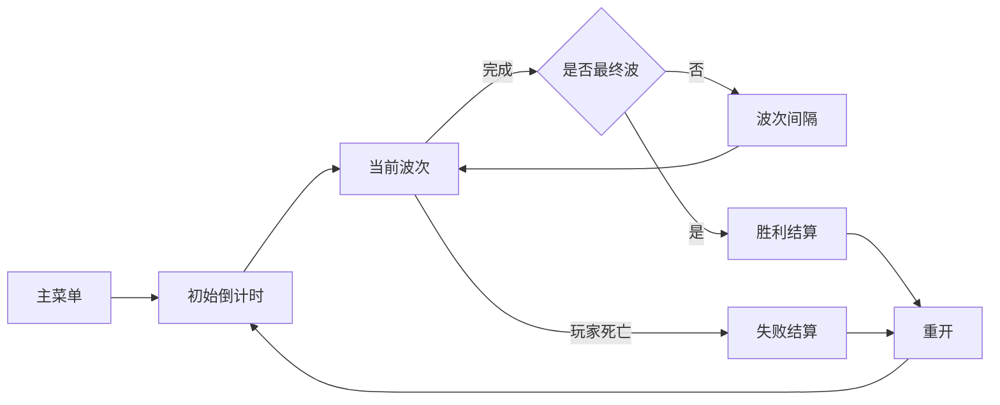
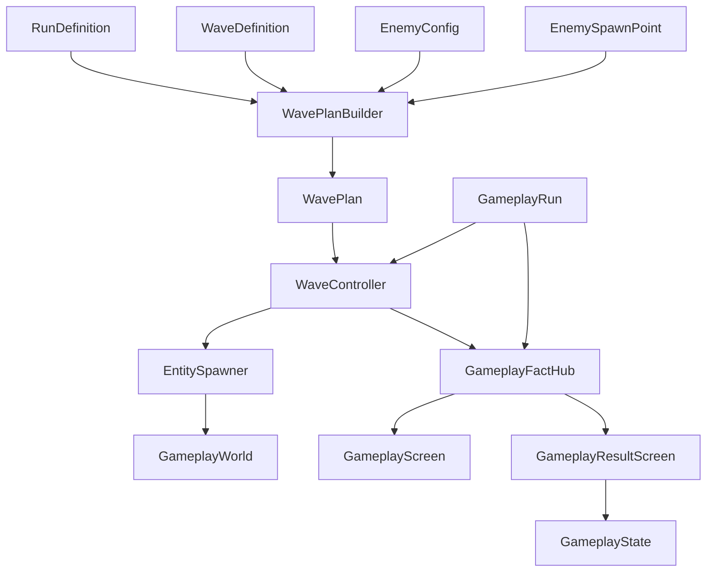

# 第六部分：正式波次、胜负与局内结算计划

> 状态：待确认，尚未开始实现。
>
> 第六阶段建立在已经可玩的射击、后坐、擦弹和充能闭环上，目标是把单次战斗组织成一局完整 Demo：“初始倒计时 → 5 个确定性波次 → 波次间隔 → 最终胜负 → 重开或返回主菜单”。本阶段优先完成稳定、可读、可重复测试的一局，不同时扩张 Boss、掉落构筑或复杂行为树。

## 1. 阶段目标

第六阶段结束时应具备：

- 使用 Asset 配置一局和有序波次，不在场景中写死敌人顺序。
- 进入 Gameplay 后先显示初始倒计时，再开始第一波。
- 按时序和出生点组生成敌人。
- 支持歼灭和关键目标两种波次目标。
- 正确追踪生成队列、当前存活敌人和关键目标。
- 波次完成后保留玩家控制，经过间隔自动进入下一波。
- 最后一波完成后稳定进入胜利。
- 玩家死亡后稳定进入失败，并停止后续生成和敌人行为。
- HUD 显示倒计时、当前波次、目标与剩余敌人。
- 结算界面显示胜负、进度和失败原因，并提供重开/返回主菜单。
- 相同 Run Seed、配置和场景出生点产生相同 WavePlan。



## 2. 本阶段范围

### 2.1 本阶段实现

- `RunDefinition` 单局配置 Asset。
- `WaveDefinition` 独立波次配置 Asset。
- `EnemyConfig` 敌人静态配置 Asset。
- 场景出生点稳定 Id 和逻辑 Group。
- 进入 Session 时一次性解析只读 `WavePlan`。
- 显式生成组和预算随机池的最小实现。
- 5 波 Demo 内容。
- 歼灭、关键目标两种目标。
- 波次生成、存活追踪、间隔和最终胜利。
- 玩家死亡失败和最小失败原因快照。
- 波次/单局强类型 Fact。
- HUD 波次信息和独立结算页面。
- 重开与返回主菜单流程。
- 第六阶段配置和场景自动搭建工具。

### 2.2 本阶段暂不实现

- Boss 阶段、架势和专属技能。
- 行为树、复杂感知和技能系统。
- 敌人死亡掉落、波次奖励和三选一构筑。
- 武器掉落、拾取和背包替换。
- 难度选择、动态难度和长期成长。
- 联机、多玩家和存档回放。
- 完整统计、评分、最高连段或常用武器分析。
- 复杂刷怪导演、屏幕外动态选点和自适应克制。

掉落和构筑会成为下一独立阶段。本阶段允许 `DropRoot` 继续为空，防止波次、奖励和物品系统一次性耦合。

## 3. 关键设计决定

1. 一局固定使用当前 `GamePlay` Scene，不切换战斗场景。
2. 使用 5 个波次，目标时长先控制在约 4 至 7 分钟。
3. `RunDefinition` 按顺序引用独立 `WaveDefinition`。
4. 最后一个 Wave 自动视为最终波，不增加 `IsFinalWave` 重复配置。
5. 波次配置只引用出生点 Group，不直接引用 Scene Transform。
6. Session 初始化时一次性生成整局 `WavePlan`，运行时不再次随机。
7. Demo 默认使用固定 Seed，便于复现和调试。
8. 同一时刻只能存在一个 Active Wave。
9. 波次间隔中玩家、弹丸和已有场景实体继续运行，玩家保持控制。
10. 胜负属于 `GameplayRun` 内部状态，不新增 AppState。
11. 结算页只发起重开或返回菜单请求，不直接释放 Session。
12. AI 继续使用简单状态机，不在第六阶段引入行为树。

## 4. 总体模块关系



| 模块 | 唯一职责 |
| --- | --- |
| `RunDefinition` | 初始倒计时、默认间隔、固定 Seed 和有序波次引用 |
| `WaveDefinition` | 单波目标、显式组、随机池、预算和时序 |
| `EnemyConfig` | 敌人 Prefab、属性、武器、AI 范围和预算 Cost |
| `EnemySpawnPoint` | 场景中的稳定 SpawnId 与 Group，不包含刷怪逻辑 |
| `WavePlanBuilder` | 用配置、Seed 和出生点快照解析整局只读计划 |
| `WaveController` | 执行当前波生成队列、追踪目标和判断完成 |
| `GameplayRun` | 单局状态、波次切换、最终胜负和结果快照 |
| `GameplaySession` | 组装以上对象并驱动 Tick/Dispose |
| `GameplayState` | 控制输入模式、HUD、结算页、重开和返回菜单 |

## 5. 配置资产

### 5.1 EnemyConfig

`EnemyConfig : ScriptableObject` 集中一个敌人类型当前真正需要的参数：

```text
EnemyId
DisplayName
Prefab
WeaponConfig
MaxHealth
MoveSpeed
AttackRange
InitialAttackDelay
BudgetCost
```

约束：

- `EnemyId` 在所有敌人配置中唯一且稳定。
- Prefab 只负责 Collider、Rigidbody2D、SpriteRenderer 等 Unity 表现。
- 生命和移动数值在 Spawn 时写入 `AttributeComponent` 运行时实例。
- `InitialAttackDelay` 防止敌人生成后同帧开火。
- `BudgetCost` 只用于 WavePlan 预算解析，不用于战斗结算。
- 本阶段不建立抗性表、技能列表或行为树引用。

### 5.2 RunDefinition

```text
RunId
InitialCountdown
DefaultWaveInterval
FixedSeed
WaveDefinition[] Waves
```

规则：

- Waves 必须有 1 至 8 个有效引用。
- 同一个 WaveDefinition 不能重复引用。
- 最后一个引用就是最终波。
- Demo 默认固定 Seed，不增加菜单 Seed 输入。
- 配置验证在生成玩家和启动倒计时前完成。

### 5.3 WaveDefinition

```text
WaveId
DisplayName
ObjectiveType
WaveIntervalOverride（小于 0 时使用 Run 默认值）
ExplicitSpawnGroup[]
RandomPoolEntry[]
RandomBudget
MaxAliveEnemies
```

`WaveObjectiveType`：

```csharp
public enum WaveObjectiveType
{
    EliminateAll,
    KeyTarget
}
```

显式生成组：

```text
EnemyConfig
SpawnGroup
Count
StartDelay
SpawnInterval
RequiredForClear
IsKeyTarget
```

随机池项：

```text
EnemyConfig
SpawnGroup
Weight
MinCount
MaxCount
```

配置约束：

- 关键目标波必须且只能配置一个显式 KeyTarget。
- 普通歼灭波不能标记 KeyTarget。
- Count、时间、Weight、Cost 和预算必须有效。
- SpawnGroup 必须能在场景中找到至少一个出生点。
- `MaxAliveEnemies` 至少为 1，且不会小于同一时刻必须出现的关键内容。
- 随机池无法合法消耗预算时在初始化阶段报错。

## 6. 场景出生点

当前 `GameplaySceneBindings` 只保存 `Transform[]`。第六阶段把它升级为被动场景配置：

```csharp
public sealed class EnemySpawnPoint : MonoBehaviour
{
    [SerializeField] private string _spawnId;
    [SerializeField] private string _group;
}
```

它不包含 Update、刷怪、计时或 Entity 逻辑，只负责把 Unity Transform 暴露给 `GameplaySceneContext`。

建议场景布局：

```text
SpawnPoints/EnemySpawns
├── EnemySpawn_Left       Id: enemy_left       Group: Side
├── EnemySpawn_Right      Id: enemy_right      Group: Side
├── EnemySpawn_Top        Id: enemy_top        Group: Far
└── EnemySpawn_Center     Id: enemy_center     Group: Elite
```

规则：

- SpawnId 在当前场景唯一。
- Group 使用简单字符串，不创建通用 Tag 数据库。
- WavePlan 保存 SpawnId，不长期持有 Transform。
- 实际生成时由 SceneContext 通过 SpawnId 取得位置与旋转。
- 自动配置工具检查所有点位位于 ArenaBounds 内。
- 出生点与 PlayerSpawn 保持安全距离。

## 7. WavePlan 预解析

`WavePlanBuilder` 在 Session 初始化时完成：

```text
验证 RunDefinition / WaveDefinition / EnemyConfig
  → 建立 SpawnId 与 Group 快照
  → 使用 FixedSeed 创建 System.Random
  → 按顺序解析每个 Wave
  → 先加入显式生成项
  → 按预算、权重和数量限制填充随机池
  → 为每个生成项确定 SpawnId 与 SpawnTime
  → 输出只读 WavePlan
```

运行期计划项：

```text
WaveIndex
SpawnOrder
SpawnTime
EnemyConfig
SpawnId
RequiredForClear
IsKeyTarget
```

确定性要求：

- 同配置、同 Seed、同 SpawnId/Group 集合必须得到相同顺序。
- 不使用 `UnityEngine.Random`，避免其他 VFX 或掉落影响波次。
- 随机池只补充普通敌人，不删除或替换显式生成项。
- 全部波次在玩家获得操作权前解析完成。
- 解析失败直接阻止 Session 启动，不允许运行中少刷敌人后误判胜利。

## 8. WaveController

`WaveController` 是普通 C# 对象，一次只执行一个 `WavePlanEntry` 集合。

运行时状态：

```text
CurrentWaveIndex
SpawnElapsed
NextSpawnIndex
AliveEnemyIds
RequiredEnemyIds
KeyTargetId
IsSpawnQueueExhausted
IsKeyTargetKilled
IsCompleted
```

公开窄接口：

```text
StartWave(WavePlanEntry wave)
Tick(deltaTime)
NotifyEnemyDied(EntityId enemyId)
Stop()
```

不直接打开 UI、不切换 AppState，也不写入 Scene MonoBehaviour。

### 8.1 生成规则

- `SpawnElapsed` 使用 Gameplay scaled 时间。
- 达到计划项 SpawnTime 后才允许生成。
- 达到 `MaxAliveEnemies` 时暂停后续普通生成。
- 关键目标不应被普通并发上限永久阻塞；配置验证应为它预留容量。
- 每个生成请求通过 `EntitySpawner.SpawnEnemy` 完成。
- Spawn 返回的 EntityId 立即登记到当前 Wave。
- 波次停止后禁止处理剩余队列。

### 8.2 歼灭目标

完成条件：

```text
生成队列耗尽
AND RequiredEnemyIds 为空
```

首版所有该波敌人默认 `RequiredForClear = true`。字段保留是为了以后允许非目标环境敌人，但第六阶段不主动使用复杂例外。

### 8.3 关键目标

流程：

```text
生成关键目标和普通护卫
  → 关键目标死亡
  → 取消尚未生成的非关键普通项
  → 场上已生成敌人继续正常战斗和死亡
  → AliveEnemyIds 为空
  → 波次完成
```

关键目标未死亡时，即使其他敌人全部死亡也不能完成。

## 9. 敌人配置与简单 AI

第六阶段继续沿用：

```text
Chase
Attack
Dead
```

只为 `AIComponent` 增加配置输入和生成保护时间，不引入行为树：

- `MoveSpeed` 决定追击速度。
- `AttackRange` 决定 Chase/Attack 切换。
- `InitialAttackDelay` 内可以追击，但不能产生 FireIntent。
- 武器射速、散布和敌弹速度仍来自 `WeaponConfig`。
- 玩家死亡后 `GameplayRun` 停止 World，新敌人不再生成。

计划提供三个低成本敌人配置：

| 类型 | 主要作用 | 建议特征 |
| --- | --- | --- |
| 慢弹射手 | 提供清晰可规划的擦弹材料 | 中距离、低射速、慢弹 |
| 追击射手 | 压缩空间并迫使玩家开枪换位 | 较快移动、较近攻击距离、低生命 |
| 精英射手 | 关键目标和最终波压力 | 高生命、较慢移动、较强但可读的射击 |

三者继续复用相同 `CharacterEntity`、组件组装和 AI 状态机。Prefab 差异仅用于尺寸、颜色和 Collider，不创建三个逻辑类。

## 10. 五波 Demo 内容

以下作为首轮默认配置，数值在 Play Mode 后再调：

| 波次 | 目标 | 显式内容 | 随机补充 | 设计用途 |
| --- | --- | --- | --- | --- |
| 1 | 歼灭 | 1 个慢弹射手 | 无 | 学会射击后坐和观察慢弹 |
| 2 | 歼灭 | 左右各 1 个慢弹射手 | 无 | 第一次处理交叉弹道 |
| 3 | 歼灭 | 1 个追击射手 | 2 至 3 个普通敌人预算 | 引入空间压缩和连续擦弹 |
| 4 | 关键目标 | 1 个精英射手 + 1 个护卫 | 小额普通预算 | 验证关键目标规则 |
| 5 | 歼灭 | 1 个精英射手 + 2 个追击射手 | 适量普通预算 | 最终综合测试 |

并发敌人数起始上限建议为 4。当前 Demo 的重点是验证路线规划和擦弹，不用数量掩盖敌人行为简单的问题。

## 11. GameplayRun 状态流

沿用现有状态枚举：

```text
Initializing
  → Countdown
  → WaveActive
  → WaveInterval
  → WaveActive
  → Victory / Defeat
  → Finished
```

调整后的职责：

- `GameplayRun` 不再依靠外部手动 `VictoryRequestedFact` 才能结束。
- Countdown 归零后启动 WaveController 第一波。
- 当前波完成且不是最后一波时进入 WaveInterval。
- 间隔归零后启动下一波。
- 最后一波完成时创建 Victory Result。
- 玩家死亡在任何未结算阶段都创建 Defeat Result。
- Victory/Defeat 时停止 World，并发布一次结算事实。
- 结果确认离开页面后才进入 Finished 或由 Session Dispose 结束。

波次间隔中 `GameplayWorld.IsSimulationEnabled` 保持 true，玩家仍可移动、换弹和拾取未来加入的掉落。

## 12. GameplayResult

在现有结果基础上增加足够解释 Demo 的字段：

```text
ResultType
ElapsedTime
ReachedWaveIndex
TotalWaveCount
LastDamageSourceId
LastDamageAmount
PlayerWeaponName
GrazePhaseAtDefeat
```

规则：

- 胜利不需要失败字段。
- 玩家每次真实受伤后更新最小伤害快照。
- 失败时保存最终一次真实伤害来源和当时状态。
- 不增加 PlayerStatisticsComponent。
- 不统计最高连段、命中率、DPS 或常用武器。
- 如果伤害来源已经 Despawn，仍显示保存的 EntityId 和通用来源文本。

## 13. Fact

新增强类型 Fact：

| Fact | 主要数据 |
| --- | --- |
| `RunCountdownChangedFact` | 剩余秒数 |
| `WaveStartedFact` | 当前波、总波数、名称、目标 |
| `WaveEnemySpawnedFact` | 波次、EnemyId、EntityId、是否关键目标 |
| `WaveProgressChangedFact` | 已生成、待生成、当前存活 |
| `WaveCompletedFact` | 波次、耗时 |
| `WaveIntervalStartedFact` | 下一波、剩余间隔 |
| `GameplaySettledFact` | 完整 GameplayResult |

倒计时 Fact 只在 UI 显示整数变化时发布，不需要每帧广播相同文本。WaveController 使用直接调用处理死亡；Fact 主要服务 Presentation 和调试，不把内部状态机反向建立在 UI 事件上。

## 14. HUD 与结算页

### 14.1 Gameplay HUD

在当前 HUD 增加：

```text
开始倒计时
波次 2 / 5
目标：歼灭全部敌人 / 击杀关键目标
场上敌人：3
下一波：2.4 秒
```

HUD 继续订阅 Fact，不主动查询和推进 WaveController。

### 14.2 GameplayResultScreen

新增独立页面：

```text
胜利 / 失败
到达波次
本局时长
失败来源（仅失败）
[重新开始]
[返回主菜单]
```

此页面需要 `GameplayResultScreenArgs`，因为两个按钮确实需要流程回调：

```text
GameplayResult
RestartAsync
ReturnToMenuAsync
```

参数只包含页面显示和按钮真正需要的内容，不把 AppFlowContext 暴露给 UI。

## 15. GameFlow 接入

胜负仍属于 `AppState.Gameplay` 内部，不增加 Victory/Defeat AppState。

`GameplayState` 负责：

- 首次 Enter 加载场景并创建 Session。
- 打开 Gameplay HUD。
- 监听一次 `GameplaySettledFact`。
- 结算时把 InputMode 切到 UI，并清除奖励慢动作。
- 打开 GameplayResultScreen。
- 返回主菜单时走现有 `Gameplay → MainMenu` 状态切换。
- 重开时关闭 Gameplay 页面、停止当前 Session、重新创建同一场景的一局。

重开不是从 Gameplay 切换到相同 AppState，避免依赖状态机对同状态切换的隐含行为。由 GameplayState 内部使用一个受 `_isRestarting` 保护的明确流程：

```text
关闭结果页和 HUD
  → StopGameplayAsync
  → 加载 GamePlay Scene
  → 创建新 Session
  → 打开 HUD
  → 恢复 Gameplay InputMode
```

小游戏不增加 Loading 页面。

## 16. Session 初始化调整

当前测试敌人直出逻辑将被正式 Wave 取代：

```text
创建 FactHub / World / Spawner
  → 校验 RunDefinition
  → 从 SceneContext 取得 SpawnPoint 快照
  → WavePlanBuilder.Build
  → SpawnPlayer
  → 创建 WaveController
  → 创建 GameplayRun
  → Run.Start
```

`GameplayContentConfig` 调整：

- 增加 `RunDefinition` 引用。
- 移除或停止使用 `SpawnTestEnemy`、`TestEnemyCount` 和直接测试敌人生成入口。
- 玩家、LayerMask、武器和 Graze 配置继续保留。

正式 Run 启动后不再由 Session 自己循环 SceneContext.EnemySpawns 生成测试敌人。

## 17. EntitySpawner 调整

敌人生成入口收敛为：

```text
SpawnEnemy(
    EnemyConfig config,
    Vector3 position,
    Quaternion rotation,
    EntityId targetId,
    LayerMask targetMask,
    LayerMask wallMask,
    Transform parent)
```

Spawner 负责：

- 从 EnemyConfig 建立 AttributeComponent。
- 将 `MaxHealth` 和 `MoveSpeed` 写入角色属性。
- 建立 AIComponent、Movement、Equipment、WeaponUse 和 CharacterController。
- 把 `InitialAttackDelay` 传给 AI。
- 注册 Entity 并返回 EntityId。

WaveController 不手工拼装 Entity Component。

## 18. 暂停、结算和时间域

| 内容 | 时间域 |
| --- | --- |
| 初始倒计时 | Gameplay scaled |
| 敌人 SpawnTime | Gameplay scaled |
| 波次间隔 | Gameplay scaled |
| AI、武器和弹丸 | Gameplay scaled |
| 右键擦弹与 Charge | Unscaled，但 Pause 时 Session 不 Tick |
| 结算 UI | UI，不依赖 Gameplay Tick |

规则：

- Pause 冻结倒计时、刷怪时序、波次间隔和全部 Gameplay。
- 子弹时间会减慢刷怪时序和波次间隔，与世界模拟保持一致。
- Victory/Defeat 时立即清除 TimeDilation 并停止 World。
- 结算页面期间不响应 Gameplay 输入或 Pause 请求。
- 返回菜单和重开都必须 Dispose 原 Session。
- 新 Session 的 TimeScale 必须从 1 开始。

## 19. 边界情况

- 玩家在 Countdown 死亡：直接失败，不启动第一波。
- 玩家与最后一个敌人同一帧死亡：失败优先，避免死亡后判胜。
- 最后一个敌人死亡但生成队列未耗尽：歼灭波不能提前完成。
- 关键目标死亡：取消未生成普通项，但已生成护卫必须清场。
- 关键目标在生成前无法生成：视为配置/运行错误，不能判波次完成。
- 敌人因非玩家来源死亡：仍从当前波存活集合移除。
- 非当前波敌人死亡：不改变当前波目标。
- Entity 重复死亡 Fact：按 EntityId 集合移除，结果幂等。
- 达到并发上限：延后生成，不丢弃计划项。
- 波次完成与 Pause 同帧：先完成当前 Gameplay Tick，再由 AppFlow 处理后续页面。
- 结算页按钮连续点击：页面和 GameplayState 双重 Busy 保护。
- 重开中发生异常：释放半创建 Session，返回主菜单或保留可解释错误。

## 20. 计划文件结构

```text
Assets/Scripts/ShotGame/Gameplay/
├── Config/
│   ├── EnemyConfig.cs
│   ├── GameplayContentConfig.cs
│   ├── RunDefinition.cs
│   ├── WaveDefinition.cs
│   └── WaveObjectiveType.cs
├── Run/
│   ├── GameplayResult.cs
│   ├── GameplayRun.cs
│   ├── GameplaySession.cs
│   ├── WaveController.cs
│   ├── WavePlan.cs
│   └── WavePlanBuilder.cs
├── Scene/
│   ├── EnemySpawnPoint.cs
│   ├── GameplaySceneBindings.cs
│   └── GameplaySceneContext.cs
├── Facts/
│   └── Facts.cs
├── Intent/
│   └── AIComponent.cs
├── World/
│   └── EntitySpawner.cs

Assets/Scripts/ShotGame/Presentation/UI/
├── GameplayScreen.cs
└── GameplayResultScreen.cs

Assets/Scripts/ShotGame/GameFlow/States/
└── GameplayState.cs

Assets/Scripts/ShotGame/Editor/
├── SixthPhaseSetup.cs
└── SixthPhaseSetupMarker.cs

Assets/Res/Gameplay/
├── Enemy/
│   ├── SlowShooter.asset
│   ├── ChaserShooter.asset
│   └── EliteShooter.asset
├── Run/
│   └── DemoRun.asset
└── Wave/
    ├── Wave_01.asset
    ├── Wave_02.asset
    ├── Wave_03.asset
    ├── Wave_04.asset
    └── Wave_05.asset

Assets/Res/UI/
└── Panel_GameplayResult.prefab
```

`WaveDefinition` 内部的小型 SpawnGroup 和 RandomPoolEntry 使用 `[Serializable]` 数据类，不为每个条目创建独立 Asset。

## 21. 实施顺序

### 阶段 A：配置模型与场景出生点

- 实现 EnemyConfig、RunDefinition、WaveDefinition 和验证。
- 实现 EnemySpawnPoint 被动 Mono。
- SceneContext 改为按 SpawnId/Group 提供点位快照。
- 在 GamePlay 场景配置四个出生点。

验收：重复 SpawnId、空 Group 和越界点能在开始游戏前报出明确错误。

### 阶段 B：确定性 WavePlan

- 实现显式生成项解析。
- 实现预算、权重和数量限制随机池。
- 固定 Seed 并输出只读计划。
- 增加编辑器菜单输出当前 WavePlan 的调试能力。

验收：同 Seed 连续生成两次得到完全相同的敌人、点位和时间顺序。

### 阶段 C：WaveController

- 按 Gameplay 时间执行 SpawnTime。
- 通过 Spawner 生成 EnemyConfig。
- 追踪生成队列、存活集合和关键目标。
- 实现歼灭与关键目标完成规则。

验收：不会提前判胜、不会漏刷、关键目标死亡后的剩余护卫正常清场。

### 阶段 D：GameplayRun 完整状态

- 接入初始倒计时和 WaveController。
- 实现 WaveActive、WaveInterval 和最终 Victory。
- 保留玩家死亡 Defeat，并记录最小失败快照。
- 处理同帧胜负优先级和时间清理。

验收：能够从第一波连续运行到第五波胜利；任意波死亡都只结算一次失败。

### 阶段 E：HUD、结算与 GameFlow

- HUD 显示倒计时、波次、目标和剩余敌人。
- 创建 GameplayResultScreen。
- GameplayState 打开结算、禁用 Gameplay 输入。
- 实现重开和返回主菜单。

验收：胜败页面内容正确，两个按钮不能重复触发，重开不会遗留 Entity 或 TimeScale。

### 阶段 F：五波内容与自动配置

- 创建三类 EnemyConfig 和必要武器/Prefab 变体。
- 创建 5 个 WaveDefinition 和 DemoRun。
- 配置 GamePlay 出生点和 UI Catalog。
- 创建 SixthPhaseSetup 和一次性标记。

验收：新拉取项目后执行一次配置工具即可进入完整 5 波 Demo。

## 22. 重点测试用例

### 22.1 配置和计划

- Run 没有 Wave 时初始化失败。
- 重复 WaveId、EnemyId 或 SpawnId 时初始化失败。
- Wave 引用不存在的 SpawnGroup 时初始化失败。
- 关键目标波没有或有多个关键目标时初始化失败。
- 同 Seed 的 WavePlan 完全一致。
- 改变 Seed 只影响随机池，不改变显式组。

### 22.2 生成与并发

- 敌人严格按 SpawnTime 生成。
- 达到并发上限时后续生成延后而不是丢失。
- Pause 时生成计时冻结。
- 子弹时间中生成计时随 Gameplay 减速。
- 敌人生成后 InitialAttackDelay 内不会立即开火。

### 22.3 波次目标

- 歼灭波必须同时满足队列耗尽和要求敌人全部死亡。
- 关键目标未死亡时不能完成。
- 关键目标死亡后不再生成尚未出现的普通敌人。
- 已生成护卫全部死亡后才完成关键目标波。
- 非当前波 Entity 死亡不影响目标。

### 22.4 单局胜负

- 初始倒计时结束后只启动一次第一波。
- 波次完成后只进入一次间隔。
- 最后一波完成后只结算一次胜利。
- 玩家任意时刻死亡只结算一次失败。
- 玩家和末敌同帧死亡时失败优先。
- Victory/Defeat 后不再 Spawn 或模拟敌人。

### 22.5 UI 与流程

- HUD 波次索引、目标和剩余数正确。
- Pause/Resume 后 UI 和时序继续正确。
- 结算时 Gameplay 输入禁用。
- 返回菜单卸载 Gameplay Scene 并恢复 1 倍时间。
- 重开创建全新 Session，并从 Countdown 和 Wave 1 开始。
- 连续点击结算按钮不会创建重复 Session。

## 23. 验收清单

- [ ] 一局由 RunDefinition 和 5 个 WaveDefinition 配置。
- [ ] Scene 只提供出生点空间信息，不保存波次顺序。
- [ ] SpawnId 唯一，Wave 只引用 Group/Id，不引用 Transform。
- [ ] WavePlan 在玩家操作前一次性解析。
- [ ] 相同配置和 Seed 产生相同计划。
- [ ] 显式内容不会被随机池替换或删除。
- [ ] 并发上限只延后生成，不丢失敌人。
- [ ] 歼灭和关键目标两种规则正确。
- [ ] 同时只有一个 Active Wave。
- [ ] 波次间隔期间玩家保持控制。
- [ ] 最终波完成后自动胜利。
- [ ] 玩家死亡后停止刷怪和 World 模拟。
- [ ] 同帧玩家死亡与末敌死亡时失败优先。
- [ ] HUD 能读出倒计时、波次、目标和剩余敌人。
- [ ] 结算页能显示胜负、进度和最小失败原因。
- [ ] 重开创建全新 Session，返回菜单完整释放旧局。
- [ ] Pause、结算、重开不会遗留错误 TimeScale。
- [ ] AI 仍为简单状态机，没有引入行为树。
- [ ] Runtime 与 Editor 编译 0 Error、0 Warning。
- [ ] Play Mode Console 无异常。

## 24. 第六阶段完成后的流程

```text
主菜单点击开始
  → 加载 GamePlay Scene
  → 校验 Run / Wave / Enemy 配置
  → 按固定 Seed 解析整局 WavePlan
  → 创建玩家与 GameplayRun
  → 初始倒计时
  → 第一波开始
  → 按时序和 Spawn Group 生成敌人
  → 完成歼灭或关键目标规则
  → 波次间隔，玩家保持控制
  → 自动进入下一波
  → 最终波完成：胜利
  或玩家死亡：失败
  → 结算页面
      → 重新开始：创建全新 Session
      → 返回主菜单：释放 Session 并卸载场景
```

完成第六阶段后，项目将从“可测试核心玩法”升级为“可以从菜单开始、完整打一局并正常结束的游戏 Demo”。第七阶段再进入掉落、拾取和最小局内构筑，不在第六阶段同时扩张内容系统。
