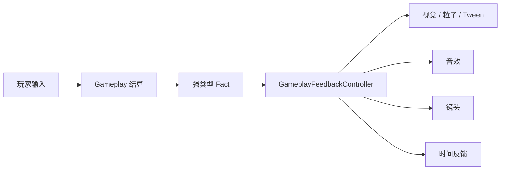
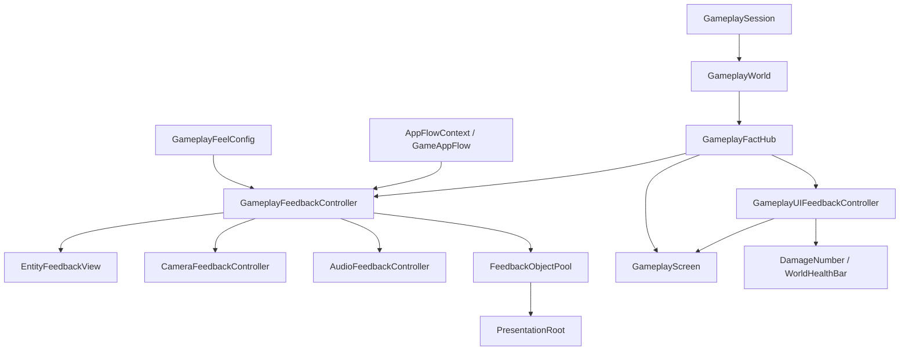
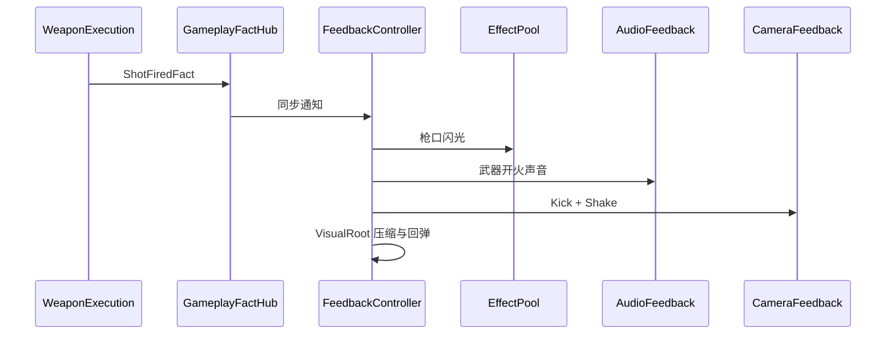

# 第七部分：游戏手感优化与反馈表现计划

> 状态：方案已整理，尚未开始实现。
>
> 第七阶段建立在现有射击、后坐、擦弹、子弹时间、五波流程和结算闭环上，目标是不修改核心胜负规则，通过事实事件、声音、粒子、视觉形变、镜头反馈和短时节奏控制，让玩家能够清楚感知每次开火、命中、受伤、擦弹和击杀。

策划依据：`擦弹射击Demo_游戏手感优化策划.md`。

## 1. 阶段目标

第七阶段完成后应具备：

- 散弹枪和冲锋枪具有明显不同的开火重量。
- 子弹命中敌人或墙体都能在正确位置产生反馈。
- 普通命中、击杀、玩家受伤、擦弹和精英死亡具有稳定强弱层级。
- 普通擦弹、完美擦弹、防守擦弹可以通过视听表现区分。
- 强化弹具有独立颜色、尺寸和尾迹。
- 敌人生成与第一次攻击具有可读预警。
- 镜头后踢和震动不影响逻辑边界与碰撞。
- Hit Stop 与现有子弹时间共用唯一时间仲裁入口。
- 高频表现使用对象池和数量上限。
- 设置页可以关闭或降低震动、闪光和 Hit Stop。



## 2. 本阶段范围

### 2.1 P0 必须实现

- `ProjectileHitFact` 与 `ProjectileWallHitFact`。
- `GameplayFeelConfig` 单一表现配置 Asset。
- `GameplayFeedbackController` 局内表现总入口。
- 最小 Prefab 对象池。
- 玩家开火反馈。
- 敌人受击、死亡反馈。
- 玩家受伤、死亡反馈。
- 玩家生命条、敌人头顶血条与延迟扣减动画。
- 池化伤害数字及散弹合并、连射限频。
- 与真实擦弹阶段同步的擦弹指示条、Charge 条和 Combo 动画。
- 擦弹窗口与四种擦弹结果反馈。
- 镜头后踢、震动与恢复。
- Hit Stop 统一时间仲裁。
- 第七阶段自动配置工具和占位表现 Prefab。

### 2.2 P1 本阶段建议实现

- 子弹尾迹与强化等级表现。
- 敌人生成 Tween 与攻击预警。
- 墙体命中反应和短时弹孔。
- 尸体残影、烟雾和弹壳上限。
- 波次开始、波次结束、胜利与失败演出。
- 设置页的表现强度选项。

### 2.3 暂不实现

- 通用 Buff、Ability 或技能表现框架。
- 通用 Timeline 演出系统。
- 第三方 Tween 框架。
- 运行时网格切割和复杂物理碎裂。
- 大幅动态跟随相机。
- 影响伤害的随机爆炸。
- Addressables、异步特效流送或复杂资源分组。
- 为每种特效建立独立 MonoBehaviour 业务状态机。

## 3. 继承现有架构约束

第七阶段继续遵守 01～05 阶段已经确立的边界：

1. `GameEntry` 仍是唯一统一驱动 Gameplay `Update` / `FixedUpdate` 的 Mono。
2. 场景和 Prefab 可以有少量被动 Mono 保存序列化表现引用，但不拥有业务 Update。
3. Entity Component 继续封装 Gameplay 能力，不把声音、粒子、闪白拆成 Gameplay Component。
4. Gameplay 只发布“发生了什么”，Presentation 决定“如何表现”。
5. Entity 身份继续通过 `EntityId` 传递。
6. 表现配置 Asset 只读，不保存局内状态。
7. 不在每帧使用 `GameObject.Find`、`Resources.Load` 或反射扫描。
8. Demo 使用直接依赖、强类型 Fact 和简单对象池，不增加 DI 容器。
9. 暂停、结算和重开必须清除所有临时表现状态。
10. 视觉节点和物理节点必须分离，任何挤压拉伸都不能改变 Collider。

## 4. 当前可复用基础

| 当前模块 | 第七阶段用途 |
| --- | --- |
| `GameplayFactHub` | 表现层统一事件入口 |
| `ShotFiredFact` | 枪口、声音、镜头后踢和开火形变 |
| `CharacterDamagedFact` | 受伤闪色、HUD 和玩家受伤反馈 |
| `CharacterDiedFact` | 死亡表现入口 |
| `GrazePhaseChangedFact` | 擦弹窗口阶段表现 |
| `GrazeSucceededFact` | 四种擦弹结果表现 |
| `ChargeChangedFact` | Charge 获得、升级、降级和 HUD Tween |
| `TimeDilationChangedFact` | 慢动作画面和音效状态 |
| `WaveStartedFact` | 波次标题和敌人入场表现 |
| `WaveCompletedFact` | 波次完成过渡 |
| `GameplaySettledFact` | 胜负演出和结算页延迟 |
| `DamageResult` | 伤害数字、即时血条和延迟扣减条的数据来源 |
| `PresentationRoot` | 局内临时表现对象父节点 |
| `GameplayCamera` | 镜头表现目标 |
| `EntitySpawner` | 动态对象和表现所需实体位置来源 |

当前主要缺少命中空间数据、表现配置、表现生命周期和可复用对象池。

## 5. 总体模块关系



| 模块 | 唯一职责 |
| --- | --- |
| `GameplayFeelConfig` | 全局反馈参数、武器表现映射、Prefab、音效和数量上限 |
| `GameplayFeedbackController` | 订阅 Fact、查找事件对象、组合并触发各类反馈 |
| `EntityFeedbackView` | Prefab 上的被动引用桥，保存 VisualRoot、Renderer 等引用 |
| `CameraFeedbackController` | 瞄准偏移、后踢、震动累计和恢复 |
| `AudioFeedbackController` | 2D OneShot、优先级、限频和音高偏差 |
| `FeedbackObjectPool` | 按 Prefab 复用短生命周期表现对象 |
| `FeedbackTween` | 少量位置、缩放、颜色 Tween 数据，不是通用 Tween 引擎 |
| `GameplayUIFeedbackController` | 统一驱动血条、飘字、擦弹指示与 HUD 局部动画 |
| `DamageNumberView` | 显示一次合并后的实际伤害，不保存 Gameplay 状态 |
| `WorldHealthBarView` | 跟随存活 Entity，显示即时生命和延迟损失段 |
| `GrazeIndicatorView` | 将真实 Graze 阶段和 Charge 状态转成图形化指示 |
| `TimeDilationController` | 擦弹慢动作、Hit Stop 和恢复的唯一时间倍率仲裁者 |

## 6. 生命周期与驱动

表现控制器不属于 Entity，也不由 UI 页面持有。建议由 `AppFlowContext` 与 `GameplaySession` 同生共死：

```text
GameplayState.Enter
  → 加载 GamePlay Scene
  → 创建 GameplaySession
  → 创建 GameplayFeedbackController
      → 接收 Session、SceneContext、GameplayFeelConfig
      → 缓存 Camera、PresentationRoot 和 AudioSource
      → 建立 Fact 订阅
  → 打开 Gameplay HUD
```

每帧顺序：

```text
GameEntry.Update
  → Time.Tick
  → GameAppFlow.Tick
      → GameplayInput.Tick
      → GameplaySession.Tick
      → GameplayFeedbackController.Tick(UnscaledDeltaTime)
```

使用 `UnscaledDeltaTime` 的原因：

- 枪口闪光、Hit Stop 期间的闪白和镜头恢复仍能推进。
- 子弹时间不会把 0.05 秒闪白拉长成明显停留。
- Pause AppState 下不调用 Feedback Tick，因此暂停时表现保持静止。

释放顺序：

```text
停止输入
  → FeedbackController 解除 Fact 订阅
  → 停止 AudioSource
  → 恢复 Camera Transform
  → 回收全部表现对象
  → Dispose GameplaySession
  → 卸载 GamePlay Scene
```

## 7. GameplayFeelConfig

配置文件建议放置：

```text
Assets/Res/Gameplay/Feel/GameplayFeelConfig.asset
```

为了保持 Demo 简单，只建立一个 Asset，不为每种反馈创建大量小型 ScriptableObject。

建议结构：

```text
GameplayFeelConfig
├── WeaponFeedbackEntry[]
│   ├── WeaponConfig
│   ├── FireAudio
│   ├── MuzzlePrefab
│   ├── MuzzleDuration
│   ├── CameraKick
│   ├── ShakeStrength
│   ├── ShakeDuration
│   ├── VisualScale
│   ├── HitStopDuration
│   └── HitStopCooldown
├── HitFeedback
├── DeathFeedback
├── PlayerDamageFeedback
├── GrazeFeedback
├── CameraFeedback
├── SpawnFeedback
├── AudioClips
├── EffectPrefabs
├── UIFeedback
│   ├── HealthBarTiming
│   ├── DamageNumberTiming
│   ├── DamageNumberLimit
│   ├── WorldHealthBarLimit
│   ├── GrazeIndicatorColors
│   └── LowHealthThreshold
└── PoolLimits
```

`WeaponFeedbackEntry` 通过 `WeaponConfig` 引用匹配，不使用显示名称字符串作为运行时主键。

配置可以放在 `ShotGame.Gameplay.Config` 程序集，只提供只读数据；Gameplay 逻辑不直接播放其中的表现资源。`GameplayContentConfig` 持有唯一 `GameplayFeelConfig` 引用，Session 创建前统一校验。

## 8. Fact 调整

### 8.1 保留现有 Fact

- `ShotFiredFact`
- `CharacterDamagedFact`
- `CharacterDiedFact`
- `GrazePhaseChangedFact`
- `GrazeSucceededFact`
- `ChargeChangedFact`
- `TimeDilationChangedFact`
- 波次与结算 Fact

### 8.2 扩展 ShotFiredFact

当前已有：

```text
SourceId
Origin
Direction
RecoilImpulse
EmpowerLevel
```

建议补充：

```text
WeaponConfig
SourceTeam
```

表现层由此直接找到对应武器 Profile，无需通过 Entity 当前装备状态反查；即使同帧切枪，事件仍然表示真正完成射击的武器。

### 8.3 新增 ProjectileHitFact

```csharp
public readonly struct ProjectileHitFact
{
    public EntityId ProjectileId;
    public EntityId SourceId;
    public EntityId TargetId;
    public Vector2 HitPosition;
    public Vector2 HitNormal;
    public Vector2 Direction;
    public DamageResult DamageResult;
    public int EmpowerLevel;
}
```

用途：

- 命中点粒子。
- 命中方向形变。
- 普通或致死反馈分级。
- 强化弹命中表现。
- 武器 Hit Stop 限频。
- 使用 `DamageResult.AppliedDamage` 生成伤害数字。
- 使用 `DamageResult.HealthAfterDamage` 更新目标血条。

### 8.4 新增 ProjectileWallHitFact

```csharp
public readonly struct ProjectileWallHitFact
{
    public EntityId ProjectileId;
    public EntityId SourceId;
    public Vector2 HitPosition;
    public Vector2 HitNormal;
    public Vector2 Direction;
    public int EmpowerLevel;
}
```

墙体命中与角色受伤分开，避免表现层根据 Category 再做一次不必要判断。

### 8.5 事件发布时机

`ProjectileComponent` 当前已经获得 CircleCast 命中结果，但只保留 Target 和 Distance。第七阶段改为保留完整最近命中：

```text
CircleCastAll
  → 过滤合法 Entity
  → 保存最近 RaycastHit2D
  → 命中墙体：发布 ProjectileWallHitFact
  → 命中角色：TakeDamage 返回 DamageResult
  → 发布 ProjectileHitFact
  → 按穿透规则继续或 Despawn
```

Fact 必须在对象仍然有效时同步发布。死亡表现依赖 Fact 中的位置快照，不能等待 Entity Despawn 后再查 Transform。

## 9. Entity 视觉节点调整

当前角色 Prefab 的 `SpriteRenderer` 与 Collider 可能位于同一根节点。为了安全进行挤压、拉伸和回弹，需要调整为：

```text
EntityRoot
├── Rigidbody2D
├── Collider2D
└── VisualRoot
    └── SpriteRenderer
```

新增被动 Mono：

```csharp
public sealed class EntityFeedbackView : MonoBehaviour
{
    [SerializeField] private Transform _visualRoot;
    [SerializeField] private SpriteRenderer[] _renderers;
}
```

约束：

- 不实现 Update。
- 不保存生命、武器或 AI 状态。
- 只暴露已经序列化的表现引用和初始颜色、缩放快照。
- `GameplayFeedbackController` 按 EntityId 缓存 View。
- 所有缩放只作用于 `VisualRoot`，不能作用于 EntityRoot。

弹丸 Prefab 不强制加入 `EntityFeedbackView`，尾迹和 Renderer 可在生成时由表现层直接缓存。

需要显示头顶血条的角色 Prefab 在 `VisualRoot` 之外增加稳定锚点：

```text
EntityRoot
├── VisualRoot
└── HealthBarAnchor
```

`HealthBarAnchor` 不参与挤压拉伸。血条通过屏幕坐标跟随该锚点，避免挂在 World Space Canvas 后随 Entity 缩放。

## 10. GameplayFeedbackController

内部建议维护：

```text
GameplaySession
GameplaySceneContext
GameplayFeelConfig
Dictionary<EntityId, EntityFeedbackState>
CameraFeedbackController
AudioFeedbackController
FeedbackObjectPool
List<FeedbackTween>
Fact Subscriptions
```

订阅：

- EntitySpawned / EntityDespawned。
- ShotFired。
- ProjectileHit / ProjectileWallHit。
- CharacterDamaged / CharacterDied。
- GrazePhaseChanged / GrazeSucceeded。
- ChargeChanged。
- WaveStarted / WaveCompleted。
- GameplaySettled。

它可以直接通过 `Session.World.TryGetEntity(EntityId)` 查找仍存活实体。需要跨 Despawn 的反馈必须使用事件快照或创建无逻辑视觉副本。

## 11. 开火表现流程



规则：

- 一包散弹只触发一次开火表现。
- 枪口位置直接使用 Fact.Origin，方向使用 Fact.Direction。
- 玩家武器触发镜头后踢；敌人武器只触发局部反馈。
- 强化射击根据 `EmpowerLevel` 改变枪口颜色和尺寸。
- 冲锋枪声音与震动分别限频和封顶。

## 12. 命中、伤害与死亡表现

### 12.1 非致死命中

```text
ProjectileHitFact
  → 命中点火花
  → 命中音效
  → Target VisualRoot 闪白
  → 沿 Direction 压缩/倾斜
  → 申请武器级 Hit Stop
```

`DamageResult.Killed == false` 时才登记受击恢复 Tween。新命中到来时覆盖或加权当前闪白，不为每次命中创建独立协程。

### 12.2 致死命中

```text
ProjectileHitFact(Killed)
  → 强命中帧
  → 死亡 Hit Stop
  → 在事件位置生成死亡特效
  → 复制 Sprite 生成无碰撞残影
  → Entity 正常进入 World Despawn
```

死亡视觉副本放入 `PresentationRoot/PersistentEffects`，不放入为掉落物保留的 `DropRoot`。

### 12.3 玩家受伤

表现控制器收到玩家的 `CharacterDamagedFact` 后：

- 播放红色闪烁。
- 触发受伤震动与暗角。
- 播放高优先级受伤声音。
- 通知 HUD 执行生命文本回弹。
- 如果 Charge 降级，由随后的 `ChargeChangedFact` 播放破碎反馈。

普通敌人受伤与玩家受伤使用不同处理路径，不只依赖同一个通用闪白。

## 13. 擦弹表现流程

### 13.1 阶段表现

`GrazePhaseChangedFact` 驱动玩家 `EntityFeedbackView`：

```text
Idle      → 恢复默认颜色与外圈
Startup   → 收缩光环
Perfect   → 明亮脉冲
Active    → 低强度稳定轮廓
Cooldown  → 淡出和降饱和
```

HUD 不再直接修改玩家 `SpriteRenderer`。当前 [GameplayScreen.cs](D:/UnityProject/GrazeShotDemo/Assets/Scripts/ShotGame/Presentation/UI/GameplayScreen.cs) 中的玩家颜色逻辑迁移到反馈控制器，UIScreen 只显示状态。

### 13.2 结果表现

| `GrazeResultType` | 局部特效 | 声音 | 镜头 | Charge 表现 |
| --- | --- | --- | --- | --- |
| Defensive | 小蓝火花 | 低强度确认 | 无 | 无 |
| PerfectDefensive | 格挡环 | 清晰确认 | 极轻 | 无 |
| Momentum | 青色切向弧 | 动势确认 | 轻 | HUD 回弹 |
| PerfectMomentum | 青白冲击环 | 高音 + 低频 | 中 | 升级颜色与飞字 |

位置优先取敌弹当前位置；敌弹已经移除时使用玩家位置和当前瞄准/后坐方向生成表现。

## 14. 时间仲裁

当前只有 `TimeDilationController` 可以修改 Gameplay TimeScale，这条约束继续保持。

新增最小 Hit Stop 支持：

```text
GrazeSlowRequest
├── Scale
└── RemainingDuration

HitStopRequest
├── Scale（建议接近 0，不直接线程阻塞）
└── RemainingDuration（Unscaled）
```

最终倍率：

```text
CurrentScale = Min(有效擦弹倍率, 有效 HitStop 倍率)
```

要求：

- 两类请求分别计时，结束后重新计算倍率。
- Hit Stop 不清除擦弹剩余时长。
- 连续命中通过事件类型和武器 Profile 限频。
- Pause 继续由 `GameTimeService.SetPaused` 控制，不包装为 Hit Stop。
- Victory、Defeat、返回菜单和重开统一 `Clear()`。

## 15. 镜头控制与边界安全

新增 `CameraFeedbackController`，使用 Unscaled Tick 管理：

```text
AimOffset
KickOffset
ShakeOffset
BaseLocalPosition
Trauma / ShakeLimit
```

推荐结构：

```text
GameplayRoot
└── CameraAnchor
    └── GameplayCamera
```

当前 `GameplaySceneContext.MovementBounds` 会读取 GameplayCamera 位置计算屏幕与 Arena 的交集。如果直接震动这台 Camera 后再次读取，后生成敌人的边界可能发生偏移。

第七阶段必须二选一，推荐方案 A：

- A：进入 Session 时一次性计算并缓存稳定 `MovementBounds`，之后镜头表现不再影响它。
- B：MovementBounds 使用 `CameraAnchor`，Camera 子节点只负责局部表现偏移。

实现时可同时采用 A + B，使逻辑边界完全独立于镜头表现。

镜头参数基线：

| 事件 | Kick/Shake 建议 |
| --- | --- |
| 散弹枪开火 | 反向 Kick 0.10～0.14，中等震动 |
| 冲锋枪开火 | Kick 0.02～0.04，极轻震动 |
| 普通敌人死亡 | 小震动 |
| 玩家受伤 | 中等震动 |
| 完美动势擦弹 | 中等、短促震动 |
| 精英死亡 | 较强震动，但不超过全局上限 |

## 16. 对象池与表现对象

`FeedbackObjectPool` 按 Prefab 建立简单池：

```text
Dictionary<GameObject, Queue<GameObject>>
ActiveFeedback[]
```

每个 ActiveFeedback 保存：

```text
Instance
PrefabKey
RemainingDuration
Transform Tween
Color Tween
```

表现对象自身不需要业务 Update，由 `GameplayFeedbackController.Tick` 统一推进。

默认上限：

| 类型 | 上限 |
| --- | ---: |
| 一次性冲击特效 | 32 |
| 枪口闪光 | 12 |
| 弹孔 | 40 |
| 弹壳 | 30 |
| 尸体残影 | 12 |
| 飘字 | 16 |

超过上限时回收最旧对象。Session Dispose 时统一销毁池内实例。

## 17. Prefab 与场景调整

建议新增资源：

```text
Assets/Res/Gameplay/Feel/
├── GameplayFeelConfig.asset
├── FX_MuzzleShotgun.prefab
├── FX_MuzzleSMG.prefab
├── FX_HitCharacter.prefab
├── FX_HitWall.prefab
├── FX_DeathNormal.prefab
├── FX_DeathElite.prefab
├── FX_Graze.prefab
├── FX_PerfectGraze.prefab
├── FX_ChargeBreak.prefab
└── FX_SpawnWarning.prefab

Assets/Res/Audio/Gameplay/
├── Fire/
├── Hit/
├── Graze/
└── Run/
```

GamePlay 场景调整：

```text
GameplayRoot
├── WorldRoot
├── PresentationRoot
│   ├── TemporaryEffects
│   ├── PersistentEffects
│   └── GameplayAudio
├── DropRoot
├── CameraAnchor
│   └── GameplayCamera
└── ...
```

`GameplaySceneBindings` 增加必要的表现引用，或由 `PresentationRoot` 下的单个被动 `GameplayPresentationBindings` 提供：

- TemporaryEffectRoot。
- PersistentEffectRoot。
- GameplayAudioSource。
- CameraAnchor。

推荐新增独立 `GameplayPresentationBindings`，避免继续扩大 Gameplay 场景业务引用类；它仍是无 Update 的序列化桥梁。

## 18. UI 与设置

当前 `GameplayScreen` 主要由运行时创建的调试文本组成。第七阶段将其改造成正式 HUD，但仍保持一个页面、少量 View 和直接引用，不建立通用 UI 框架。

### 18.1 UI 职责边界

```text
GameplayScreen
├── PlayerHealthView       固定 HUD 生命条
├── WeaponStatusView       武器、弹药和换弹
├── GrazeIndicatorView     擦弹阶段、Charge、Combo
├── WaveStatusView         波次、目标和阶段标题
└── WorldUIRoot
    ├── DamageNumberView[]
    └── WorldHealthBarView[]
```

- `GameplayScreen` 负责持有序列化引用和页面开关。
- `GameplayUIFeedbackController` 订阅 Fact，并在统一 Tick 中更新动画和世界坐标映射。
- 各 View 是被动 Mono，只提供引用、赋值和立即复位，不实现业务 Update。
- UI 不读取或修改 Controller 意图，不发布伤害、擦弹或 Charge 规则。
- 初次打开页面可通过 `Session.World` 做一次完整刷新，之后只响应 Fact。

### 18.2 玩家生命条

`PlayerHealthView` 包含：

```text
ImmediateFill       当前生命
DelayedDamageFill   延迟扣减段
HealthText          当前 / 最大生命
LowHealthFrame      低血量边框
```

事件流程：

```text
CharacterDamagedFact(Player)
  → ImmediateFill 在 0.06～0.10 秒内更新到 HealthAfterDamage / MaxHealth
  → DelayedDamageFill 等待 0.18～0.25 秒
  → 在 0.25～0.40 秒内追上 ImmediateFill
  → HealthText 放大回弹
  → 低于阈值时切换 LowHealthFrame
```

最大生命在页面打开时从玩家 `AttributeComponent` 读取并缓存。本阶段属性没有动态 MaxHealth 修改，因此无需新增通用属性变化事件。连续受伤时取消旧目标值，两个条都以最新真实生命重新计算；不得出现血条向上回弹。

### 18.3 敌人头顶血条

`EntitySpawnedFact` 对 Character 类敌人建立 `WorldHealthBarView` 绑定，使用 `EntityId` 作为字典键：

```text
Dictionary<EntityId, WorldHealthBarState>
```

- 创建时读取当前/最大生命，普通敌人满血隐藏，精英或关键目标常驻。
- `CharacterDamagedFact` 更新即时条、延迟扣减条并显示血条。
- 每个表现 Tick 将 `HealthBarAnchor.position` 转换到 `WorldUIRoot` 的 Canvas 坐标。
- `EntityDespawnedFact` 或 `CharacterDiedFact` 解除绑定并回池。
- 默认上限 12；超出时优先保留精英、受伤目标和靠近玩家的目标。
- 血条 View 不缓存 CharacterEntity 引用，查找入口仍为 `EntityId`。

### 18.4 伤害数字

伤害数字直接由 `ProjectileHitFact.DamageResult.AppliedDamage` 产生，不新增只为 UI 服务的 Gameplay Fact。

`DamageNumberAggregator` 在表现层做短窗口合并：

```text
Key: TargetId + SourceId + 同一渲染帧/短合并窗口
Value: 累计 AppliedDamage + 最后命中位置 + 是否致死 + EmpowerLevel
```

- 散弹同帧命中同一目标合并后再显示。
- 冲锋枪同目标连续数字错开横向位置，并限制同时存活数量。
- 普通、强化、致死使用不同字号/描边，不能依靠颜色作为唯一区别。
- 零伤害默认不显示；若以后加入格挡，用独立“格挡”文字而非数字 0。
- 默认只显示玩家造成的伤害；玩家受伤不生成世界飘字。
- `DamageNumberView` 使用对象池，总时长约 0.45～0.70 秒，同屏上限建议 24。
- 动画和回收使用 Unscaled Time；Pause 时统一冻结。

### 18.5 擦弹指示条

`GrazeIndicatorView` 不再只显示 `GrazePhase` 文本，结构如下：

```text
GrazeTrack
├── StartupSegment
├── PerfectSegment
├── ActiveSegment
├── CooldownMask
└── PhaseCursor
ChargeFill
ChargeLevelText
ChargeDurationFill
ComboText
ResultLabel
```

数据驱动：

- `GrazePhaseChangedFact`：切换区间状态、颜色和阶段过渡。
- `GrazeSucceededFact`：在判定位置触发刻度脉冲，显示普通或完美结果。
- `ChargeChangedFact`：更新等级、Combo 与剩余时间。
- `TimeDilationChangedFact`：只改变慢动作提示，不用来推算擦弹阶段。

若当前 `GrazePhaseChangedFact` 只能表示枚举切换，不能提供阶段内进度，则由 UI 每帧通过玩家 `GrazeComponent` 的只读进度查询获取 `NormalizedPhaseProgress`。UI 不维护自己的计时器。若组件尚无该只读属性，只增加最小查询属性，不新增事件风暴。

### 18.6 UI Tween 规则

- 生命减少：损失段追赶，生命数字放大回弹。
- Charge 获得：填充条快速增加后轻微过冲。
- Charge 升级：颜色、等级文字和音高同步变化。
- Combo 中断：短暂破碎或缩小淡出。
- 波次开始：标题进入后自动淡出。
- 所有 HUD Tween 使用统一 `FeedbackTween`/曲线函数，不引入第三方 Tween 框架。
- HUD 使用 Unscaled Time，子弹时间下仍保持清晰；Pause 时由控制器冻结。
- 高频反馈只影响局部元素，不能每发子弹都缩放整张 HUD。

`SettingsScreen` 增加：

```text
ShakeLevel: Off / Low / Normal
ReduceFlashes: bool
HitStopEnabled: bool
SfxVolume: 0..1
ShowDamageNumbers: bool
EnemyHealthBarMode: DamagedOnly / Always / Off
```

设置属于应用级运行时数据，不写入 `GameplaySession`。Demo 阶段可以只保存在内存中；暂不实现本地存档。

## 19. 声音实现

使用一个 2D `AudioSource` 播放短 OneShot，必要时增加一个循环环境源，不为每个 Entity 挂独立 AudioSource。

`AudioFeedbackController` 提供：

- 按事件播放 AudioClip。
- 音量和音高范围。
- 同类事件最小间隔。
- 玩家关键反馈优先级。
- Pause、结算和 Dispose 时停止或衰减。

冲锋枪、命中和墙体火花必须限频；玩家受伤、完美擦弹和精英死亡不能被普通事件限频器阻止。

Entry 场景已经持有全局 AudioListener，GamePlay 场景不新增第二个 Listener。

## 20. 自动配置工具

新增：

```text
SeventhPhaseSetup.cs
SeventhPhaseSetupMarker.cs
```

菜单入口：

```text
Unity → Shot Game → Setup Seventh Phase
```

负责：

1. 创建 Feel 与 Audio 文件夹。
2. 创建或更新 `GameplayFeelConfig.asset`。
3. 生成最小占位特效 Prefab。
4. 为玩家和敌人 Prefab 建立 `VisualRoot` 与 `EntityFeedbackView`。
5. 为弹丸 Prefab 加入对应尾迹表现。
6. 更新 GamePlay 场景的 PresentationRoot、AudioSource 和 CameraAnchor。
7. 更新 `GameplayContentConfig` 引用。
8. 更新设置页控件引用。
9. 创建正式 GameplayScreen HUD 层级、伤害数字和敌人血条 Prefab。
10. 为角色 Prefab 增加 `HealthBarAnchor`。
11. 校验 Prefab、UI 引用、音效、Camera、Renderer 和池上限。

工具必须使用 `PrefabUtility` 和 `SerializedObject`，不手工编辑 Prefab YAML，不使用 Unity 保留 FileID。

## 21. 计划文件结构

```text
Assets/Scripts/ShotGame/
├── Gameplay/
│   ├── Config/
│   │   └── GameplayFeelConfig.cs
│   ├── Facts/
│   │   └── Facts.cs                     修改
│   ├── Projectile/
│   │   └── ProjectileComponent.cs       修改
│   └── Time/
│       └── TimeDilationController.cs    修改
├── Presentation/
│   ├── Feedback/
│   │   ├── GameplayFeedbackController.cs
│   │   ├── CameraFeedbackController.cs
│   │   ├── AudioFeedbackController.cs
│   │   ├── FeedbackObjectPool.cs
│   │   ├── FeedbackTween.cs
│   │   ├── EntityFeedbackState.cs
│   │   ├── EntityFeedbackView.cs
│   │   └── GameplayPresentationBindings.cs
│   └── UI/
│       ├── GameplayScreen.cs                    修改
│       ├── GameplayUIFeedbackController.cs
│       ├── PlayerHealthView.cs
│       ├── WorldHealthBarView.cs
│       ├── DamageNumberView.cs
│       ├── DamageNumberAggregator.cs
│       ├── GrazeIndicatorView.cs
│       ├── WaveStatusView.cs
│       └── SettingsScreen.cs                    修改
├── GameFlow/
│   ├── AppFlowContext.cs                修改
│   ├── GameAppFlow.cs                   修改
│   └── States/GameplayState.cs          修改
└── Editor/
    ├── SeventhPhaseSetup.cs
    └── SeventhPhaseSetupMarker.cs
```

类名保持短而直接，不新增 `Manager`、`Service` 或多层抽象接口。

## 22. 实施顺序

### 第一步：事件数据

1. 扩展 `ShotFiredFact`。
2. 增加角色和墙体命中 Fact。
3. 让 Projectile 保留完整最近命中数据。
4. 静态验证穿透、致死和墙体分支只发布一次正确事件。

### 第二步：表现生命周期

1. 增加 `GameplayFeelConfig`。
2. 增加 `GameplayPresentationBindings`。
3. 建立 `GameplayFeedbackController`。
4. 从 AppFlowContext 创建、Tick 和释放。
5. 建立最小对象池和 Tween 数据。

### 第三步：核心战斗反馈

1. 枪口闪光和开火声音。
2. 玩家 VisualRoot 开火形变。
3. 相机后踢和震动。
4. 命中闪白、粒子和声音。
5. Hit Stop 与限频。
6. 池化伤害数字、散弹合并与冲锋枪错位限频。

### 第四步：死亡与受伤

1. 普通敌人死亡。
2. 精英敌人死亡。
3. 玩家受伤和 Charge 破碎。
4. 玩家死亡与结算前演出。
5. 玩家生命条、敌人头顶血条和延迟扣减动画。

### 第五步：擦弹表现

1. 五阶段外圈表现。
2. 四种结果分级反馈。
3. 擦弹阶段指示条、Charge 条和 Combo HUD Tween。
4. 子弹时间进入和退出过渡。

### 第六步：可读性与场景回应

1. 玩家弹、敌弹和强化弹尾迹。
2. 敌人生成与攻击预警。
3. 墙体火花、弹孔和残影。
4. 波次与胜负过渡。

### 第七步：设置与优化

1. 震动、闪光、Hit Stop 和音量设置。
2. 对象数量上限。
3. 高频事件限频。
4. 全效果压力测试。

## 23. 重点边界情况

- 散弹五颗弹丸只播放一次开火反馈，但每个真实命中点可以产生火花。
- 散弹同帧多次命中只产生一次合并 Hit Stop。
- 穿透弹命中多个敌人时，每个目标各有命中反馈。
- 弹丸命墙只发布墙体事件，不再发布角色命中。
- Entity 在 Fact 回调后立即 Despawn，死亡反馈仍能使用位置快照完成。
- 玩家死亡与精英死亡同帧发生时，失败判定优先级不被表现层改变。
- 擦弹慢动作中触发 Hit Stop，结束后恢复到原擦弹倍率而非直接 1.0。
- Pause 时声音、Tween、震动和 Hit Stop 不继续倒计时。
- 结算时不再接受新的开火、命中或刷怪表现。
- 重开后 Camera 必须恢复初始位置和缩放。
- 关闭震动后 Camera Kick 与 Shake 均不生效，但 Gameplay 后坐仍正常。
- 减少闪光后命中与完美擦弹仍可通过描边、形变和声音识别。
- 低帧率下表现 Tween 能正确结束，不永久停留在闪白状态。
- 不同屏幕比例下镜头偏移不能允许玩家越过 `MovementBounds`。
- 散弹同帧命中同一敌人时，伤害数字合并但每颗弹丸的真实伤害保持不变。
- 连续伤害到来时，延迟扣减条只能向最新生命值追赶，不能反向增长。
- Entity 回收后，头顶血条不得继续跟随被复用的 Transform。
- 慢动作中 UI 使用真实阶段进度，不能因 Unscaled 动画与 Gameplay 判定产生错位。
- Pause 时 HUD、飘字和血条动画冻结，恢复后从原进度继续。
- 分辨率和宽高比变化后，世界飘字与血条仍映射到正确 Canvas 位置。

## 24. 测试用例

### 24.1 武器

- 散弹枪一包五发只触发一次枪口、声音和镜头 Kick。
- 冲锋枪持续射击时声音自然，震动不持续增大。
- 切枪同帧开火使用真正完成射击的 Weapon Profile。
- 空仓、冷却和换弹失败不播放开火表现。
- 强化射击的枪口、弹丸和命中效果按等级变化。

### 24.2 命中

- 命中敌人、墙体和穿透目标的位置与法线正确。
- 非致死闪白能恢复默认颜色。
- 致死事件不会因 Entity 销毁丢失特效。
- 同一目标不会因一个 CircleCast 结果重复触发反馈。
- 玩家受伤反馈明显且不会遮住后续敌弹。

### 24.3 擦弹与时间

- 五个擦弹阶段按 Unscaled 时间正确显示。
- 四种擦弹结果的视听表现可区分。
- Hit Stop 与 0.25 / 0.15 擦弹倍率正确叠加和恢复。
- Pause、胜负、返回菜单和重开不遗留 TimeScale。

### 24.4 镜头与性能

- Camera Shake 不改变稳定 MovementBounds。
- 高频连射和多敌人死亡时无明显实例化尖峰。
- 所有池达到上限后优先复用旧对象。
- 关闭页面或销毁 Session 后 Fact 订阅全部释放。
- 全效果开启时 Console 无异常且帧率稳定。

### 24.5 UI 反馈

- 玩家受伤后即时生命、延迟扣减段和数字均显示正确。
- 短时间连续受伤时血条不回弹到旧值，低血量状态阈值正确。
- 普通敌人受伤后显示血条，精英血条常驻，死亡或回收后正确消失。
- 散弹同目标同帧伤害数字正确合并，冲锋枪连续飘字不完全重叠。
- 伤害数字关闭后不创建 View，但其余命中反馈仍正常。
- 擦弹指示条与 Startup、Perfect、Active、Cooldown、Idle 同步。
- Charge 升级、降级、Combo 中断和持续时间变化均有正确动画。
- 16:9、16:10、21:9 下 HUD 不越过安全区，世界 UI 跟随位置正确。

## 25. 验收清单

### 25.1 代码与资源验收

- [ ] Gameplay 不直接引用 Presentation 行为类。
- [ ] 表现层只通过强类型 Fact 和只读查询获取 Gameplay 状态。
- [ ] 所有表现配置集中在一个 `GameplayFeelConfig`。
- [ ] EntityFeedbackView 不包含 Update 和 Gameplay 状态。
- [ ] 视觉形变不修改 Collider 根节点。
- [ ] Hit Stop 仍由唯一时间控制器执行。
- [ ] 镜头表现不影响 MovementBounds。
- [ ] 高频特效使用对象池和限频。
- [ ] UI 只消费 Fact 和只读查询，不持有或修改 Gameplay 规则状态。
- [ ] 伤害数字和敌人血条使用对象池，并在 Session Dispose 时全部回收。
- [ ] `HealthBarAnchor` 独立于 VisualRoot，不受挤压拉伸影响。
- [ ] 擦弹指示条不自行维护判定计时。
- [ ] 自动配置工具可重复执行。
- [ ] Runtime、Presentation、GameFlow、Entry 和 Editor 编译通过。

### 25.2 Play Mode 手感验收

- [ ] 两把玩家武器的重量和节奏明显不同。
- [ ] 玩家能立即判断命中敌人还是墙体。
- [ ] 普通命中、死亡、受伤和完美擦弹强度层级清楚。
- [ ] 普通弹、敌弹和强化弹在混战中可辨认。
- [ ] 擦弹反馈不会遮蔽危险弹幕。
- [ ] 冲锋枪连续射击不会造成过量震动或停顿。
- [ ] 玩家受伤和 Charge 丢失能被明确感知。
- [ ] 波次开始和结算演出不拖慢重新挑战节奏。
- [ ] 关闭震动、闪光、Hit Stop 后 Gameplay 结果不变。
- [ ] 返回菜单并重开后无残留声音、特效、镜头或时间状态。
- [ ] 玩家和敌人生命变化可以通过图形条直观看懂，不依赖调试文本。
- [ ] 延迟扣减条能清楚表达单次损失量，连续受伤时数值始终正确。
- [ ] 伤害数字强化命中感，但高频战斗中不遮蔽玩家、敌人和敌弹。
- [ ] 擦弹指示条能准确解释 Perfect 窗口、冷却和 Charge 状态。

## 26. 第七阶段完成后的反馈闭环

```text
玩家点击开火
  → WeaponExecution 产生 ShotPackage、弹丸和后坐
  → ShotFiredFact 同时触发枪口、声音、形变和镜头后踢
  → Projectile 命中并发布带空间快照的 Fact
      → 墙体：火花、声音、弹孔
      → 敌人：闪白、形变、粒子、Hit Stop
              + 头顶血条即时扣减、延迟损失段、池化伤害数字
      → 致死：爆发、残影、死亡声音和更强震动
  → 后坐把玩家推向敌弹路线
  → 主动擦弹阶段获得清晰预告
      → HUD 指示条与角色外圈共同显示 Startup / Perfect / Active / Cooldown
  → 擦弹结果触发分级视听反馈和子弹时间
  → Charge 条、Combo、伤害数字与强化弹表现同步变化
  → 世界、镜头、声音和 UI 共同确认玩家行为
```

第七阶段的核心不是增加更多规则，而是让现有规则被玩家完整感知。完成本阶段后，再依据外部试玩决定是否进入掉落构筑、Boss 或更多武器阶段。
